```{r}
library(tidyverse)
library(knitr)
library(googlesheets4)
library(cowplot)
library(ggrepel)
# See here:https://arelbundock.com/posts/quarto_figures/index.html
knitr::opts_chunk$set(
  out.width = "70%", # enough room to breath
  fig.width = 6,     # reasonable size
  fig.asp = 0.618,   # golden ratio
  fig.align = "center" # mostly what I want
)
out2fig = function(out.width, out.width.default = 0.7, fig.width.default = 6) {
  fig.width.default * out.width / out.width.default 
}
code_flag = TRUE;# Set to true and recompile after class
show_survey_truth = TRUE; # Set to true and recompile after survey (during class) 
```

## *Farbtafel*, Paul Klee (1930)

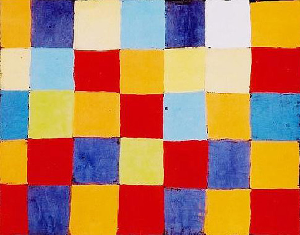

Which color appears most often?

::: {style="font-size: 75%;"}
<https://www.demilked.com/tidying-up-art-ursus-wehrli/>
:::

## Tidied up *Farbtafel*, Ursus Wehrli (2003)

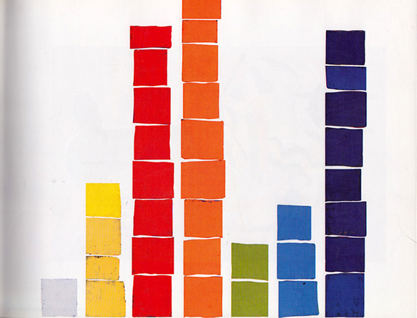

Which color appears most often?

::: {style="font-size: 75%;"}
<https://www.demilked.com/tidying-up-art-ursus-wehrli/>
:::

## Mapping data to aesthetics

*Aesthetics* or *encodings* are ways that we map data to visual properties of the plot and include position, color, length, shape, area, volume

Choice of aesthetics helps or hinders your audience's understanding of what the data are showing

## Case study: Five proportions

One proportion for each of five groups (A-E)

```{r}
num_cats <- 4;
set.seed(1);
data5 <- 
  tibble(value=sample(23, num_cats, F)) %>%
  mutate(value = value / sum(value)) %>%
  arrange(desc(value)) %>%
  mutate(group = LETTERS[1:num_cats])

p5 <- ggplot(data5, aes(x = group, y = value)) +
  geom_bar(stat = "identity", width = 1, color = "white") +
  theme(text = element_text(size = 14)) + 
  labs(x = NULL, y = NULL)
p5
```
Guess **group B's** numerical value as a proportion, e.g. 0.98. 

::: {.fragment}
Your answer would probably be close to 0.28
:::

##

For each of the next 8 plots, guess **group B's** numerical value based on the plot. Enter your guesses on this google form:


<https://tinyurl.com/ph345aesthetics>

## Plot 1: Sorted Pie Chart

```{r}
# Create Data
set.seed(20261);
data1 <- 
  tibble(value=sample(23, num_cats, F)) %>%
  mutate(value = value / sum(value)) %>%
  mutate(max_value = value == max(value)) %>%
  arrange(max_value, desc(value)) %>%
  select(-max_value) %>%
  mutate(group = LETTERS[1:num_cats])

# Basic piechart
p1 <- ggplot(data1, aes(x="", y=value, fill=group)) +
  geom_bar(stat="identity", width=1, color="white") +
  geom_text_repel(aes(label = group), 
                  position = position_stack(vjust = 0.5), 
                  size = 4,
                  show.legend = FALSE, 
                  force = 0.01) +
  coord_polar("y", start=0) +
  theme_void(base_size = 14) + 
  guides(fill = "none") + 
  labs(x = NULL, fill = NULL) 
p1
```

## Plot 2: Unsorted Pie Chart

```{r}
set.seed(20262);
data2 <- 
  tibble(value=sample(23, num_cats, F)) %>%
  mutate(value = value / sum(value)) %>%
  mutate(group = LETTERS[1:num_cats])

p2 <- ggplot(data2, aes(x="", y=value, fill=group)) +
  geom_bar(stat="identity", width=1, color="white") +
  geom_text_repel(aes(label = group), 
                  position = position_stack(vjust = 0.5), 
                  size = 4,
                  show.legend = FALSE, 
                  force = 0.01) +
  coord_polar("y", start=0) +
  scale_fill_manual(values = scales::hue_pal()(num_cats), 
                    breaks = LETTERS[1:num_cats]) +
  theme_void(base_size = 14) + 
  guides(fill = "none") + 
  labs(x = NULL, fill = NULL)
p2
```

## Plot 3: Filled Bar Chart

```{r}
set.seed(20263);
data3 <- 
  tibble(value=sample(23, num_cats, F)) %>%
  mutate(value = value / sum(value)) %>%
  mutate(group = LETTERS[1:num_cats])


p3 <- ggplot(data3, aes(x = "", y = value, fill = group)) +
  geom_bar(stat = "identity", width = 1, color = "white") +
  geom_text_repel(aes(label = group), 
                  position = position_stack(vjust = 0.5), 
                  size = 4,
                  show.legend = FALSE, 
                  force = 0.01) +
  scale_x_discrete(name = NULL) + 
  guides(fill = "none") + 
  theme(text = element_text(size = 14), 
        axis.ticks.x = element_blank()) +
  labs(y = NULL, fill = NULL)
p3
```

## Plot 4: Bar Chart

```{r}
set.seed(20264);
data4 <- 
  tibble(value=sample(23, num_cats, F)) %>%
  mutate(value = value / sum(value)) %>%
  mutate(group = LETTERS[1:num_cats])


p4 <- ggplot(data4, aes(x = group, y = value)) +
  geom_bar(stat = "identity", width = 1, color = "white") +
  theme(text = element_text(size = 14)) + 
  labs(x = NULL, y = NULL)
p4
```

## Plot 5: Unsorted scatterplot

```{r}
set.seed(20265);
data5 <- 
  tibble(value=sample(23, num_cats, F)) %>%
  mutate(value = value / sum(value)) %>%
  mutate(group = LETTERS[1:num_cats])

p5 <- ggplot(data5, aes(x = group, y = value)) +
  geom_point(size = 5) +
  scale_y_continuous(limits = c(0, 0.42)) +
  theme(text = element_text(size = 14)) + 
  labs(x = NULL, y = NULL)
p5
```

## Plot 6: Sorted scatterplot

```{r}
set.seed(20266);
data6 <- 
  tibble(value=sample(23, num_cats, F)) %>%
  mutate(value = value / sum(value)) %>%
  arrange(desc(value)) %>%
  mutate(group = LETTERS[1:num_cats])

p6 <- ggplot(data6, aes(x = group, y = value)) +
  geom_point(size = 5) +
  scale_y_continuous(limits = c(0, max(data6$value))) +
  theme(text = element_text(size = 14)) + 
  labs(x = NULL, y = NULL)
p6 
```

## Plot 7: Colors

```{r}
set.seed(20267);
data7 <- 
  tibble(value=sample(23, num_cats, F)) %>%
  mutate(value = value / sum(value)) %>%
  mutate(group = LETTERS[1:num_cats])

p7 <- ggplot(data7) + 
  geom_point(aes(x = group, color = value), y = 1, size = 5) +
  coord_cartesian(ylim = c(0.9, 1.1)) + 
  guides(color = guide_colorbar(barwidth = 10,  direction = "horizontal")) +
  labs(x = NULL, color = NULL) +
  theme(legend.position = "inside",
        legend.position.inside = c(0.7, 0.9))
p7
```

## Plot 8: Area

```{r}
set.seed(20268);
data8 <- 
  tibble(value=sample(23, num_cats, F)) %>%
  mutate(value = value / sum(value)) %>%
  mutate(group = LETTERS[1:num_cats])

p8 <- ggplot(data8) + 
  geom_point(aes(x = group, size = value), y = 1) +
  coord_cartesian(ylim = c(0.9, 1.1)) + 
  guides(size = guide_legend(direction = "horizontal")) +
  labs(x = NULL, size = NULL) +
  theme(legend.position = "inside",
        legend.position.inside = c(0.7, 0.9))
p8
```

##

```{r}
#| out-width: 130%
#| fig-width: 11.14286
plot_grid(p1,
          p2,
          p3,
          p4, p5, p6, 
          p7, 
          p8,
          labels = c("Plot 1: Sorted Pie Chart", "Plot 2: Unsorted Pie Chart", "Plot 3: Filled Bar Chart", "Plot 4: Bar Chart", "Plot 5: Unsorted Scatterplot", "Plot 6: Sorted Scatterplot", "Plot 7: Colors", "Plot 8: Area"),
          hjust = 0,
          vjust = 1.5,
          ncol = 3)
```

## True values of B

```{r}

all_Bs <- 
  bind_rows(
    data1  %>% filter(group == "B") %>% mutate(plot = "Plot 1: Sorted Pie Chart"),
    data2  %>% filter(group == "B") %>% mutate(plot = "Plot 2: Unsorted Pie Chart"),
    data3  %>% filter(group == "B") %>% mutate(plot = "Plot 3: Filled Bar Chart"),
    data4  %>% filter(group == "B") %>% mutate(plot = "Plot 4: Bar Chart"),
    data5  %>% filter(group == "B") %>% mutate(plot = "Plot 5: Unsorted Scatterplot"),
    data6  %>% filter(group == "B") %>% mutate(plot = "Plot 6: Sorted Scatterplot"),
    data7  %>% filter(group == "B") %>% mutate(plot = "Plot 7: Colors"),
    data8  %>% filter(group == "B") %>% mutate(plot = "Plot 8: Area")
  )

true_values <- all_Bs %>% pivot_wider(id_cols = group, names_from = plot, values_from = value) %>% select(-group)

```


```{r}
#| eval: !expr show_survey_truth
all_Bs %>%
  select(`Plot` = plot, 
         `Value` = value) %>% kable(digits = 3) %>% kableExtra::kable_styling(font_size = 24)
```


## Perceived difficulty

```{r}
#| echo: false
#| include: true
gs4_deauth()
class_responses <- read_sheet("https://docs.google.com/spreadsheets/d/1oZnICP4AAwLub1PSfzeOLqbPOG6rh9tvzxpsCMzTREc/edit?usp=sharing", 
                              col_types = c("cnnnnnnnncc"))

full_join(
  tibble(Plot = c("Plot 1: Sorted Pie Chart", "Plot 2: Unsorted Pie Chart", "Plot 3: Filled Bar Chart", "Plot 4: Bar Chart", "Plot 5: Unsorted Scatterplot", "Plot 6: Sorted Scatterplot", "Plot 7: Colors", "Plot 8: Area")),
class_responses %>% 
  count(`Which is easiest to estimate?`, name = "Easiest") %>%
  rename(Plot = `Which is easiest to estimate?`)) %>%
  full_join(
    class_responses %>% 
      count(`Which is the most difficult to estimate?`, name = "Most Difficult") %>%
  rename(Plot = `Which is the most difficult to estimate?`)
) %>%
  mutate(Plot = factor(Plot, levels = c("Plot 1: Sorted Pie Chart", "Plot 2: Unsorted Pie Chart", "Plot 3: Filled Bar Chart", "Plot 4: Bar Chart", "Plot 5: Unsorted Scatterplot", "Plot 6: Sorted Scatterplot", "Plot 7: Colors", "Plot 8: Area"))) %>%
  mutate(Easiest = replace_na(Easiest, 0),
         `Most Difficult` = replace_na(`Most Difficult`, 0)) %>%
  kable(digits = 3) %>% 
  kableExtra::kable_styling(font_size = 24)
```

## Truth minus Guess (Bias)

```{r}
#| echo: false
#| include: true

bias_values <- 
  # class estimates of values
  (class_responses %>% select(2:9) %>% rename_all(~c("Sorted Pie", "Unsorted Pie", "Filled Bar", "Bar", "Unsorted Scatter", "Sorted Scatter", "Colors", "Area"))- 
     # stack multiple copies of true_values, matching number of rows of class_responses:
     bind_rows(true_values %>% slice(rep(1:n(), nrow(class_responses))))) %>%
  pivot_longer(everything()) %>%
  mutate(value = -1 * value) %>%
  mutate(name = factor(name, levels = c("Sorted Pie", "Unsorted Pie", "Filled Bar", "Bar", "Unsorted Scatter", "Sorted Scatter", "Colors", "Area")))

ggplot(bias_values, aes(x = name, y = value, color = name)) + 
  geom_boxplot(outlier.shape = NA) + 
  geom_jitter(height = 0, width = 0.25, alpha = 0.8, size = 2) + 
  labs(x = "Plot", y = "Bias") +
  coord_cartesian(ylim = c(-0.5, 0.5)) + 
  guides(color = "none") + 
  theme(text = element_text(size = 17), 
        axis.text.x = element_text(angle = 30, hjust = 1))
```


## Relative order of accuracy

Take away: some aesthetics communicate data better than others

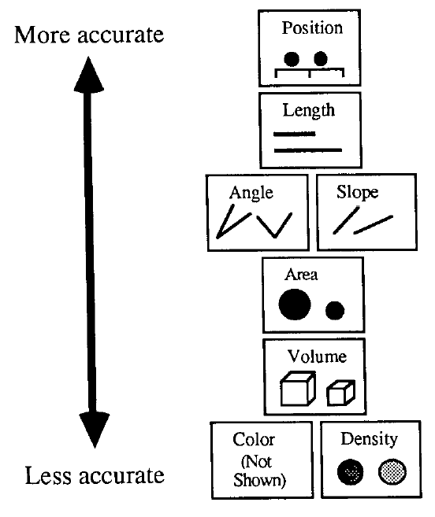

::: {style="font-size: 75%;"}
Figure 14 from Mackinlay (1986)
:::

## Bang Wong


::::: columns
::: {.column width="50%"}

Vertex Fellow, Data Visualization at Vertex Pharmaceuticals. 

Formerly Creative Director of the Broad Institute of MIT and adjunct assistant professor  in the Department of Art as Applied to Medicine at Hopkins

Published monthly column on data visualization in *Nature Methods* journal from 2010-2012

:::

::: {.column width="50%"}
{width=60%}

::: {style="font-size: 75%;"}
<https://www.linkedin.com/in/bangwong/>
:::

:::
:::::


## Example 1

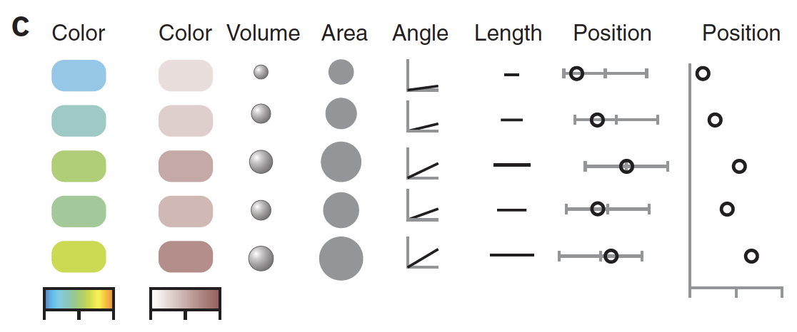

> Different visual variables encoding the same five values.

::: {style="font-size: 75%;"}
Figure 1c from Wong (2010a)
:::


## Example 2

::::: columns
::: {.column width="50%"}
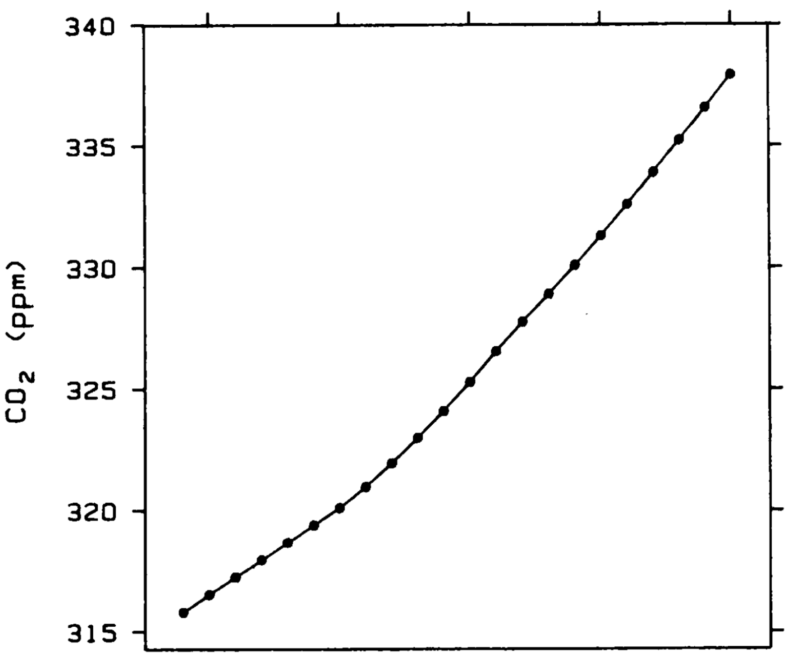
:::


::: {.column width="50%"}
```{r}
#| echo: false
#| results: 'asis'
if (code_flag) {
  cat("::: {.fragment}\n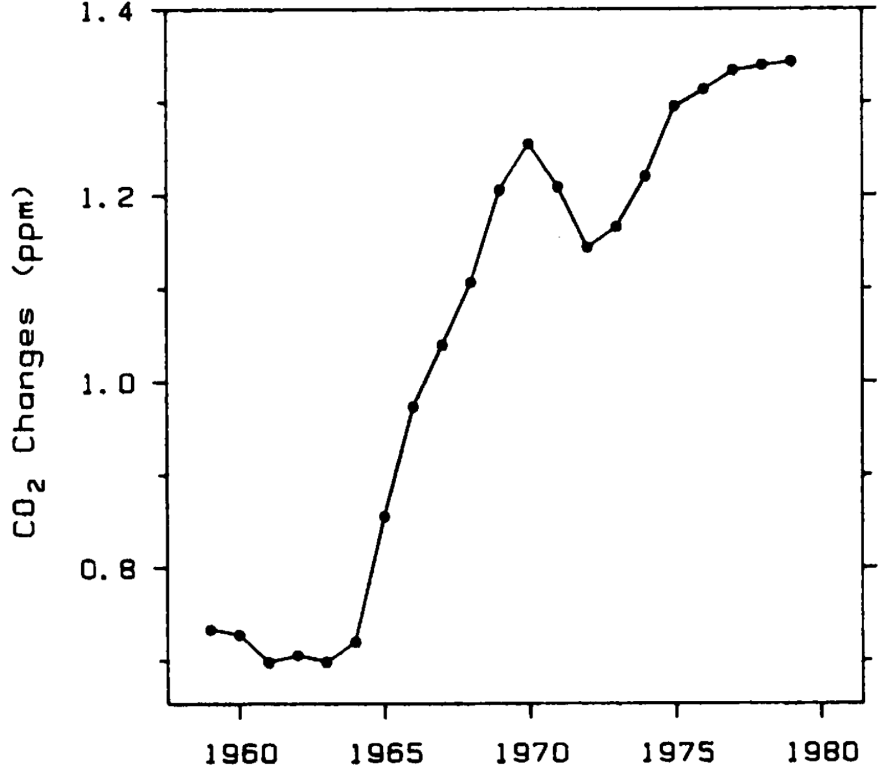\n:::")
}
```


:::
:::::

What is the rate of change of atmospheric CO2 over time? 

::: {style="font-size: 75%;"}
Figure 6 from Cleveland and McGill (1985)
:::


## Example 3

::::: columns
::: {.column width="50%"}
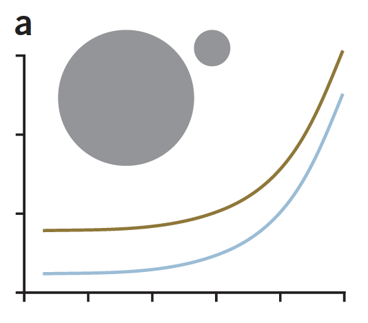
:::


::: {.column width="50%"}
What is the relative size of big vs small circle? 

```{r}
#| echo: false
#| results: 'asis'
if (code_flag) {
  cat("::: {.fragment}\n14x\n:::")
}
```

How does distance between lines vary?

```{r}
#| echo: false
#| results: 'asis'
if (code_flag) {
  cat("::: {.fragment}\nit's constant\n:::")
}
```

:::


:::::

::: {style="font-size: 75%;"}
Figure 1c from Wong (2010a)
:::


## Types of data

-   Quantitative: numbers that measure units, e.g. years, kg, etc. Differences between numbers have meaning
-   Ordinal: numbers or categories that have natural order, e.g. Likert scales, tumor stage. Distances between numbers do not have consistent meaning ('Almost always' - 'Sometimes' = ?)
-   Nominal: Categories that have no inherent order, e.g. US states

## Aesthetics for different types of data


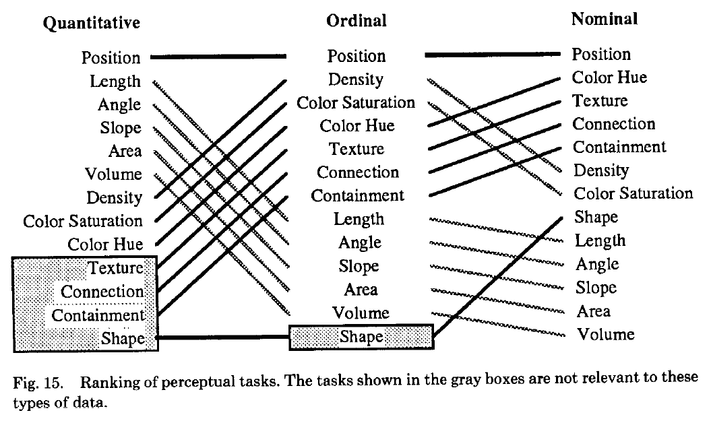

::: {style="font-size: 75%;"}
Figure 15 from Mackinlay (1986)
:::   

:::{.speaker-notes}
Point out the swap between Quant and Ord in (length, angle, slope, area, volume)
and (density, color saturation, color hue, texture, connection, containment), 
and then (hue, texture, connection, and containment) further improve between
ord and nom. 
:::


## Example 4

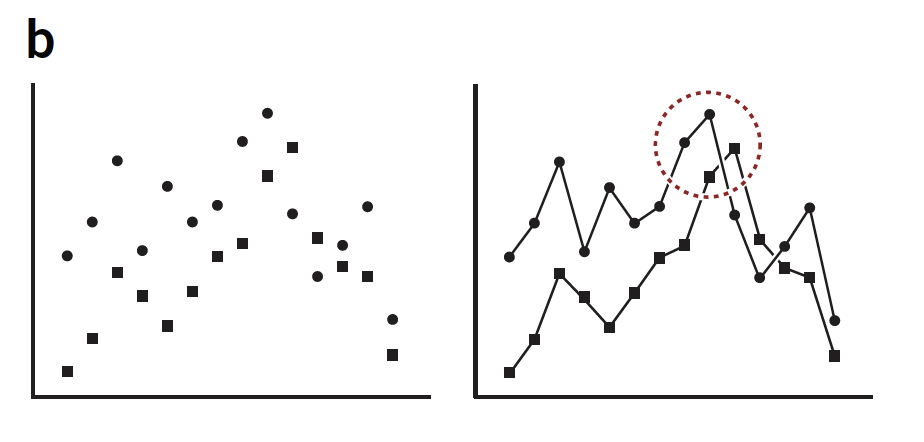

> Lines in graphs create clear connection. Enclosure is an effective way to draw attention to a group of objects.

::: {style="font-size: 75%;"}
Figure 2b from Wong (2010b)
:::

:::{.speaker-notes}
Example of shape as grouping for nominal data, but connection (on the rhs) provides
even better grouping. but enclosure can counteract this connection, if needed
:::

## Example 5 {.nostretch}

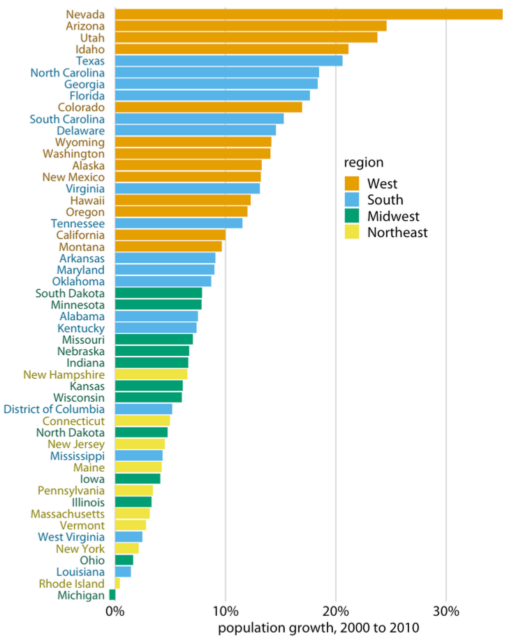{width=50%}

What regions of the US experienced greatest population growth?

::: {style="font-size: 75%;"}
Figure 4.2, Wilke (2019)
:::

:::{.speaker-notes}
Key point is that color is much more effective when used to group observations
rather than for numbers
:::

## Example 6 {.nostretch}

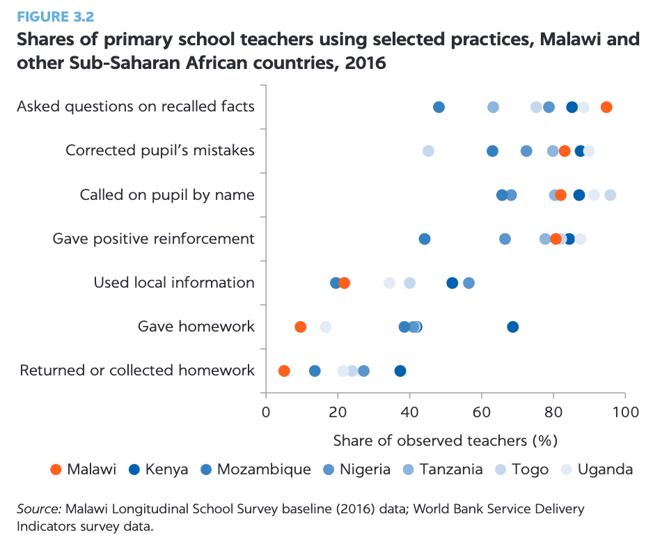{width=55%}

How do Malawi's teachers positive teaching practices compare to those of other Sub-Saharan African countries?

::: {style="font-size: 75%;"}
Figure 3.2, Asim (2024)
:::

:::{.speaker-notes}
Another example of effective use of color -- here a distinctive color is used
to frame the country we are interested in, Malawi, and the other countries are 
also colored according to a blue scheme. On the other hand, it's tempting but 
wrong to draw meaning about the different shades of blue. 
:::

## Example 7 {.nostretch}

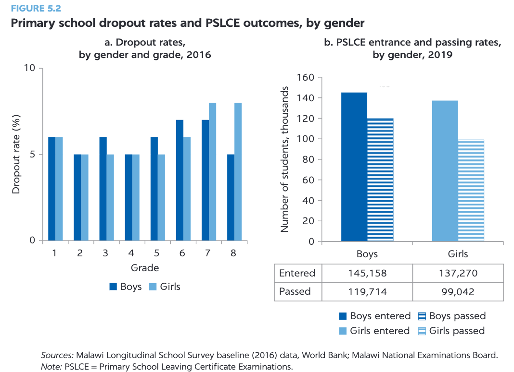{width=55%}

How do entrance and pass rates for Primary School Leaving Certificate Examinations (PSLCE) compare between boys and girls in Malawi?

::: {style="font-size: 75%;"}
Figure 5.2, Asim (2024)
:::

## Example 7 {.nostretch}

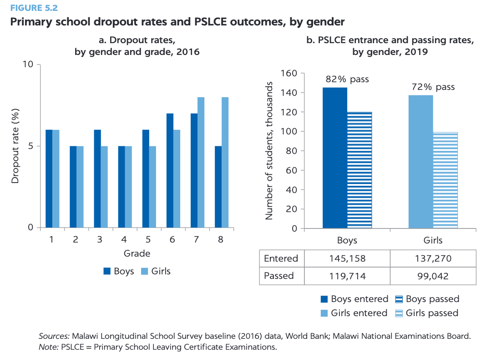{width=55%}

How do entrance and pass rates for Primary School Leaving Certificate Examinations (PSLCE) compare between boys and girls in Malawi?

::: {style="font-size: 75%;"}
Figure 5.2, Asim (2024)
:::

## Example 7 {.nostretch}

> Ultimately,
girls are 6 percent less likely than boys to enter the Primary School Leaving
Certificate Examinations (PSLCE) and 13 percent less likely than boys to pass
(refer to figure 5.2, panel b).

:::{.speaker-notes}
The 13% statistic requires comparing the relative height of the striped bar
for boys against the relative height of the striped bar for girls, which is challenging
without the annotated values. 
:::


## Example 8 {.nostretch}

**Toward Safer and More Productive Migration for South Asia**

{width=60%}

> Number of
deployments is calculated as average for Bangladeshi, Indian, Nepali, Pakistani, and
Sri Lankan labor migrants in their respective top five destination countries... remittances are defined as total amount of
remittances that flow into Bangladesh, India, Nepal, and Pakistan.

::: {style="font-size: 75%;"}
Figure 3.4, Ahmed (2022)
:::

## Example 8

Questions:

1. When was the amount of remittances into sending countries at its highest?
2. For every 100 deploying migrants in 2006, how many deployed in 2015?
3. How long did it take to recover to 2006 levels in terms of deploying migrants?

## Phil's Recreation of Figure 3.4 {#no-spice}

```{r}
#| echo: false
#| eval: false
library(tidyverse)
migration <- read_csv("Slides/Aesthetics/migration.csv")
```

```{r}
#| echo: false
#| eval: true
library(tidyverse)
migration <- read_csv("migration.csv")
```

::: panel-tabset
### Plot

```{r}
#| label: remittance1
ggplot(migration) + 
  geom_line(aes(x = year, y = pct_change_diff, color = variable), linewidth = 1) +
  # you could stop here for the no-spice option (make sure to delete the '+' above)
  # otherwise the rest is of the code is how you get the yoga flame option
  geom_hline(yintercept = 0, linetype = "dashed") + 
  geom_vline(xintercept = 2008, linetype = "dashed") + 
  scale_x_continuous(breaks = 2007:2015, minor_breaks = NULL, name = NULL) + 
  scale_y_continuous(name = "Annual growth rate (%)", breaks = seq(-100, 100, by = 20)) +
  scale_color_manual(values = c("#ED6B36", "#78ACD9"), name = NULL, labels = c("Number of deployments (from sending)", "Remittances (into sending)")) +
  theme(legend.position = "bottom",
        axis.line = element_line(),
        panel.background = element_blank())
```

### Code

```{r}
#| label: remittance1
#| echo: !expr code_flag
#| eval: false
```
:::


Plotting lines emphasizes change between points: the change in the annual growth rate. How easy is this to interpret?

## Drop the lines

```{r}
ggplot(migration) + 
  geom_point(aes(x = year, y = pct_change_diff, color = variable)) +
  geom_hline(yintercept = 0, linetype = "dashed") + 
  geom_vline(xintercept = 2008, linetype = "dashed") + 
  scale_x_continuous(breaks = 2007:2015, minor_breaks = NULL, name = NULL) + 
  scale_y_continuous(name = "Annual growth rate (%)", breaks = seq(-100, 100, by = 20)) +
  scale_color_manual(values = c("#ED6B36", "#78ACD9"), name = NULL, labels = c("Number of deployments (from sending)", "Remittances (into sending)")) +
  theme(legend.position = "bottom",
        axis.line = element_line(),
        panel.background = element_blank())
```

:::{.speaker-notes}
Removing the lines makes the differences less dramatic (probably a good thing)
:::


## Change from 2006 {#medium-spice}

::: panel-tabset
### Plot

```{r}
#| label: remittance2
migration <- 
  migration %>% 
  # 'pct_change_mult' is the multiplier for the change in the number of deployments or remittances, e.g. 10% increase = 1.10 multiplier, 10% decrease = 0.90 multiplier
  mutate(pct_change_mult = 1 + pct_change_diff / 100) %>% 
  # the next mutate will be year-by-year, so we need to make sure this
  # is separate for each variable (deployments or remittances), i.e. with group_by()
  group_by(variable) %>% 
  # cumulative product of the multipliers gives us the multiplier for the change from 2006, e.g. if we have a 10% increase in year 1 and a 20% decrease in year 2, then the multiplier for year 2 is (1.10 * 0.80) = 0.88, which means an overall decrease of 12% from year 0 (2006)
  mutate(pct_change_mult_2006 = 100 * cumprod(pct_change_mult) - 100) %>%
  ungroup()

ggplot(migration) + 
  geom_line(aes(x = year, y = pct_change_mult_2006, color = variable), linewidth = 1) +
  # stop here for the medium spice option (make sure to delete the '+' above), otherwise
  # the rest of the code is how you get the dim mak option
  geom_hline(yintercept = 0, linetype = "dashed") + 
  geom_vline(xintercept = 2008, linetype = "dashed") + 
  scale_x_continuous(breaks = 2007:2015, minor_breaks = NULL, name = NULL) + 
  scale_y_continuous(name = "% Change from 2006", breaks = seq(-100, 100, by = 20)) +
  scale_color_manual(values = c("#ED6B36", "#78ACD9"), name = NULL, labels = c("Number of deployments (from sending)", "Remittances (into sending)")) +
  theme(legend.position = "bottom",
        axis.line = element_line(),
        panel.background = element_blank())
```

### Code

```{r}
#| label: remittance2
#| echo: !expr code_flag
#| eval: false
```
:::


## Code Together Task


**No Spice**: Make an approximate version of my recreation of Figure 3.4 on slide [34](#no-spice): focus just on the structure

**Weak Sauce**: No menu options today...

**Medium Spice**: Make an approximate version of my '% Change from 2006' plot on slide
[36](#medium-spice): focus just on the structure

**Yoga Flame**: Make an exact replicate of my recreation of Figure 3.4 on slide [34](#no-spice). I'm looking for perfection!

**Dim Mak**: Make an exact replicate of my '% Change from 2006' plot on slide [36](#medium-spice). I'm looking for perfection!


## References

Ahmed, S.A. and Bossavie, L. eds., 2022. Toward Safer and More Productive Migration for South Asia. World Bank Publications.
[website](https://openknowledge.worldbank.org/server/api/core/bitstreams/dd91fa20-75ed-5d0f-b3e7-69c164d298b0/content)

Asim, S. and Gera, R.C., 2024. What Matters for Learning in Malawi? Evidence from the Malawi Longitudinal School Survey. World Bank Publications-Books. [website](https://openknowledge.worldbank.org/entities/publication/92b138f9-f4f1-4998-a975-bb4e8436718c)

Cleveland, W.S. and McGill, R., 1985. *Graphical perception and graphical methods for analyzing scientific data.* Science, 229(4716), pp.828-833.

Mackinlay, J., 1986. *Automating the design of graphical presentations of relational information.* Acm Transactions On Graphics (Tog), 5(2), pp.110-141.

Wehrli, U., 2003. Tidying Up Art. Prestel Publishing.

Wilke, C.O., 2019. Fundamentals of data visualization: a primer on making informative and compelling figures. O'Reilly Media.

Wong, B., 2010a. *Design of data figures*. Nature Methods, 7(9), pp.665-666.

Wong, B., 2010b. *Points of view: Gestalt principles (Part 1)*. Nature Methods, 7(11), p.863.