```{r}
library(tidyverse)
library(knitr)
library(googlesheets4)
library(cowplot)
library(ggrepel)
# See here:https://arelbundock.com/posts/quarto_figures/index.html
knitr::opts_chunk$set(
  out.width = "70%", # enough room to breath
  fig.width = 6,     # reasonable size
  fig.asp = 0.618,   # golden ratio
  fig.align = "center" # mostly what I want
)
out2fig = function(out.width, out.width.default = 0.7, fig.width.default = 6) {
  fig.width.default * out.width / out.width.default 
}
code_flag = TRUE;# Set to true and recompile after class

```

## Graphical Integrity

1. Representation of numbers should equal quantities represented
2. Use clear, detailed, and thorough labeling, especially if there is risk of distortion or ambiguity
3. Show data variation, not design variation
4. In time-series displays of money, using inflation-adjusted units
5. Number of dimensions (encodings) should not exceed number of datapoints
6. Don't quote data out of context


## {.nostretch}

*Representation of numbers should equal quantities represented*

::::: columns
::: {.column width="90%"}

{width=70%}

:::

::: {.column width="10%"}

:::

:::::

> You’ll notice that large fundraisers can have a pretty significant impact on raising money for causes — and also that there are big gaps between the diseases that affect the most people and those that net the most money and attention.

::: {style="font-size: 75%;"}
<https://www.vox.com/2014/8/20/6040435/als-ice-bucket-challenge-and-why-we-give-to-charity-donate>
:::

## 

*Representation of numbers should equal quantities represented*

::::: columns
::: {.column width="60%"}

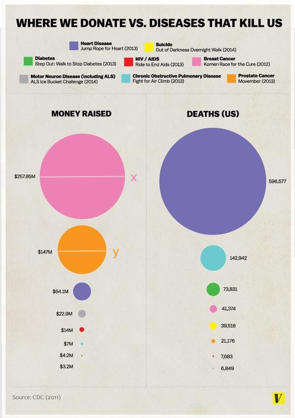{width=70%}
:::

::: {.column width="40%"}

What the plot has: $x/y = 257.87/147$ (diameter/radius proportional to data


What *should* the plot have?

```{r}
#| echo: false
#| results: 'asis'
if (code_flag) {
  cat("
  $x^2/y^2 = 257.87/147$ (area proportional to data)
      ")
}
```


:::

:::::
::: {style="font-size: 75%;"}
<https://www.vox.com/2014/8/20/6040435/als-ice-bucket-challenge-and-why-we-give-to-charity-donate>
:::


## {.nostretch}

*Representation of numbers should equal quantities represented*


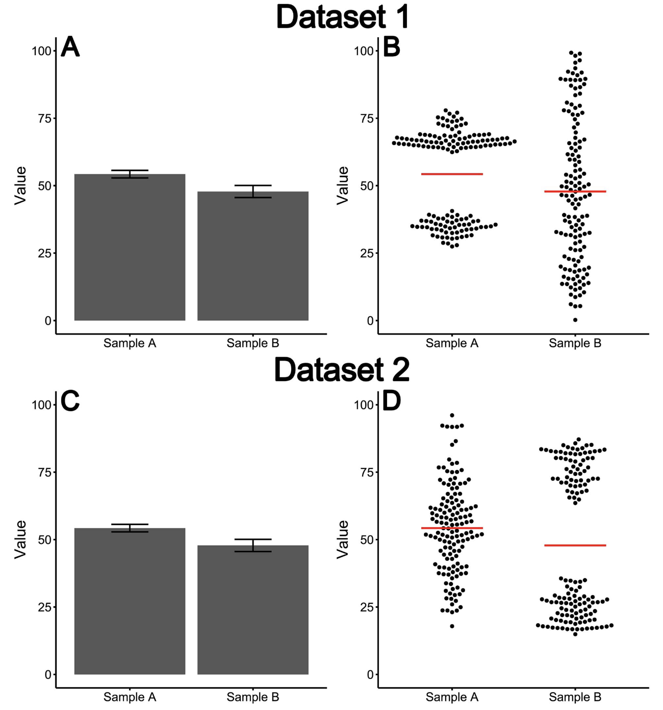

> Demonstration of how dynamite plots do not give an accurate representation of the data’s distribution; A and C show dynamite plots; B and
D show ‘beeswarm’ plots, a type of univariate scatter plot; A and B both represent the same dataset—‘Dataset 1’, and C and D represent
another—‘Dataset 2’; the dynamite plots A and C are identical, even though the Dataset 1 and Dataset 2 are vastly different; B and D give a good
representation of the two different datasets, allowing the reader to note that although these datasets have the same mean and standard error, they
have vastly different distributions

::: {style="font-size: 75%;"}
Figure 1, Dogget and Way, et al. (2024)
:::


## 

*Use clear, detailed, and thorough labeling, especially if there is risk of distortion or ambiguity*


::::: columns
::: {.column width="60%"}


:::

::: {.column width="40%"}
How did the number of gun deaths change after introduction of Stand Your Ground law?
:::

:::::

::: {style="font-size: 75%;"}
<https://www.heap.io/blog/how-to-lie-with-data-visualization>
<https://visualisingdata.com/2014/04/the-fine-line-between-confusion-and-deception/>
:::


##  {.nostretch}

*Show data variation, not design variation*

> Obese people in the Canary Islands in 2004, 2009 and 2015. Pink area shows the proportion of people who are obese, while grey area is related to non-obese people. The percentages refer to the total number of people of their respective group.


::::: columns
::: {.column width="60%"}

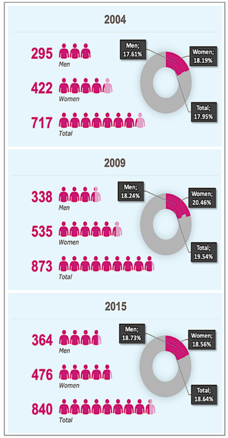{width=70%}

:::

::: {.column width="40%"}
* Numbers on left-hand side are uninformative because each survey has different sample size

* Cartoon people are redundant

* Proportions would be impossible to see without annotations

* Difficult to compare across years

:::

:::::

::: {style="font-size: 75%;"}
Figure 1, Hernández-Yumar, et al. (2019)
:::

:::{.speaker-notes}
note the use of the donut plots
Cross-sectional survey of Canary Island residents in 2004, 2009, and 2015.
:::

## {.nostretch}

*Show data variation, not design variation*

::::: columns
::: {.column width="60%"}

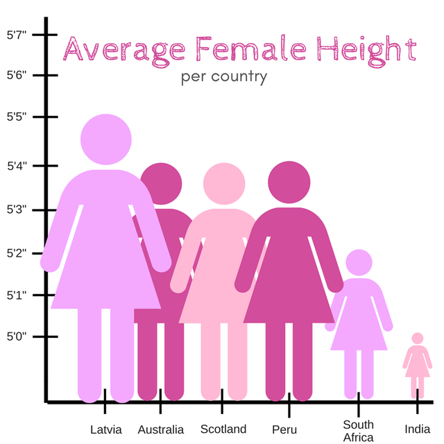

:::

::: {.column width="40%"}
Size of cartoon women is growing proportional to height

See also: *Representation of numbers should equal quantities represented*
:::

:::::

::: {style="font-size: 75%;"}
<https://x.com/reina_sabah/status/1291509085855260672>
:::

## {.nostretch}

*Show data variation, not design variation*

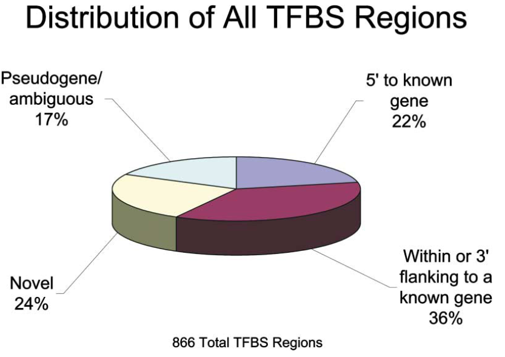

> Classification of [Transcription factor binding sites] Regions

::: {style="font-size: 75%;"}
Figure 1, Cawley, et al. (2004)
:::


## {.nostretch}

*In time-series displays of money, using inflation-adjusted units*

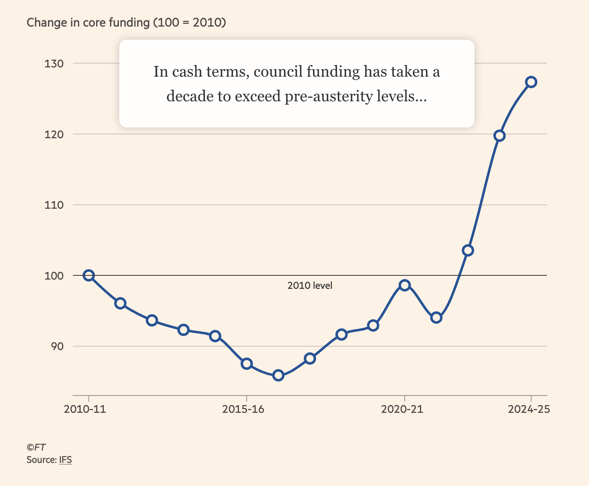

Year-by-year changes in core funding in the UK relative to year 2010. Not adjusted for inflation

::: {style="font-size: 75%;"}
<https://www.ft.com/content/bc19bbf4-2939-489e-a113-e21d5baf356d>
:::

## {.nostretch}

*In time-series displays of money, using inflation-adjusted units*

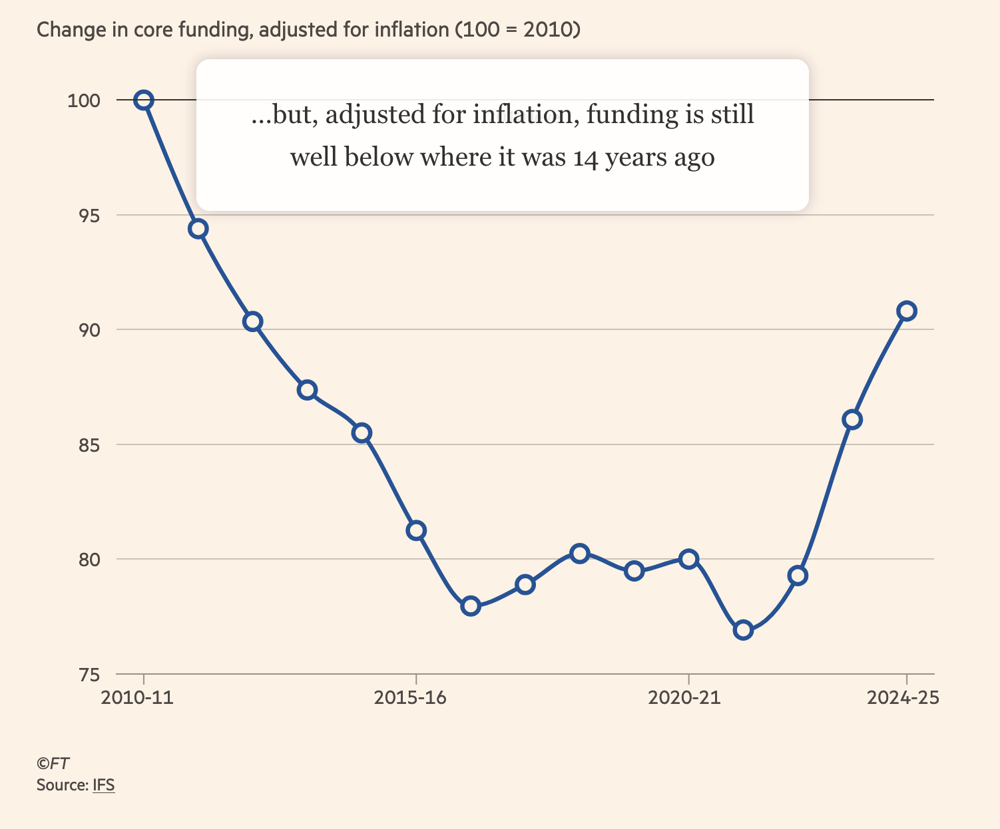

Year-by-year changes in core funding in the UK relative to year 2010, after adjusting for inflation

::: {style="font-size: 75%;"}
<https://www.ft.com/content/bc19bbf4-2939-489e-a113-e21d5baf356d>
:::


## {.nostretch}

*In time-series displays of money, using inflation-adjusted units*

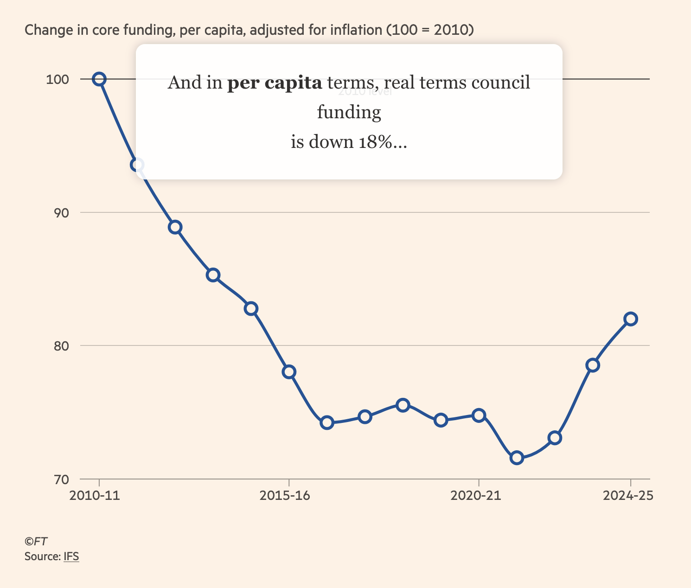

Year-by-year changes in core funding per capita in the UK relative to year 2010, after adjusting for inflation

::: {style="font-size: 75%;"}
<https://www.ft.com/content/bc19bbf4-2939-489e-a113-e21d5baf356d>
:::

:::{.speaker-notes}
council funding = money from UK government to local councils, which then distribute it to public services.
:::

## {.nostretch}

*Number of dimensions (encodings) should not exceed number of datapoints*


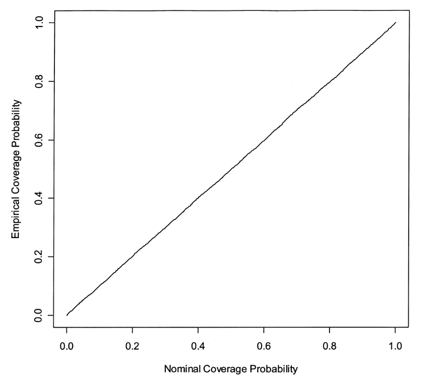

> Empirical coverage of CIs for the relative-risk parameter b of haplotype 01100. Results are based on 10,000 simulated data sets with the same haplotype frequencies as the FUSION data.

::: {style="font-size: 75%;"}
Figure 1, Epstein and Satten (2003)
:::


## {.nostretch}

*Number of dimensions (encodings) should not exceed number of datapoints*


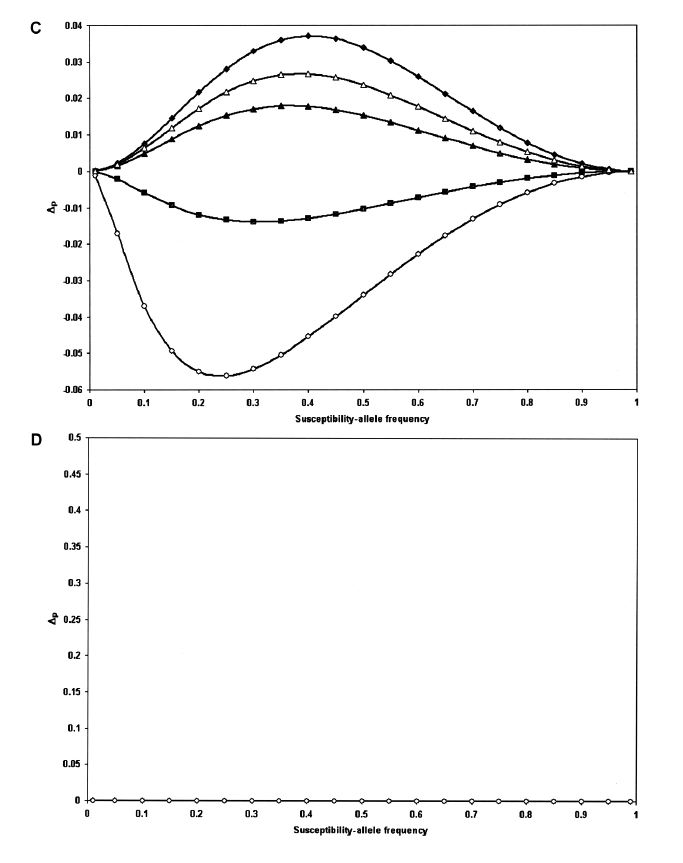

Departure from Hardy-Weinberg equilibrium under additive model (top) and multiplicative model (bottom). The authors note: "For a multiplicative model, [DHW] is equal to 0."

::: {style="font-size: 75%;"}
Figure 1C and 1D, Wittke-Thompson, et al. (2005)
:::

:::{.speaker-notes}
Note that Figure 1D plots y=0, which is the expected value under the multiplicative model, but the plot itself is not labeled as such. This makes it difficult to interpret the plot and understand the implications of the results.
:::

## Kaiser Fung


::::: columns
::: {.column width="50%"}

Data visualization expert

Author of "Numbersense" and "Numbers Rule Your World"

Writes [Junk Charts blog](https://www.junkcharts.com)
:::

::: {.column width="50%"}
{width=60%}

::: {style="font-size: 75%;"}
<https://www.kaiserfung.com/kaiser-fung-about>
:::

:::
:::::


##

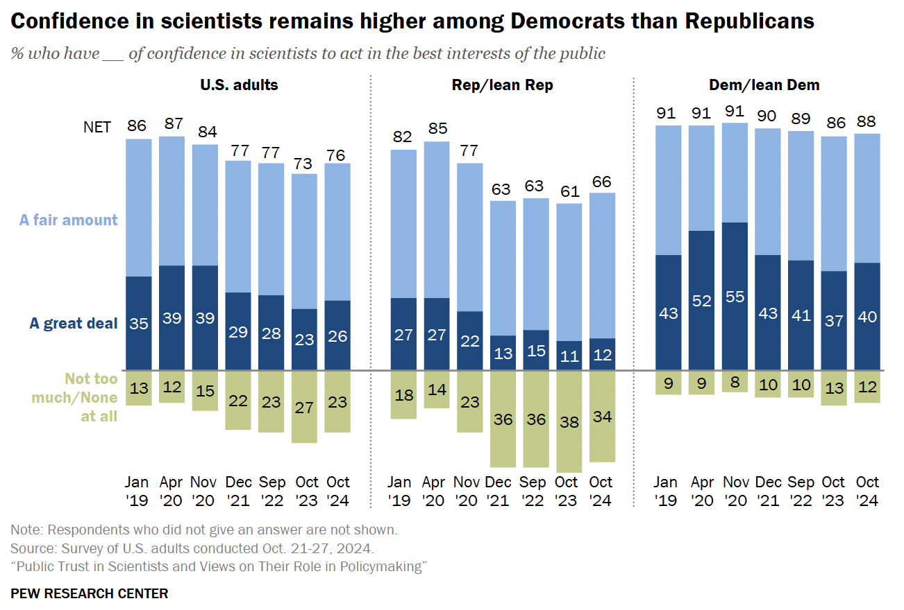


::: {style="font-size: 75%;"}
<https://www.junkcharts.com/the-wtf-moment/>
:::

##

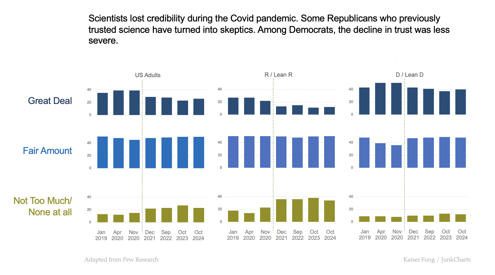

::: {style="font-size: 75%;"}
<https://www.junkcharts.com/the-wtf-moment/>
:::


## 

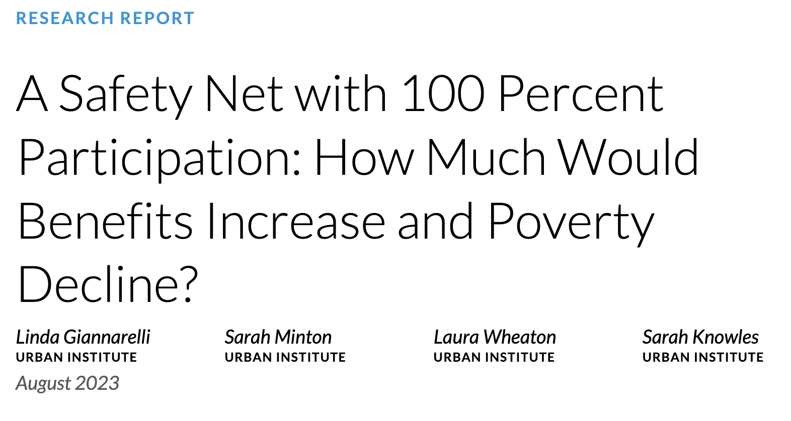
Giannarelli, et al. (2023)

::: {style="font-size: 75%;"}
<https://https://www.urban.org/sites/default/files/2023-08/A%20Safety%20Net%20with%20100%20Percent%20Participation-%20How%20Much%20Would%20Benefits%20Increase%20and%20Poverty%20Decline_0.pdf>
:::

## {.nostretch}

###  Fake Headline: "Massive increase in costs of welfare programs if fully utilized"

```{r}
#| echo: false
#| eval: false
library(tidyverse)
benefits <- read_csv("SafetyNet/FullParticipation_StateData.csv")
```

```{r}
#| echo: false
#| eval: true
library(tidyverse)
benefits <- read_csv("../../../SafetyNet/FullParticipation_StateData.csv")
```

::: panel-tabset
### Plot

```{r}
#| label: plot1
#| out-width: 1000px
p1 <- 
  benefits %>% 
  summarize(Dollars_BaselineBen = sum(Dollars_BaselineBen),
            Dollars_FullBen_Entitle = sum(Dollars_FullBen_Entitle),
            Dollars_FullBen_NoHouse = sum(Dollars_FullBen_NoHouse),
            Dollars_FullBen_All = sum(Dollars_FullBen_All)) %>%
  pivot_longer(everything()) %>%
  mutate(
    pretty_name = 
      case_when(
        name == "Dollars_BaselineBen" ~ "Current funding and\n
participation", 
        name == "Dollars_FullBen_Entitle" ~ "100% participation in SSI\n and SNAP",
        name == "Dollars_FullBen_NoHouse" ~ "100% participation in SSI,\n SNAP, WIC, TANF, CCDF,\n and LIHEAP",
        name == "Dollars_FullBen_All" ~ "100% participation in all\n programs, including\nhousing subsidies"
      ) %>% factor() %>% fct_inorder()) %>%
  ggplot() +
  geom_col(aes(x = pretty_name, y = value), fill = "#30ccf7") +
  scale_y_continuous(name = "Billions of Dollars", 
                     labels = scales::dollar) +
  scale_x_discrete(name = NULL) + 
  theme(
    # no vertical gridlines:
    panel.grid.major.x = element_blank(),
    # grey horizontal gridlines:
    panel.grid.major.y = element_line(color = "lightgrey"),
    # no grey background:
    panel.background = element_blank(),
    # no tick marks:
    axis.ticks = element_blank(),
    axis.text.x = element_text(size = 7)) 
p1 + coord_cartesian(ylim = c(215, 450), expand = FALSE) 
```

### Hint

```{r}
#| echo: true
#| eval: false

# hint 1: this is a bar chart but not showing counts. So consider precalculating the heights and using something than `geom_bar`
# hint 2: use the `labels = scales::dollar` argument in `scale_y_continuous` to format the y-axis as dollars
# hint 3: if you want to 'zoom in' on a plot, *don't* use the `limits` argument in `scale_y_continuous`. Doing so will actually drop the data and potentially change the plot itself. Use `coord_cartesian` instead
```

### Code

```{r}
#| label: plot1
#| echo: !expr code_flag
#| eval: false
```
:::

## {.nostretch}


::: panel-tabset
### Plot

```{r}
#| label: plot2
#| out-width: 1000px

#(See previous slide for p1 construction)
p1
```

### Code

```{r}
#| label: plot2
#| echo: !expr code_flag
#| eval: false
```
:::


## Code Together Task


**No Spice**: Make an approximate version of the bar chart on slide 20

**Weak Sauce**: No menu options today...

**Medium Spice**: Make an approximate version of the misleading bar chart on slide 19 

**Yoga Flame**: No menu options today...

**Dim Mak**: Make an exact replicate of the misleading bar chart on slide 19. I'm looking for perfection!


## References

Cawley, S., Bekiranov, S., Ng, H.H., Kapranov, P., Sekinger, E.A., Kampa, D., Piccolboni, A., Sementchenko, V., Cheng, J., Williams, A.J. and Wheeler, R., 2004. Unbiased mapping of transcription factor binding sites along human chromosomes 21 and 22 points to widespread regulation of noncoding RNAs. Cell, 116(4), pp.499-509.

Doggett, T.J. and Way, C., 2024. Dynamite plots in surgical research over 10 years: a meta-study using machine-learning analysis. Postgraduate Medical Journal, 100(1182), pp.262-266.

Epstein, M.P. and Satten, G.A., 2003. Inference on haplotype effects in case-control studies using unphased genotype data. The American Journal of Human Genetics, 73(6), pp.1316-1329.

Giannarelli, L., Minton, S., Wheaton, L. and Knowles, S., 2023. A Safety Net with 100 Percent Participation: How Much Would Benefits Increase and Poverty Decline?. Washington, DC: The Urban Institute.

Hernández-Yumar, A., Abásolo Alessón, I. and González López-Valcárcel, B., 2019. Economic crisis and obesity in the Canary Islands: an exploratory study through the relationship between body mass index and educational level. BMC Public Health, 19, pp.1-9.

Wittke-Thompson, J.K., Pluzhnikov, A. and Cox, N.J., 2005. Rational inferences about departures from Hardy-Weinberg equilibrium. The American Journal of Human Genetics, 76(6), pp.967-986.