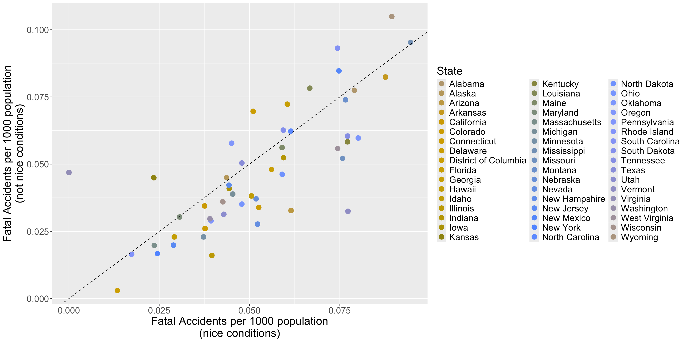
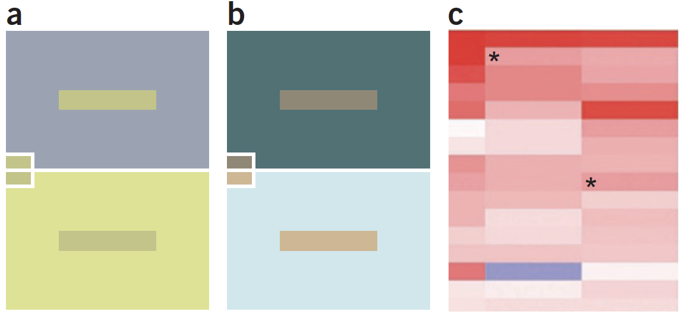

```{r}
library(tidyverse)
library(knitr)
library(googlesheets4)
library(cowplot)
library(ggrepel)
# See here:https://arelbundock.com/posts/quarto_figures/index.html
knitr::opts_chunk$set(
  out.width = "70%", # enough room to breath
  fig.width = 6,     # reasonable size
  fig.asp = 0.618,   # golden ratio
  fig.align = "center" # mostly what I want
)
out2fig = function(out.width, out.width.default = 0.7, fig.width.default = 6) {
  fig.width.default * out.width / out.width.default 
}
code_flag = TRUE;# Set to true and recompile after class

```


## Case Study: FARS 2022

Fatal Accident Reporting System (FARS)

- Data from National Highway Traffic Safety Administration (NHTSA) on fatal traffic accidents in the US

- Collected and reported annually from 1975

- We will use 2022 data


##

For each state, I calculated the following:

  * Number of crashes on nice days per 1000 population (`nice_crash_per_capita`)
  * Number of crashes on "not nice" days per 1000 population (`not_nice_crash_per_capita`)
  
I also calculated the following, which we won't use today:

  * Number of crashes per 1000 population (`all_crash_per_capita`)
  * Number of crashes on other days per 1000 population (`other_crash_per_capita`)
  * Ratio of crashes on nice days vs crashes on not nice days (`ratio_nice_not_nice`)
  
##

Nice day: Either Clear or Cloudy weather and Daylight light conditions

Not nice day = Either Blowing Sand, Soil, Dirt, Blowing Snow, Fog, Smog, Smoke, Freezing Rain or Drizzle, Rain, Severe Crosswinds, Sleet or Hail, or Snow *or* Dark - Not Lighted, Dawn, or Dusk light conditions

```{r}
#| echo: true
#| eval: false
 mutate(
    nice_conditions = 
      WEATHERNAME %in% c("Clear","Cloudy") & LGT_CONDNAME == "Daylight",
    not_nice_conditions = 
      WEATHERNAME %in% c("Blowing Sand, Soil, Dirt",
                                             "Blowing Snow",
                                             "Fog, Smog, Smoke",
                                             "Freezing Rain or Drizzle",
                                             "Rain",
                                             "Severe Crosswinds",
                                             "Sleet or Hail",
                                             "Snow") | 
      LGT_CONDNAME %in% c("Dark - Not Lighted", 
                          "Dawn", 
                          "Dusk")
  ) 
```


##

- Data are available on Canvas > Datasets > FARS: `fars2022_summary.csv` and 
`fars2022_regional_summary.csv`

- Original data available at <https://www.nhtsa.gov/file-downloads?p=nhtsa/downloads/FARS/>

- State population data were taken from <https://www2.census.gov/programs-surveys/popest/datasets/2020-2022/state/totals/>


## {#no-spice}

```{r}
#| message: false
fars2022 <- read_csv("../../../FARS/FARS2022NationalCSV/accident.csv") %>%
  mutate(DAY_WEEKNAME = factor(DAY_WEEKNAME, levels = c("Sunday", "Monday", "Tuesday", "Wednesday", "Thursday", "Friday", "Saturday")))

state_pops <- read_csv("../../../FARS/state_pops.csv")

fars2022 <-
  fars2022 %>%
  mutate(region = case_when(
    STATENAME %in% c("Connecticut", "Maine", "Massachusetts", "New Hampshire", "Rhode Island", "Vermont", "Delaware") ~ "Northeast",
    STATENAME %in% c("New Jersey", "New York", "Pennsylvania") ~ "Northeast",
    STATENAME %in% c("Illinois", "Indiana", "Michigan", "Ohio", "Wisconsin") ~ "Midwest",
    STATENAME %in% c("Iowa", "Kansas", "Minnesota", "Missouri", "Nebraska", "North Dakota", "South Dakota") ~ "Midwest",
    STATENAME %in% c( "District of Columbia", "Florida", "Georgia", "Maryland", "North Carolina", "South Carolina", "Virginia", "West Virginia") ~ "South",
    STATENAME %in% c("Alabama", "Kentucky", "Mississippi", "Tennessee") ~ "South",
    STATENAME %in% c("Arkansas", "Louisiana", "Oklahoma", "Texas") ~ "South",
    STATENAME %in% c("Arizona", "Colorado", "Idaho", "Montana", "Nevada", "New Mexico", "Utah", "Wyoming") ~ "West",
    STATENAME %in% c("Alaska", "California", "Hawaii", "Oregon", "Washington") ~ "West"
  )) %>%
  mutate(
    nice_conditions = WEATHERNAME %in% c("Clear","Cloudy") & LGT_CONDNAME == "Daylight",
    not_nice_conditions = WEATHERNAME %in% c("Blowing Sand, Soil, Dirt","Blowing Snow","Fog, Smog, Smoke","Freezing Rain or Drizzle","Rain","Severe Crosswinds","Sleet or Hail","Snow") | 
      LGT_CONDNAME %in% c("Dark - Not Lighted", "Dawn", "Dusk")
  ) %>%
  left_join(state_pops %>% select(STATE, POPESTIMATE2022))


fars2022_summary <-
  fars2022 %>%
  group_by(STATE, STATENAME, region) %>% 
  summarize(
    all_crash_per_capita = 1000 * n() / mean(POPESTIMATE2022),
    nice_crash_per_capita = 1000 * sum(nice_conditions) / mean(POPESTIMATE2022),
    not_nice_crash_per_capita = 1000 * sum(not_nice_conditions) / mean(POPESTIMATE2022),
    other_crash_per_capita = 1000 * sum(!nice_conditions&!not_nice_conditions) / mean(POPESTIMATE2022),
    ratio_nice_not_nice = sum(nice_conditions) / sum(not_nice_conditions)
  ) %>%
  mutate(highlight_state = 
           case_when(
             nice_crash_per_capita < 0.014 ~ TRUE, 
             nice_crash_per_capita < 0.025 & not_nice_crash_per_capita > 0.025 ~ TRUE, 
             nice_crash_per_capita > 0.075 & not_nice_crash_per_capita < 0.05 ~ TRUE,
             nice_crash_per_capita > 0.0875 ~ TRUE,
             TRUE ~ FALSE
           ))

fars2022_regional_summary <-
  fars2022 %>%
  left_join(
    fars2022 %>% 
      group_by(STATENAME) %>% 
      slice(1) %>% 
      group_by(region) %>%
      summarize(region_POPESTIMATE2022 = sum(POPESTIMATE2022))
  ) %>%
  filter(STATENAME != "Virginia") %>%
  group_by(region) %>% 
  summarize(
    all_crash_per_capita = 1000 * n() / mean(region_POPESTIMATE2022),
    nice_crash_per_capita = 1000 * sum(nice_conditions) / mean(region_POPESTIMATE2022),
    not_nice_crash_per_capita = 1000 * sum(not_nice_conditions) / mean(region_POPESTIMATE2022),
    other_crash_per_capita = 1000 * sum(!nice_conditions&!not_nice_conditions) / mean(POPESTIMATE2022),
    ratio_nice_not_nice = sum(nice_conditions) / sum(not_nice_conditions)
  )
```


```{r}
#| fig-asp: 0.5
#| out-width: 200%
#| fig-width: 17.14286
#| cache: true

ggplot(fars2022_summary, aes(x = nice_crash_per_capita, y = not_nice_crash_per_capita)) + 
  geom_point(size = 4, aes(color = STATENAME)) +  
  geom_abline(slope = 1, intercept = 0, linetype = "dashed") + 
  scale_x_continuous(name = "Fatal Accidents per 1000 population\n(nice conditions)") +
  scale_y_continuous(name = "Fatal Accidents per 1000 population\n(not nice conditions)") +
  scale_color_discrete(name = "State") + 
  theme(text = element_text(size = 20), 
        legend.position = "right")
```

What are three potential issues with this plot?

```{r}
#| echo: false
#| results: 'asis'
if (code_flag) {
  cat("
  1) Too many colors to be helpful
  2) Color scheme encourages comparisons between alphabetically adjacent states
  3) Lots of plot space taken up by the legend
      ")
}
```


## 

What previous plot looks like to someone with 80% deuteranopia (can't see green well)



::: {style="font-size: 75%;"}
<https://bioapps.byu.edu/colorblind_image_tester>
:::

## {#weak-sauce}

Grouping by region instead of individual states

::: panel-tabset
### Plot

```{r}
#| label: first_fars
#| out-width: 125%
#| fig-width: 10.71429

ggplot(fars2022_summary, aes(x = nice_crash_per_capita, y = not_nice_crash_per_capita)) + 
  geom_point(size = 4, aes(color = region)) +  
  geom_abline(slope = 1, intercept = 0, linetype = "dashed") + 
  scale_x_continuous(name = "Fatal Accidents per 1000 population\n(nice conditions)") +
  scale_y_continuous(name = "Fatal Accidents per 1000 population\n(not nice conditions)") +
  scale_color_brewer(name = "Region", palette = "Dark2") +
  theme(text = element_text(size = 20), 
        legend.position = "right")
```

### Code

```{r}
#| label: first_fars
#| echo: !expr code_flag
#| eval: false
```
:::


## {#yoga-flame}

Labeling outlying states explicitly using `ggrepel` R package (Slowikowski, 2024)

::: panel-tabset
### Plot

```{r}
#| label: final_fars
#| out-width: 125%
#| fig-width: 10.71429

ggplot(fars2022_summary, aes(x = nice_crash_per_capita, y = not_nice_crash_per_capita)) + 
  geom_point(size = 4, aes(color = region)) +
  geom_abline(slope = 1, intercept = 0, linetype = "dashed") + 
  # Uses R package ggrepel:
  geom_text_repel(data = filter(fars2022_summary, highlight_state), aes(label = STATENAME), size = 6, force = 3) +
  scale_x_continuous(name = "Fatal Accidents per 1000 population\n(nice conditions)") +
  scale_y_continuous(name = "Fatal Accidents per 1000 population\n(not nice conditions)") +
  # Use 'Dark2' palette from RColorBrewer
  scale_color_brewer(name = "Region", palette = "Dark2") +
  theme(text = element_text(size = 20), 
        legend.position = "right")
```


### Code

```{r}
#| label: final_fars
#| echo: !expr code_flag
#| eval: false
```
:::


## 

1. Clearly something wrong with the data for Virgina regarding daylight accidents (dropped from plot below). Kansas and Vermont also worth closer look
2. More fatal crashes in the South; fewer in the Northeast


## {#medium-spice}


::: panel-tabset
### Plot

```{r}
#| label: regional_fars1
#| out-width: 125%
#| fig-width: 10.71429

fars2022_summary %>%
  filter(STATENAME != "Virginia") %>%
  ggplot(aes(x = nice_crash_per_capita, y = not_nice_crash_per_capita)) + 
  geom_point(size = 4, aes(color = region), alpha = 0.5) +
  geom_point(data = fars2022_regional_summary, aes(color = region), 
             size = 6, pch = 17) +
  geom_abline(slope = 1, intercept = 0, linetype = "dashed") + 
  scale_x_continuous(name = "Fatal Accidents per 1000 population\n(nice conditions)") +
  scale_y_continuous(name = "Fatal Accidents per 1000 population\n(not nice conditions)") +
  # Use 'Dark2' palette from RColorBrewer
  scale_color_brewer(name = "Region", palette = "Dark2") +
  theme(text = element_text(size = 20), 
        legend.position = "right")
```


### Code

```{r}
#| label: regional_fars1
#| echo: !expr code_flag
#| eval: false
```
:::


## {#dim-mak}

```{r}
#| label: hull_setup
find_hull <- function(x) {
  x[
    chull(x$nice_crash_per_capita,
          x$not_nice_crash_per_capita), 
  ]
}

# Feed this into geom_polygon
hulls <- 
  fars2022_summary %>% 
  filter(STATENAME != "Virginia") %>%
  split(.$region) %>%
  map_df(.f = find_hull)
```

::: panel-tabset
### Plot

```{r}
#| label: regional_fars2
#| out-width: 125%
#| fig-width: 10.71429
fars2022_summary %>%
  filter(STATENAME != "Virginia") %>%
  #filter(STATENAME != "Kansas") %>%
  #filter(STATENAME != "Vermont") %>%
  ggplot(aes(x = nice_crash_per_capita, y = not_nice_crash_per_capita)) + 
  geom_point(size = 4, aes(color = region)) +
  geom_polygon(data = hulls, mapping = aes(color = region, fill = region), alpha = 0.2) +
  scale_x_continuous(name = "Fatal Accidents per 1000 population\n(nice conditions)") +
  scale_y_continuous(name = "Fatal Accidents per 1000 population\n(not nice conditions)") +
  # Use 'Dark2' palette from RColorBrewer
  scale_color_brewer(name = "Region", palette = "Dark2") +
  scale_fill_brewer(name = "Region", palette = "Dark2") +
  theme(text = element_text(size = 20), 
        legend.position = "right")

```


### Code

```{r}
#| label: hull_setup
#| echo: true
#| eval: false
```

```{r}
#| label: regional_fars2
#| echo: !expr code_flag
#| eval: false
```
:::


## Defining Color

::::: columns
::: {.column width="40%"}
Color can be defined by its hue (the defining attribute, e.g. blue or red),
lightness (the brightness), and chroma (the richness of a color),

* Three hues (red, green, blue)
* Three lightnesses (top [not
bright], middle, bottom [bright])
* Ten chromas (left [not intense] to
right [intense])

:::

::: {.column width="60%"}

```{r}
#| fig-asp: 1
library(scales)
show_col(hcl(h = rep(rep(c(15, 135, 255), each = 10), times = 3),
             c = rep(seq(10, 100, length = 10), times = 9),
             l = rep(c(35, 65, 95), each = 30)),
         labels = FALSE,
         border = NA,
         ncol = 10)
```

:::
:::::


## Cynthia Brewer (1960-)

::::: columns
::: {.column width="50%"}
American cartographer and professor of geography at Penn State University

Pioneering work in developing color schemes for maps (<https://colorbrewer2.org>) 

Recipient of the Carl Mannerfelt Gold Medal in 2023

:::

::: {.column width="50%"}
{width=60%}

::: {style="font-size: 75%;"}
<https://www.geog.psu.edu/directory/cynthia-brewer>
:::

:::
:::::


## Color scales

::::: columns
::: {.column width="40%"}

Instead of choosing individual colors, typically use predefined 'palette' of
colors. Three types of palettes:

- Sequential: colors follow a gradient from low to high
- Qualitative: hue-based palettes for categorical data
- Diverging: two sequential palettes "pasted together" 

:::

::: {.column width="60%"}

Many palettes available in R, including `ggplot2`

```{r}
#| out-width: 150%
#| fig-width: 12.85714

library(RColorBrewer)
par(mar=c(3,4,2,2))
display.brewer.all()
```
:::
:::::

::: {style="font-size: 75%;"}
<https://colorbrewer2.org/>
:::

## Default color scheme in `ggplot2`

::: panel-tabset
### Plot

```{r}
#| label: datasaurus_dozen
#| out-width: 125%
#| fig-width: 10.71429

library(datasauRus)
dino_plot <-
  ggplot(datasaurus_dozen) +
  geom_point(aes(x = x, y = y, color = dataset), size = 1) + 
  facet_wrap(vars(dataset), ncol = 5) +
  labs(x = NULL, y = NULL) + 
  guides(color = FALSE) +
  theme(text = element_text(size = 18)) 
dino_plot
```


### Code

```{r}
#| label: datasaurus_dozen
#| echo: true
#| eval: false
```
:::

## `Set3` palette (qualitative)

::: panel-tabset
### Plot

```{r}
#| label: datasaurus_dozen2
#| out-width: 125%
#| fig-width: 10.71429

library(datasauRus)
dino_plot +
scale_color_brewer(palette = "Set3") 
```


### Code

```{r}
#| label: datasaurus_dozen2
#| echo: true
#| eval: false
```
:::

## `Dark2` palette (qualitative)

::: panel-tabset
### Plot

```{r}
#| label: datasaurus_dozen3
#| out-width: 125%
#| fig-width: 10.71429

library(datasauRus)
dino_plot +
scale_color_brewer(palette = "Dark2") 
```


### Code

```{r}
#| label: datasaurus_dozen3
#| echo: true
#| eval: false
```
:::

## `Spectral` palette (diverging)

::: panel-tabset
### Plot

```{r}
#| label: datasaurus_dozen4
#| out-width: 125%
#| fig-width: 10.71429

library(datasauRus)
dino_plot +
scale_color_brewer(palette = "Spectral") 
```


### Code

```{r}
#| label: datasaurus_dozen4
#| echo: true
#| eval: false
```
:::

## `BrBG` palette (qualitative)

::: panel-tabset
### Plot

```{r}
#| label: datasaurus_dozen5
#| out-width: 125%
#| fig-width: 10.71429

library(datasauRus)
dino_plot +
scale_color_brewer(palette = "BrBG") 
```


### Code

```{r}
#| label: datasaurus_dozen5
#| echo: true
#| eval: false
```
:::


## Misleading comparisons



> Perception of color can vary. (a,b) The same color can look different
(a), and different colors can appear to be nearly the same by changing the
background color (b)1. (c) The rectangles in the heat map indicated by the
asterisks (*) are the same color but appear to be different.

::: {style="font-size: 75%;"}
Figure 1 from Wong (2010a)
:::

## Common pitfalls / Recommendations

- Ignoring color blindness

  * Use color-blind friendly color palettes when possible

- Too Much Information

  * Use containment or other aesthetics to assist interpretation
  * Avoid using more than 6-8 colors in a plot (Wong, 2011)

- Misleading comparisons

  * Viewers have difficulty mapping color changes to quantitative variables

- Color scales

  * Consider how colors relate to each other, background


## Code Together Task


**No Spice**: Use `fars2022_summary` to create the plot on slide [6](#no-spice)

**Weak Sauce**: Use `fars2022_summary` to create the plot on slide [8](#weak-sauce). You will need to use the `scale_color_brewer()` option in `ggplot2`

**Medium Spice**: Use `fars2022_summary` and `fars2022_regional_summary` to create the plot on slide [11](#medium-spice)

**Yoga Flame**: Use `fars2022_summary` to create the plot on slide [9](#yoga-flame). You will need
to install and load the `ggrepel` package and use `geom_text_repel()` or `geom_label_repel()`

**Dim Mak**: Use `fars2022_summary` to create the plot on slide [12](#dim-mak). Hint: On slide 12 I give
you code to create a dataset containing the polygons (the 'convex hulls'). You will
need to use `geom_polygon()`


## References

Slowikowski K, 2024. _ggrepel: Automatically Position Non-Overlapping Text Labels with 'ggplot2'_. R package version 0.9.5, <https://CRAN.R-project.org/package=ggrepel>.

Wilke, C.O., 2019. Fundamentals of data visualization: a primer on making informative and compelling figures. O'Reilly Media.

Wong, B., 2010. *Color coding*. Nature Methods, 7(8), pp.573.

Wong, B., 2011. *Color blindness*. Nature Methods, 8(6), pp.441.

