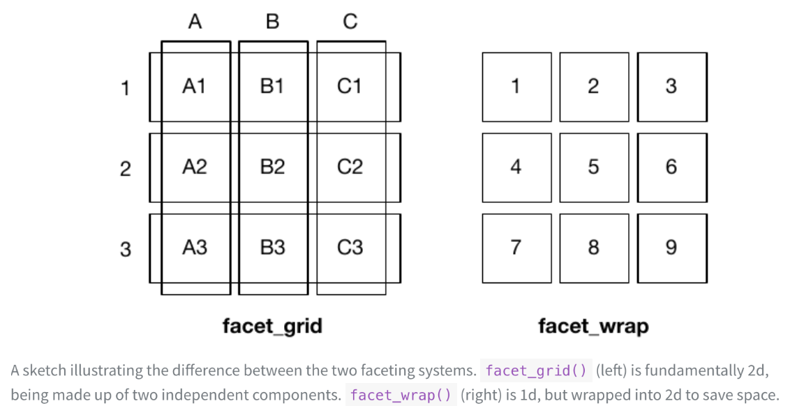
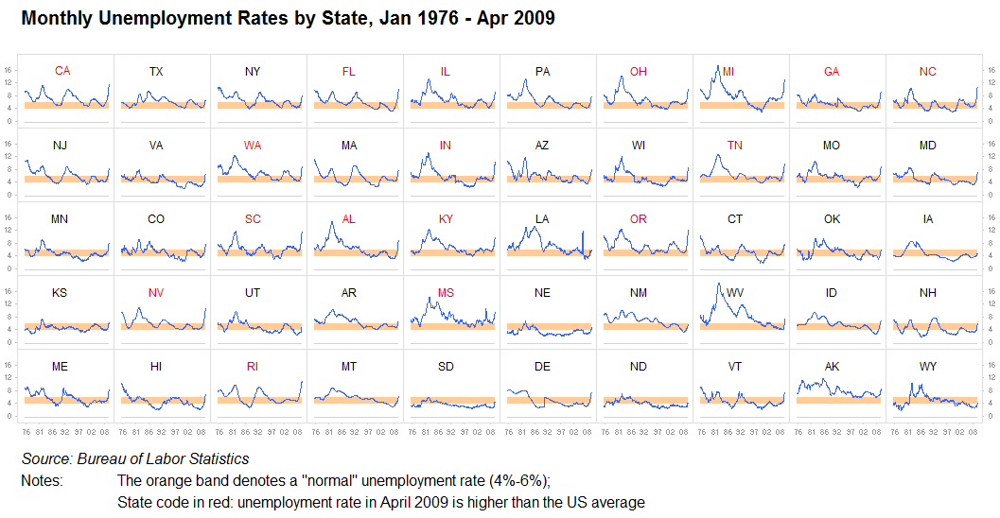
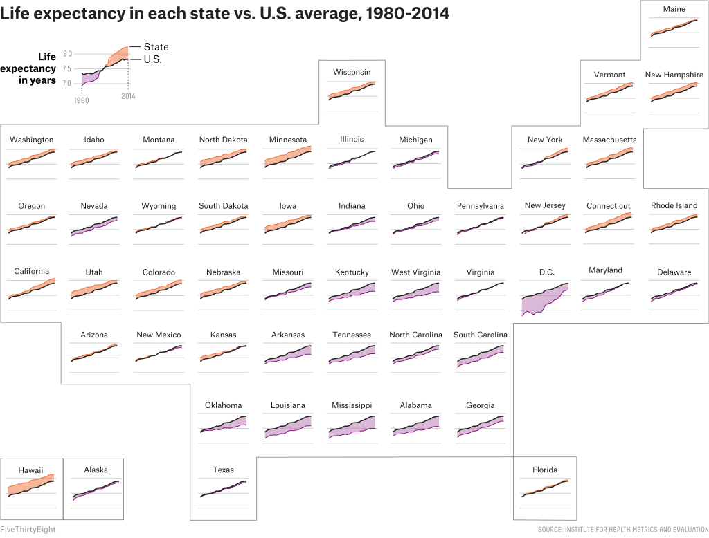

```{r}
library(datasauRus)
library(tidyverse)
library(knitr)
library(kableExtra)
# See here:https://arelbundock.com/posts/quarto_figures/index.html
knitr::opts_chunk$set(
  out.width = "70%", # enough room to breath
  fig.width = 6,     # reasonable size
  fig.asp = 0.618,   # golden ratio
  fig.align = "center" # mostly what I want
)
out2fig = function(out.width, out.width.default = 0.7, fig.width.default = 6) {
  fig.width.default * out.width / out.width.default 
}
code_flag = TRUE;# Set to true and recompile after class
code_flag_opposite = !code_flag
```


## Horse in Motion

{width=100%}

Is there a moment where a galloping horse has all hooves off the ground?

::: {style="font-size: 75%;"}
Eadweard Muybridge, 1878. Public Domain
:::

## Chromosomes

{width=140%}

> Schematic representation of late-prophase chromosomes (1000-band stage) of man, chimpanzee, gorilla, and orangutan, arranged from left
to right, respectively, to better visualize homology between the chromosomes of the great apes and the human complement.

::: {style="font-size: 75%;"}
Figure 2, Yunis and Prakash (1982)
:::

## What is this called?

> [S]lice the data into parts according to one or more data dimensions, visualize each data slice separately, and then arrange the individual visualizations into a grid (Ch21, Wilke, 2019).

Called 'small multiples' (Tufte, 1991), 'trellis plots' (Becker et al., 1996), or 'facet plots' (Wickham, 2016). 

## Why do this?

Introduces a third dimension (first two dimensions being x and y). Essentially another aesthetic. 

Tufte's principles of graphical excellence:

  - *Present many numbers in small space*

  - *Make large data sets coherent*
  
  
## What are guidelines?

Useful when focus is more on individual observations than on overall trends and
to see how differences vary between observations

Faceting variable must be categorical

Each mini-plot should (normally) have same structure: common axes, scales, etc

## Hadley Wickham (1979-)

::::: columns
::: {.column width="50%"}
New Zealand statistician, Chief Scientist at Posit PBC

Creator of `ggplot2` and the `tidyverse`

John Chambers Award for Statistical Computing (2006); Fellow of ASA (2015); COPSS Presidents' Award (2019)

:::

::: {.column width="50%"}
{width=60%}

::: {style="font-size: 75%;"}
<https://hadley.nz/>
:::

:::
:::::

## Two flavors of faceting in `ggplot2`

1. `facet_wrap()`: wrap a 1D ribbon of plots into 2D grid
2. `facet_grid()`: create a 2D grid of plots

{width=60%}

::: {style="font-size: 75%;"}
See Chapter 16 of `ggplot2` book (<https://ggplot2-book.org/facet>)
:::


## We've already seen `facet_wrap()`

::: panel-tabset
### Plot

```{r}
#| fig-asp: 0.7
#| out-width: 130%
#| fig-width: 11.14286
#| label: datasaurus
# Install and load datasauRus if not already installed
if(!require(datasauRus)) {install.packages("datasauRus");library(datasauRus)}
ggplot(datasaurus_dozen) +
  geom_point(aes(x = x, y = y), size = 1) + 
  facet_wrap(facets = vars(dataset), ncol = 5) +
  guides(color = "none") +
  theme(text = element_text(size = 20)) 
```

### Code

```{r}
#| label: datasaurus
#| echo: true
#| eval: false
```
:::


## 

#### `facet_grid()` doesn't 'work' here

Aspect ratio (ratio of height and width) needs to be maintained

::: panel-tabset
### Plot

```{r}
#| fig-asp: 0.7
#| out-width: 130%
#| fig-width: 11.14286
#| label: datasaurus2
# Install and load datasauRus if not already installed
if(!require(datasauRus)) {install.packages("datasauRus");library(datasauRus)}
ggplot(datasaurus_dozen) +
  geom_point(aes(x = x, y = y), size = 1) + 
  facet_grid(rows = vars(dataset)) +
  guides(color = "none") +
  theme(text = element_text(size = 20)) 
```

### Code

```{r}
#| label: datasaurus2
#| echo: true
#| eval: false
```
:::

##

#### Doesn't work as columns either

::: panel-tabset
### Plot

```{r}
#| fig-asp: 0.7
#| out-width: 130%
#| fig-width: 11.14286
#| label: datasaurus3
# Install and load datasauRus if not already installed
ggplot(datasaurus_dozen) +
  geom_point(aes(x = x, y = y), size = 1) + 
  facet_grid(cols = vars(dataset)) +
  guides(color = "none") +
  theme(text = element_text(size = 20)) 
```

### Code

```{r}
#| label: datasaurus3
#| echo: true
#| eval: false
```
:::

## Unemployment in USA

{width=100%}

::: {style="font-size: 75%;"}
Jorge Camoes, <https://excelcharts.com/charts-monthly-unemployment-rates-by-state-1976-2009/>
:::

:::{.speaker-notes}
Wrapped facet by US States, ordered by size of workforce. Easy to compare trends across states. Unemployment band provides anchors
:::

## Life expectancy in USA

{width=120%}

::: {style="font-size: 75%;"}
Anna Maria Barry-Jester, <https://fivethirtyeight.com/features/as-u-s-life-expectancies-climb-people-in-a-few-places-are-dying-younger/>
:::

:::{.speaker-notes}
Sort of a facet grid by categorized latitude and longtitude. The trend line provides an anchor. The amount of purple and orange allow to immediately determine the relationship with nationwide changes
in life expectancy
:::


## Malaria 

* Spread by the bite of female *Anopheles* mosquitos, which are hosts to the malaria parasite

* Exists in tropical and subtropical regions with inadequate public health infrastructure

* 263 million cases in 2023; 597,000 deaths

::: {style="font-size: 75%;"}
US CDC: <https://www.cdc.gov/malaria/data-research/index.html>;

World Malaria Report, WHO: <https://www.who.int/teams/global-malaria-programme/reports/world-malaria-report-2024>
:::

## Global malaria incidence

WHO collects country-level data on malaria incidence. 

Raw data on incidence per 1000-at risk persons available at <https://data.worldbank.org/indicator/SH.MLR.INCD.P3>

Friendlier data available on canvas (`malaria_countries_long.csv`)

##

####  An unfaceted plot of incidence: Sub-Saharan Africa

::: panel-tabset
### Plot

```{r}
malaria_countries <- read_csv("../../../Malaria/malaria_countries_long.csv")
malaria_countries_ssafrica <- malaria_countries %>% filter(region == "Sub-Saharan Africa")
```

```{r}
#| label: malaria_ssafrica_color
#| out-width: 125%
#| fig-width: 10.71429
ggplot(malaria_countries_ssafrica) +
  geom_line(aes(x = year, y = incidence, group = country, color = country), 
            alpha = 0.75)
```

### Code

```{r}
#| echo: true
#| eval: false

# I've downloaded the data from Canvas into my project folder:
malaria_countries <- read_csv("malaria_countries_long.csv")
malaria_countries_ssafrica <- malaria_countries %>% filter(region == "Sub-Saharan Africa")
```

```{r}
#| label: malaria_ssafrica_color
#| echo: true
#| eval: false
```
:::

## {#no-spice}

####  An faceted plot of incidence: Sub-Saharan Africa

::: panel-tabset
### Plot


```{r}
#| label: malaria_ssafrica_facet
#| out-width: 125%
#| fig-width: 10.71429

# Create ggplot object for future updating
p1 <-
  ggplot(data = malaria_countries_ssafrica,
         mapping = aes(x = year, y = incidence)) +
    geom_line() + 
    facet_wrap(vars(country)) +
    scale_y_continuous(name = "Incidence per 1000 at-risk persons")

p1
```

### Code

```{r}
#| label: malaria_ssafrica_facet
#| echo: !expr code_flag
#| eval: false
```
:::

## {#weak-sauce}

####  Drop the 'strips'

::: panel-tabset
### Plot


```{r}
#| label: malaria_ssafrica_facet2
#| out-width: 125%
#| fig-width: 10.71429

# Update p1 object from previous slide with the provided hints
p2 <- 
  p1 + theme(strip.text = element_blank())
p2
```

### Hint

```{r}
#| echo: true
#| eval: false
# To drop the strips completely, add this to your code:
theme(strip.text = element_blank())

```

### Code

```{r}
#| label: malaria_ssafrica_facet2
#| echo: !expr code_flag
#| eval: false
```
:::


## {#medium-spice}

####  Add labels inside

::: panel-tabset
### Plot


```{r}
#| label: malaria_ssafrica_facet3
#| out-width: 125%
#| fig-width: 10.71429

# Update p1 object from previous slide with the provided hints
p3 <- 
  p2 +
    # The '.' means we are taking the data inherited from the p2 object
    # and further modifying it
    geom_text(data = . %>% group_by(country) %>% slice(1),
              aes(label = country), x = 2000, y = 650, hjust = 0, size = 3)+
    theme(strip.text = element_blank())
p3
```

### Hint

```{r}
#| echo: true
#| eval: false
# To add labels to the plots, use a dataset with just one row per country:
malaria_countries_ssafrica %>%
  group_by(country) %>%
  slice(1)

```

### Code

```{r}
#| label: malaria_ssafrica_facet3
#| echo: !expr code_flag
#| eval: false
```
:::


## {#yoga-flame}

####  Arrange countries by the change in incidence from 2000 to 2022

::: panel-tabset
### Plot


```{r}
#| label: malaria_ssafrica_facet4
#| out-width: 125%
#| fig-width: 10.71429

malaria_countries_ssafrica2 <- 
  malaria_countries_ssafrica %>% 
  group_by(country) %>%
  # Note we are using mutate not summarize since we want to keep the year-level
  # data. Because the data are grouped by `Country Code`, the result will just
  # be constant within country
  mutate(delta_incidence = last(incidence) - first(incidence)) %>% 
  ungroup() %>% 
  # Now sort by the calculated value, then country name, then year
  arrange(delta_incidence, country, year) %>% 
  # Now we recharacterize Country name as a factor with levels as they
  # are arranged
  mutate(country = factor(country) %>% fct_inorder())

# update p3 object from previous slide with new data
# Note use of new operator `%+%` for updating data. Type ?'%+%' for more information; basically this is a shortcut for rerunning the
# code in p3 but with a new dataset. This is useful since we have a lot of code in p3 that we don't want to repeat.
p4 <- p3 %+% malaria_countries_ssafrica2 +   
  geom_line(aes(color = delta_incidence > 0)) + 
  scale_color_manual(values = c("blue", "red")) +
  guides(color = "none")

p4
```

### Hint

```{r}
#| echo: true
#| eval: false
# Create a new variable called delta_incidence that is the difference 
# between the last and first incidence values for each country. 
# Then arrange the data by this variable and turn country into a factor
# with levels in the order that they appear in the data:

mutate(country = factor(country) %>% fct_inorder())

```

### Code

```{r}
#| label: malaria_ssafrica_facet4
#| echo: !expr code_flag
#| eval: false
```
:::

## {#dim-mak}

####  Anchor all panels with the Sub-Saharan-wide trajectory

::: panel-tabset
### Plot

```{r}
malaria_all_ssafrica <- read_csv("../../../Malaria/malaria_other_long.csv") %>% filter(name == "Sub-Saharan Africa")
```

```{r}
#| label: malaria_ssafrica_facet5
#| out-width: 125%
#| fig-width: 10.71429

p4 + 
  geom_line(data = malaria_all_ssafrica,
            linetype = "dashed", alpha = 0.75) +
  scale_x_continuous(breaks = c(2000, 2010, 2020))
```

### Code

```{r}
#| echo: true
#| eval: false

# I've downloaded the data from Canvas into my project folder:
malaria_all_ssafrica <- read_csv("malaria_other_long.csv") %>% filter(name == "Sub-Saharan Africa")
```

```{r}
#| label: malaria_ssafrica_facet5
#| echo: !expr code_flag
#| eval: false
```

### Code (Stand alone)

```{r}
#| label: malaria_ssafrica_facet6
#| echo: !expr code_flag
#| eval: false

# This is a complete, stand-alone version to make the same plot

malaria_countries <- read_csv("malaria_countries_long.csv")
malaria_countries_ssafrica <- malaria_countries %>% filter(region == "Sub-Saharan Africa")

malaria_countries_ssafrica2 <- 
  malaria_countries_ssafrica %>% 
  group_by(country) %>%
  # Note we are using mutate not summarize since we want to keep the year-level
  # data. Because the data are grouped by `Country Code`, the result will just
  # be constant within country
  mutate(delta_incidence = last(incidence) - first(incidence)) %>% 
  ungroup() %>% 
  # Now sort by the calculated value, then country name, then year
  arrange(delta_incidence, country, year) %>% 
  # Now we recharacterize Country name as a factor with levels as they
  # are arranged
  mutate(country = factor(country) %>% fct_inorder())

# I've downloaded the data from Canvas into my project folder:
malaria_all_ssafrica <- read_csv("malaria_other_long.csv") %>% filter(name == "Sub-Saharan Africa")

ggplot(data = malaria_countries_ssafrica2,
       mapping = aes(x = year, y = incidence)) +
  geom_line(aes(color = delta_incidence > 0)) + 
  geom_text(data = . %>% group_by(country) %>% slice(1),
            aes(label = country), x = 2000, y = 650, hjust = 0, size = 3) +
  geom_line(data = malaria_all_ssafrica,
            linetype = "dashed", alpha = 0.75) +
  facet_wrap(vars(country)) +
  scale_x_continuous(breaks = c(2000, 2010, 2020)) +
  scale_y_continuous(name = "Incidence per 1000 at-risk persons") + 
  scale_color_manual(values = c("blue", "red")) +
  guides(color = "none") +
  theme(strip.text = element_blank())

```
:::

## {#weak-sauce2}

####  An example with varying y-axes

::: panel-tabset
### Plot


```{r}
#| label: malaria_ssafrica_facet7
#| out-width: 125%
#| fig-width: 10.71429

ggplot(data = malaria_countries_ssafrica,
       mapping = aes(x = year, y = incidence)) +
  geom_line() + 
  facet_wrap(vars(country), scales = "free_y") +
  scale_y_continuous(name = "Incidence per 1000 at-risk persons")

```

### Hint

```{r}
#| echo: !expr code_flag_opposite
#| eval: false
# Look up the `scales` argument in the `facet_wrap` documentation. Find
# up the documentation with this:
?facet_wrap
```

### Code

```{r}
#| label: malaria_ssafrica_facet7
#| echo: !expr code_flag
#| eval: false
```
:::

:::{.speaker-notes}
Think about differences between choice of varying y-axes:
Varying y-axes are essentially many individual plots. 
Varying y-axes make it easier to evaluate differences within a panel but harder to compare between panels
:::


## Code Together Task


**No Spice**: Make the standard faceted plot on slide [17](#no-spice);

**Weak Sauce**: Make the faceted plot without strips on slide [18](#weak-sauce); Make the faceted
plot with varying y-axes on slide [22](#weak-sauce2);

**Medium Spice**: Make the faceted plot with inside labels on slide [19](#medium-spice)

**Yoga Flame**: Make the faceted plot with reordered facets on slide [20](#yoga-flame)

**Dim Mak**: Make the faceted plot with the Sub-Saharan Africa trajectory on slide [21](#dim-mak)


## References

Becker, R.A., Cleveland, W.S. and Shyu, M.J., 1996. *The visual design and control of trellis display*. Journal of computational and Graphical Statistics, 5(2), pp.123-155.

Tufte, E.R., 1991. Envisioning information. Optometry and Vision Science, 68(4), pp.322-324.

Wickham H (2016). ggplot2: Elegant Graphics for Data Analysis. Springer-Verlag New York. ISBN 978-3-319-24277-4, https://ggplot2.tidyverse.org.

Wilke, C.O., 2019. Fundamentals of data visualization: a primer on making informative and compelling figures. O'Reilly Media.

Yunis, J.J. and Prakash, O., 1982. *The origin of man: a chromosomal pictorial legacy.* Science, 215(4539), pp.1525-1530.