```{r}
library(datasauRus)
library(tidyverse)
library(knitr)
library(kableExtra)
# See here:https://arelbundock.com/posts/quarto_figures/index.html
knitr::opts_chunk$set(
  out.width = "70%", # enough room to breath
  fig.width = 6,     # reasonable size
  fig.asp = 0.618,   # golden ratio
  fig.align = "center" # mostly what I want
)
out2fig = function(out.width, out.width.default = 0.7, fig.width.default = 6) {
  fig.width.default * out.width / out.width.default 
}
code_flag = TRUE;# Set to true and recompile after class
code_flag_opposite = !code_flag
```


## Data visualization in maps

Some challenges:

1. Accurate representation of quantities within and across geographic or administrative areas

2. Maintaining privacy

3. Projecting three-dimensional surface onto two dimensions


## Presidential Election Results, 2016

##

### Unique values map

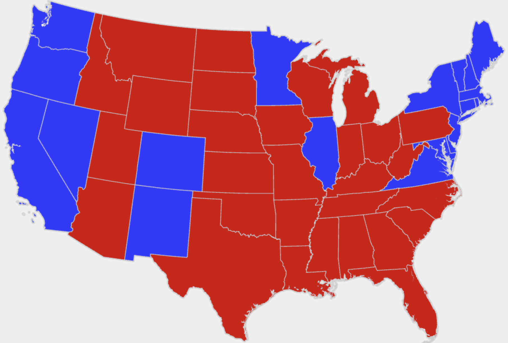

::: {style="font-size: 75%;"}
Kenneth Field

<https://www.esri.com/arcgis-blog/products/arcgis-pro/mapping/when-a-single-map-isnt-enough/>
:::

:::{.speaker-notes}
describe electoral college as rationale for coloring states
technically true map that shows that the states that voted for trump
are geographically larger than those that voted for Clinton, but not a good representation of the popular vote

:::


##

### Choropleth map by county

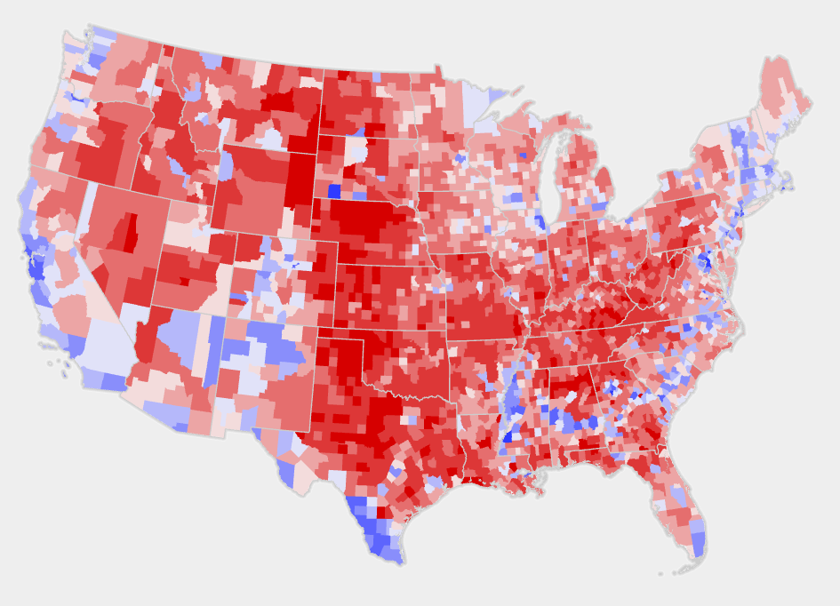

::: {style="font-size: 75%;"}
Kenneth Field

<https://www.esri.com/arcgis-blog/products/arcgis-pro/mapping/when-a-single-map-isnt-enough/>
:::

:::{.speaker-notes}
two changes: 1) color scheme (diverging palette with red and blue) and 2) geographic unit (county instead of state)
:::


##

### Dot density map by county

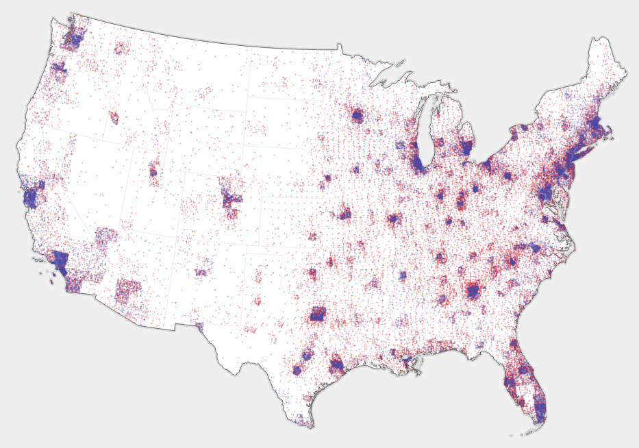

::: {style="font-size: 75%;"}
Kenneth Field

<https://www.esri.com/arcgis-blog/products/arcgis-pro/mapping/when-a-single-map-isnt-enough/>
:::

##

### Comparison of choropleth and dot density maps in Southern California

::::: columns
::: {.column width="50%"}

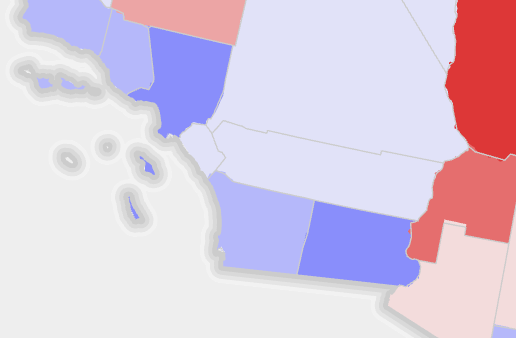

:::

::: {.column width="50%"}

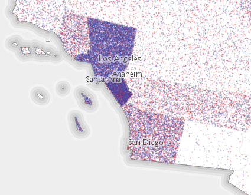
:::

::::: 

::: {style="font-size: 75%;"}
Kenneth Field

<https://www.esri.com/arcgis-blog/products/arcgis-pro/mapping/when-a-single-map-isnt-enough/>
:::

:::{.speaker-notes}
note how Los Angeles County and Imperial County look the same 
in the choropleth map, but very different in the dot density map
:::


##

### Dasymetric dot density map, diverging palette

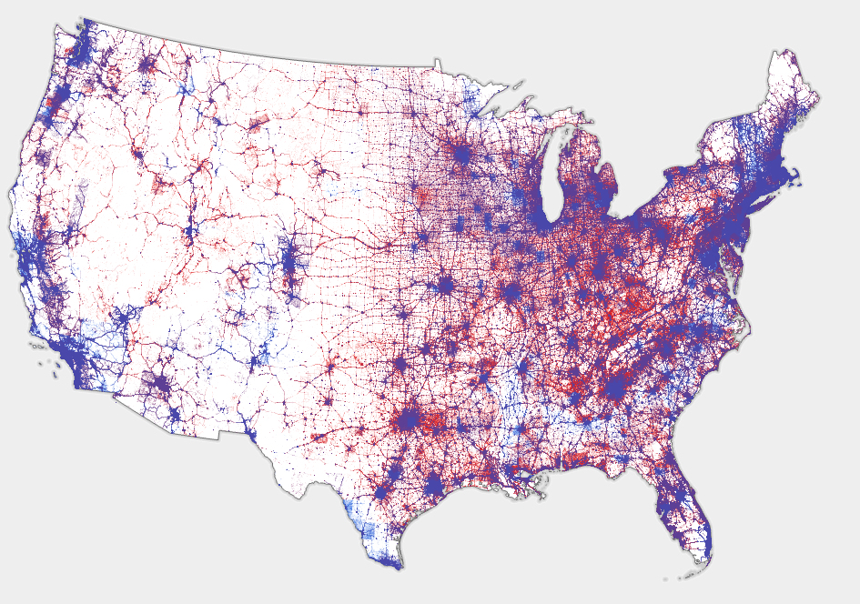

::: {style="font-size: 75%;"}
Kenneth Field

<https://www.esri.com/arcgis-blog/products/arcgis-pro/mapping/when-a-single-map-isnt-enough/>
:::

:::{.speaker-notes}
dasymetric plots are technically accurate but don't always allow for easy interpretation. how many people voted for which candidate and who got the most votes?
:::


##

### Comparison of dot density and dasymetric dot density maps in Southern California

::::: columns
::: {.column width="50%"}


:::

::: {.column width="50%"}

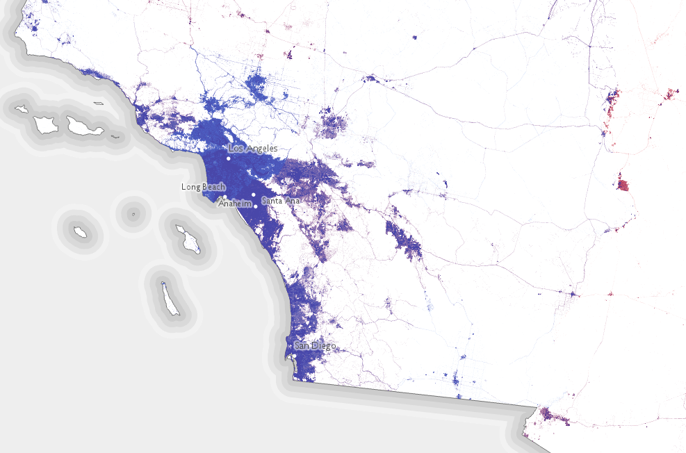
:::

::::: 

::: {style="font-size: 75%;"}
Kenneth Field

<https://www.esri.com/arcgis-blog/products/arcgis-pro/mapping/when-a-single-map-isnt-enough/>
:::


##

### Tesselated hex cartogram 

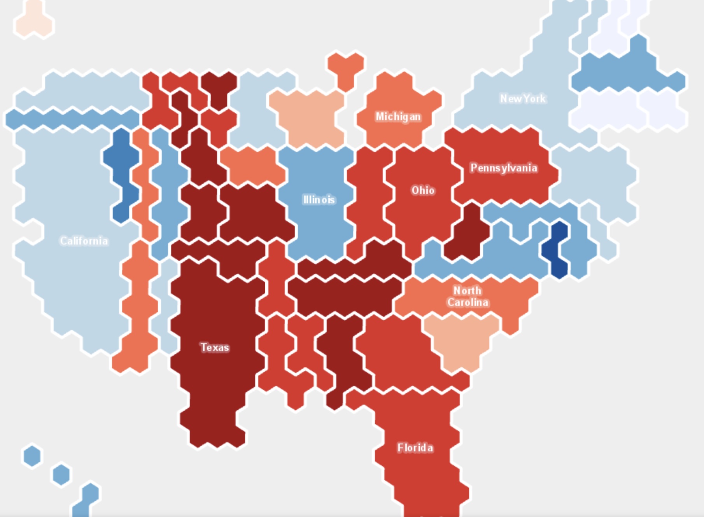

::: {style="font-size: 75%;"}
Kenneth Field

<https://www.esri.com/arcgis-blog/products/arcgis-pro/mapping/when-a-single-map-isnt-enough/>
:::


##

### Shape-preserving cartogram

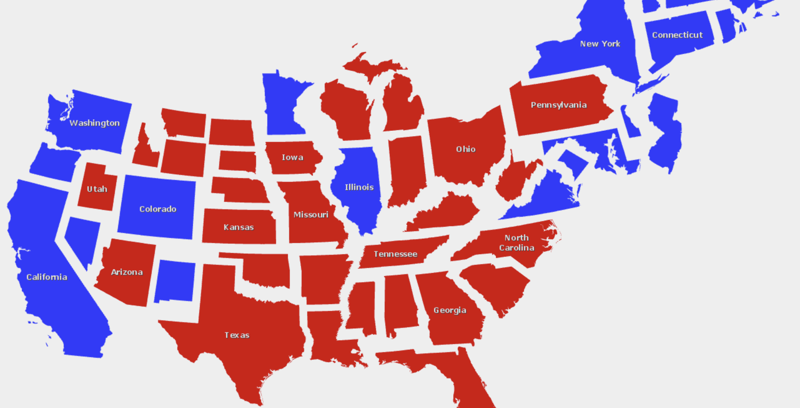

::: {style="font-size: 75%;"}
Kenneth Field

<https://www.esri.com/arcgis-blog/products/arcgis-pro/mapping/when-a-single-map-isnt-enough/>
:::

##

### Unique values vs choropleth

::::: columns
::: {.column width="50%"}
#### Unique values

- Uses color to show the value of a categorical (non-quantitative) variable across geographic or administrative areas. 

- Typically used for variables that have no ordering

:::

::: {.column width="50%"}

#### Choropleth

- Shows the values of a quantitative variable across geographic or administrative areas.

- Color may be continuously varying or categorized. Categorization usually preferred, but interpretations sensitive to choice of categorization

:::

::::: 

Warning for both: **if the variable represented by color does not account for area, the map may be misleading**

##

### Dot one-to-one vs Dot density 

::::: columns
::: {.column width="50%"}
#### Dot, one-to-one

- Map with dots representing actual data points at their locations (e.g. [John Snow's plot](https://psboonstra.github.io/PH345_W2026/Slides/Introduction/Introduction.html#/section-18))

- Point locations encode information

:::

::: {.column width="50%"}

#### Dot density

- Map of geographic or administrative areas with dots + color to represent quantities. 
 
- Dots are randomly distributed within areas and don't typically represent observations

:::

::::: 


##

### Dasymetric dot density vs Cartogram


::::: columns
::: {.column width="50%"}
#### Dasymetric dot density

- Extension of dot density plot where dots are placed in regions where the data are more likely to be found

- Requires anciliary data about population densities to determine where to place dots

- Difficult to quantify

:::

::: {.column width="50%"}

#### Cartogram

- Map where the size of geographic or administrative areas are distorted to represent quantities

- Requires anciliary data about the quantities to be represented

- Easier to quantify

:::

::::: 

##

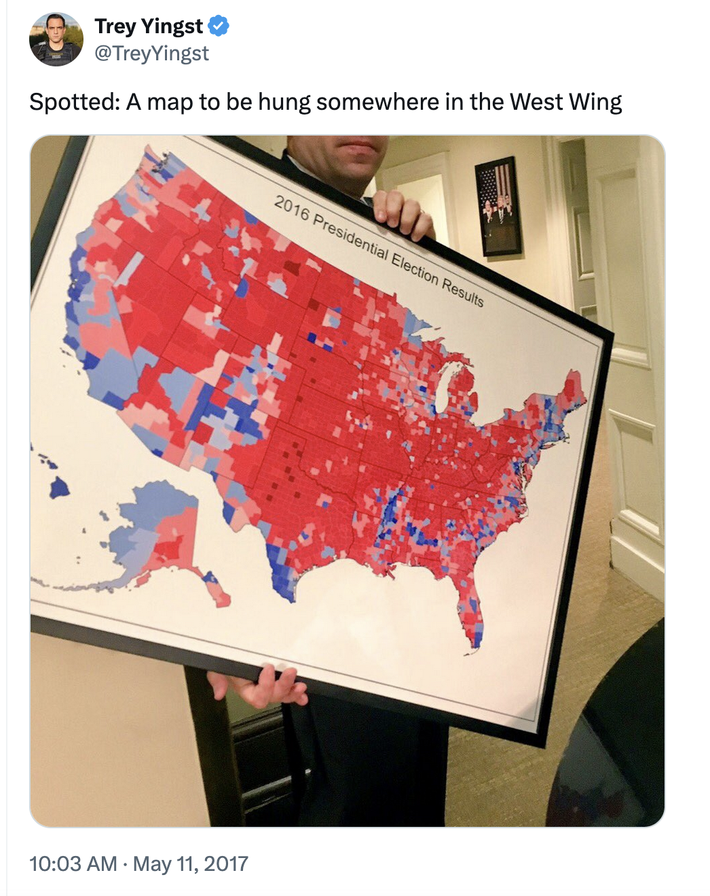

## Cholera, John Snow

::::: columns

::: {.column width="50%"}
{width=60%}

::: {style="font-size: 75%;"}
Public Domain, https://commons.wikimedia.org/w/index.php?curid=403227
:::

:::

::: {.column width="50%"}

British physician, a founder of modern epidemiology 

Gathered data to refute 'miasma theory' of diseases that disease spread through bad air

:::

:::::


## 

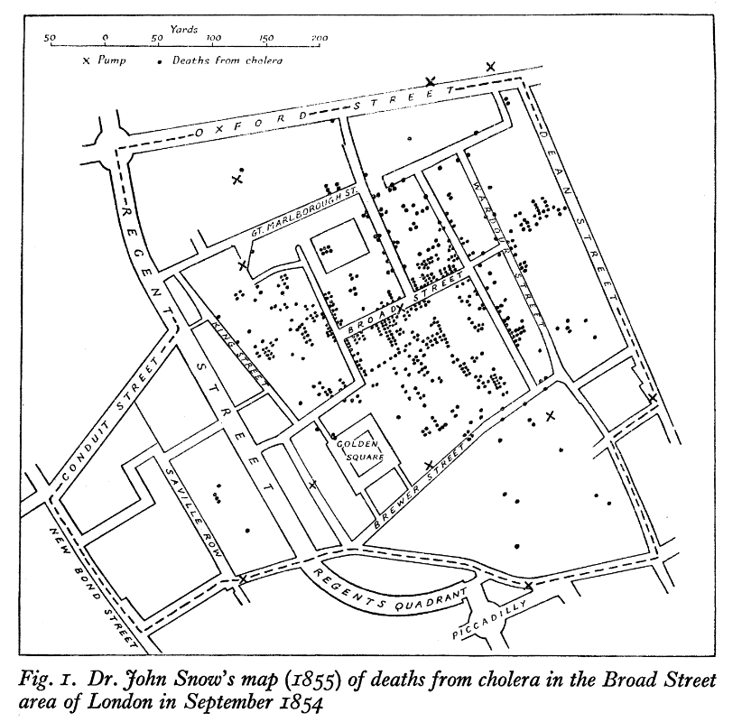{.nostretch width=100%}

::: {style="font-size: 75%;"}
Gilbert, 1958 <https://www.jstor.org/stable/pdf/1790244.pdf>
:::

## Clearing up some misconceptions

Although normally presented as strict-cause effect, truth is not as clear cut

- Cholera cases were already declining prior to removal
- Snow made his plot after removal of the handle

## Update: Handle is still gone


## 

*Choropleth map legend design for visualizing community health disparities* Cromley and Cromley (2009)

<https://ij-healthgeographics.biomedcentral.com/articles/10.1186/1476-072X-8-52>

Health disparity (low birthweight, lyme disease) analysis of 169 towns in Connecticut, USA. 

1. For each figure: how are the five colors determined/defined?

2. Using Figure 1, how many towns have a low birthweight percent of 7.9% or less?
<!-- 119, or 70.4% of the 169 towns -->

3. In Figure 3, about how many towns are shaded the darkest color blue? How would you
interpret a town shaded the darkest color blue in terms of low birthweight percent?
<!-- 33-34, or 20% of the 169 towns -->

4. From Figure 4, why are there so many towns with the lighted shade of blue?
<!-- Because the equal numerator classification puts approximately the same number of low birthweight births in each color class, and there are many towns with low numbers of low birthweight births -->

## {.nostretch}

### Low birthweight in Connecticut, 1998

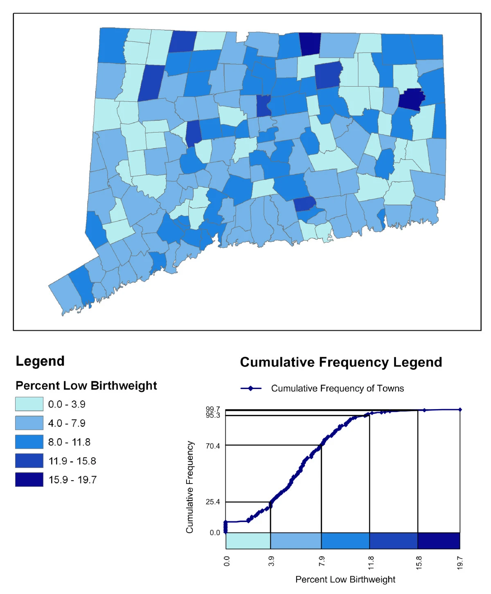{width=700}

> A choropleth map depicting the percent of low birthweight with alternative legend designs. An equal interval classification is used to portray the spatial distribution of the percent of low birthweight births by town in Connecticut. The bottom-left diagram is a standard legend connecting the colors in the map to the range of data they represent. The bottom-right diagram is a cumulative frequency legend that also depicts the cumulative percentage of towns associated with each data interval on the map.

::: {style="font-size: 75%;"}
Figure 1, Cromley and Cromley (2009)
:::

:::{.speaker-notes}
no new information in the cumulative density legend of Figure 1 -- they're just
precounting the colors so you don't have two
:::

## {.nostretch}

### Low birthweight in Connecticut, 1998

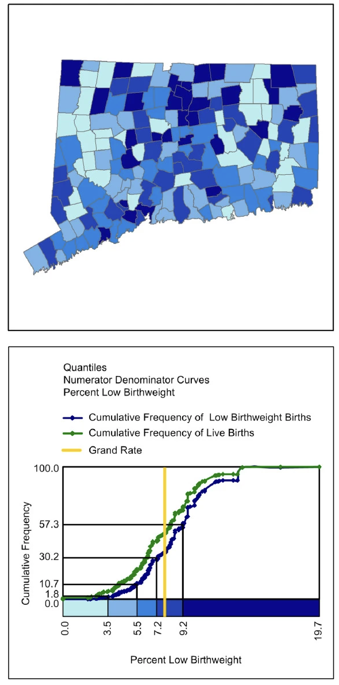{width=700}

> Choropleth maps with numerator/denominator cumulative frequency legends. A quantile classification in which an equal number of towns are in each data class is used to portray the spatial distribution of the percent of low birthweight births by town in Connecticut ... A numerator/denominator cumulative frequency legend associated with each map is presented beneath the respective map. In these legends, the cumulative frequency curve for numerator is given in blue and that for the denominator is given in green. The grand rate for each health outcome is given by a vertical yellow line that defines the maximum separation between the two curves for any value.

::: {style="font-size: 75%;"}
Figure 3, Cromley and Cromley (2009)
:::

:::{.speaker-notes}

:::


## {.nostretch}

### Low birthweight in Connecticut, 1998

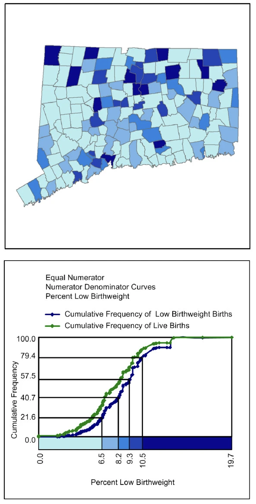{width=700}

> Choropleth maps of health outcomes using an equal numerator classification. In an equal numerator classification, approximately the same number of health outcome events are associated with each color representing a class interval in the map. This classification portrays the spatial distribution of the percent of low birthweight births by town in Connecticut... A numerator/denominator cumulative frequency legend associated with each map is presented beneath the respective map.

::: {style="font-size: 75%;"}
Figure 4, Cromley and Cromley (2009)
:::


## 

*Dot map cartograms for detection of infectious disease outbreaks: an application to Q fever, the Netherlands and pertussis, Germany* Soetens, et al. (2017)

<https://www.eurosurveillance.org/content/10.2807/1560-7917.ES.2017.22.26.30562#r8>


## Pertussis in Germany {.nostretch}

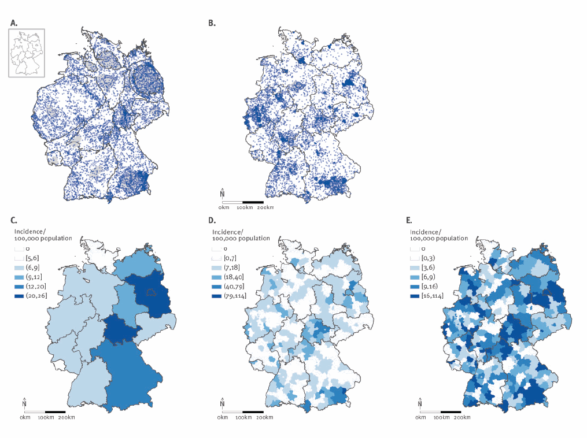{width=950}

::: {style="font-size: 75%;"}

A. Dot map cartogram. One blue dot represents one case, shaded grey areas indicate the national and federal capital municipalities. The geographical administrative units displayed as underlying layer are distorted as a result of building the cartograms.

B. Dot map. One blue dot represents one case, shaded grey areas indicate the national and federal capital municipalities.

C. Choropleth incidence map by federal state and Jenks’ natural breaks classification system.

D. Choropleth incidence map by district and Jenks’ natural breaks classification system.

E. Choropleth incidence map by district and the quantile classification system.

Figure 2, Soetens et al. (2017)
:::


## 

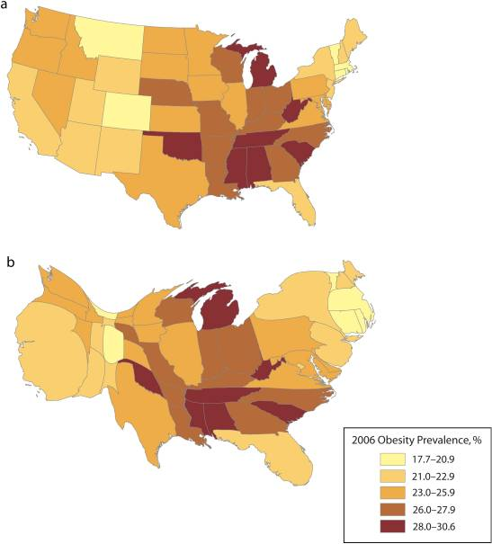

> Percentage of obese (body mass index ≥ 30 kg/m2) adults 18 years or older, by state in a (a) Choropleth map and (b) population cartogram: 2006.

::: {style="font-size: 75%;"}
Figure 1, Houle, et al. (2009)
:::


## Map Projections

You cannot project a three-dimensional surface onto a two-dimensional surface without distorting surface area or angles. 

Next three slides are choropleths of country-level maternal mortality rates using different projections. For each country, I am plotting each country's log-10 incidence of maternal mortality per 100,000 live births in the year 2000. 

Log-10 incidence of X means that the incidence of maternal mortality is 10^X per 100,000 live births. So X=2 is 100 per 100,000 live births, X=1 is 10 per 100,000 live births

## {.nostretch}

### World Geodetic System

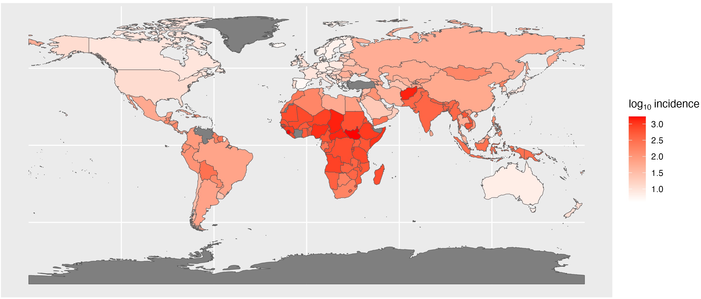{width=1000}

* x- and y-coordinates are raw longitude and latitude coordinates
* Does not preserve shape, area, or distances

## {.nostretch}

### Equal Earth Projection

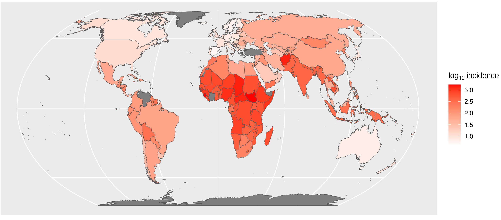{width=1000}

* Preserves size but distorts shape, especially near the poles

## {.nostretch}

### Web Mercator Projection

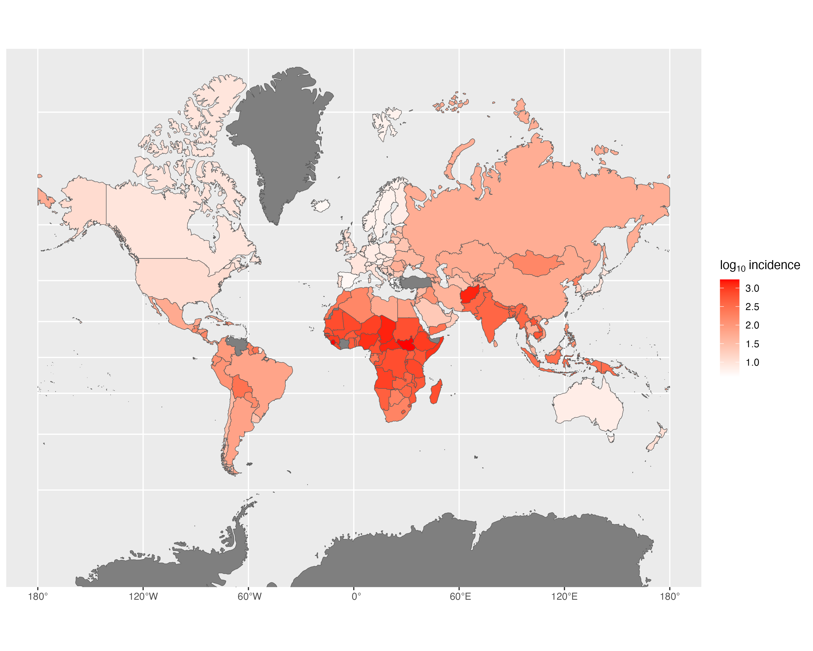{width=1000}

* Used in web mapping
* Preserves directions, angles, and shapes (locally)
* Area is (substantially) distorted

## {.nostretch}

### Locally Equidistant

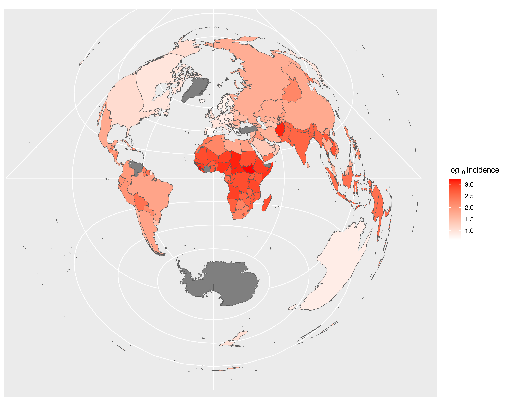{width=1000}

* Preserves distance and direction from center
* Distorts shape and area, especially near the edges

## Code

```{r}
#| echo: true
#| eval: false

library(tidy)
library(sf)
library(rnaturalearth)

read_csv("matmort_countries_long.csv")
world_sf <- ne_countries(scale = "medium", returnclass = "sf")

# Identify matches and approximate string matches between matmort and world_map region names:
matmort_regions <- unique(matmort_countries_long$country)
world_sf_regions <- unique(world_sf$name)

country_distances <- 
  # Quantify all pairwise string similarity between matmort_regions and world_map_regions:
  stringdist::stringdistmatrix(matmort_regions, world_sf_regions) %>%
  as.data.frame() %>%
  rownames_to_column(var = "worldbank_country") %>%
  pivot_longer(cols = -worldbank_country, 
               names_to = "world_sf_country", 
               values_to = "Dist") %>%
  # drop V from world_sf_country using stringr package:
  mutate(world_sf_country = str_remove(world_sf_country, "V")) %>%
  # insert country names:
  mutate(worldbank_country = matmort_regions[as.integer(worldbank_country)],
         world_sf_country = world_sf_regions[as.integer(world_sf_country)])

# Countries without an exact match
unmatched_worldbank_countries <- 
  country_distances %>% 
  group_by(worldbank_country) %>%
  mutate(exact_match = min(Dist) == 0) %>%
  ungroup() %>%
  filter(!exact_match) %>%
  distinct(worldbank_country) %>%
  arrange(worldbank_country) %>%
  pull()

unmatched_world_sf_countries <- 
  country_distances %>% 
  group_by(world_sf_country) %>%
  mutate(exact_match = min(Dist) == 0) %>%
  ungroup() %>%
  filter(!exact_match) %>%
  distinct(world_sf_country) %>%
  arrange(world_sf_country) %>%
  pull()

matmort_countries_long <- 
  matmort_countries_long %>%
  mutate(country = 
           # Match countries in 'unmatched_worldbank_countries'
           # by hand, using 'unmatched_world_sf_countries'
           case_when(
             country == "Antigua and Barbuda" ~ "Antigua and Barb.",
             country == "Bahamas, The" ~ "Bahamas",
             country == "Bosnia and Herzegovina" ~ "Bosnia and Herz.",
             country == "British Virgin Islands" ~ "British Virgin Is.",
             country == "Brunei Darussalam" ~ "Brunei",
             country == "Cayman Islands" ~ "Cayman Is.",
             country == "Central African Republic" ~ "Central African Rep.",
             country == "Channel Islands" ~ "Channel Is.",
             country == "Congo, Dem. Rep." ~ "Dem. Rep. Congo",
             country == "Congo, Rep." ~ "Congo",
             country == "Dominican Republic" ~ "Dominican Rep.",
             country == "Egypt, Arab Rep." ~ "Egypt",
             country == "Equatorial Guinea" ~ "Eq. Guinea",
             country == "Eswatini" ~ "eSwatini",
             country == "Faroe Islands" ~ "Faeroe Is.",
             country == "French Polynesia" ~ "Fr. Polynesia",
             country == "Gambia, The" ~ "Gambia",
             country == "Hong Kong SAR, China" ~ "Hong Kong",
             country == "Iran, Islamic Rep." ~ "Iran",
             country == "Korea, Dem. People's Rep." ~ "North Korea",
             country == "Korea, Rep." ~ "South Korea",
             country == "Kyrgyz Republic" ~ "Kyrgyzstan",
             country == "Lao PDR" ~ "Laos",
             country == "Macao SAR, China" ~ "Macao",
             country == "Marshall Islands" ~ "Marshall Is.",
             country == "Micronesia, Fed. Sts." ~ "Micronesia",
             country == "Northern Mariana Islands" ~ "N. Mariana Is.",
             country == "Russian Federation" ~ "Russia",
             country == "Sint Maarten (Dutch part)" ~ "Sint Maarten",
             country == "Slovak Republic" ~ "Slovakia",
             country == "Solomon Islands" ~ "Solomon Is.",
             country == "South Sudan" ~ "S. Sudan",
             country == "St. Lucia" ~ "Saint Lucia",
             country == "St. Martin (French part)" ~ "St-Martin",
             country == "St. Vincent and the Grenadines" ~ "St. Vin. and Gren.",
             country == "Syrian Arab Republic" ~ "Syria",
             country == "Turks and Caicos Islands" ~ "Turks and Caicos Is.",
             country == "Türkiye" ~ "Turkey",
             country == "United States" ~ "United States of America",
             country == "Venezuela, RB" ~ "Venezuela",
             country == "Viet Nam" ~ "Vietnam",
             country == "Virgin Islands (U.S.)" ~ "U.S. Virgin Is.",
             country == "West Bank and Gaza" ~ "West Bank",
             country == "Yemen, Rep." ~ "Yemen",
             # these are all the matched countries
             TRUE ~ country
           )) 

# Join matmort data with the world map
matmort_sf <- 
  full_join(world_sf, matmort_countries_long, by = c("name" = "country"))


# Plot using geom_sf 
# choose which projection you want by uncommenting out the appropriate
# st_transform() line
matmort_sf %>%
  # Keep only 2000 (countries with is.na(year) have no data on maternal mortality
  # and are therefore also kept
  filter(year %in% c(2000) | is.na(year)) %>% 
  # World Geodetic System 1984 (slide 28)
   st_transform(4326) %>% 
  # world equal area (slide 29)
  # st_transform(8857) %>% 
  # world mercator (slide 30)
  # st_transform(3857) %>% 
  # Azimuthal Equidistant centered at Ann Arbor (not plotted)
  # st_transform(crs = "+proj=aeqd +datum=WGS84 +lon_0=-83732124 +lat_0=42.279594 +x_0=0 +y_0=0 +units=m +no_defs") %>%
  # Azimuthal Equidistant centered at 0, 0 (slide 31)
  #st_transform(crs = "+proj=aeqd +datum=WGS84 +lon_0=0 +lat_0=0 +x_0=0 +y_0=0 +units=m +no_defs") %>%
  ggplot() +
  geom_sf(aes(fill = log10(incidence))) +
  scale_fill_gradient(name = expression(log[10]~incidence),low = "white", high = "red", na.value = "grey50")# +
  # Use this for the world mercator otherwise Antarctica looks even more ridiculous:
  #coord_sf(ylim = c(-1.3e7, 1.8e7)) 
  
```


## References

Cromley, R.G. and Cromley, E.K., 2009. Choropleth map legend design for visualizing community health disparities. International Journal of Health Geographics, 8, pp.1-11.

Houle, B., Holt, J., Gillespie, C., Freedman, D.S. and Reyes, M., 2009. Use of density-equalizing cartograms to visualize trends and disparities in state-specific prevalence of obesity: 1996–2006. American journal of public health, 99(2), pp.308-312.

Soetens, L., Hahné, S. and Wallinga, J., 2017. Dot map cartograms for detection of infectious disease outbreaks: an application to Q fever, the Netherlands and pertussis, Germany. Eurosurveillance, 22(26), p.30562.

