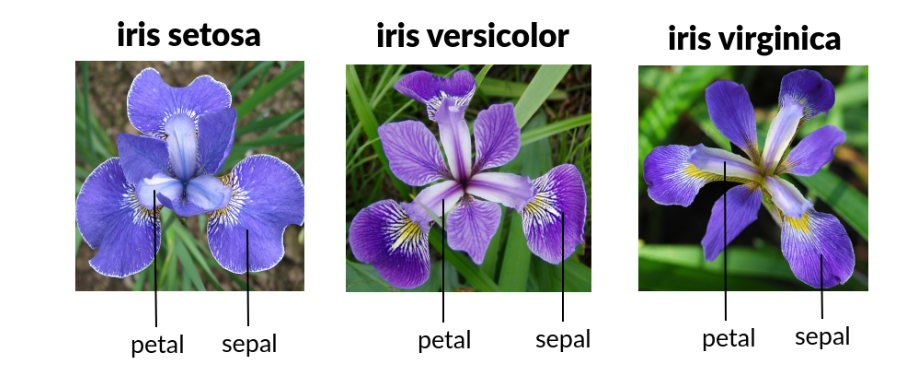
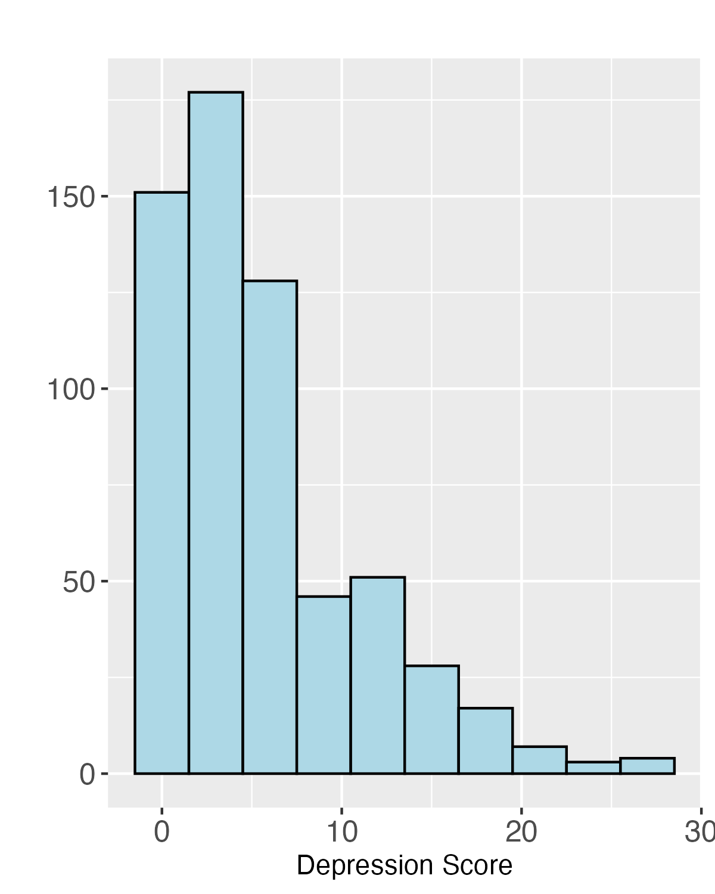

```{r}
library(tidyverse)
library(knitr)
library(cowplot)
library(ggrepel)
library(kableExtra)
# See here:https://arelbundock.com/posts/quarto_figures/index.html
knitr::opts_chunk$set(
  out.width = "70%", # enough room to breath
  fig.width = 6,     # reasonable size
  fig.asp = 0.618,   # golden ratio
  fig.align = "center" # mostly what I want
)
out2fig = function(out.width, out.width.default = 0.7, fig.width.default = 6) {
  fig.width.default * out.width / out.width.default
}
code_flag = FALSE;# Set to true and recompile after class

```

## Today's Outline

-   Introduction & Learning Objectives
-   Two Case Studies
-   Visualizing a Linear Regression Model
-   Code Together Task

## Personal Introduction

-   PhD candidate in the Dept. of Biostatistics

-   **Interests include:** cancer biostatistics, survival analysis, multiple imputation, and multi-state models, and teaching

-   **Hobbies:** Cooking, Hiking, Volleyball, Traveling

    ::: columns
    ::: {.column width="50%"}
    {width="398"}
    :::

    ::: {.column width="50%"}
    {width="290"}
    :::
    :::

## Learning Objectives

1.  Compare and contrast the strengths of tables and figures for presenting results from statistical models
2.  Differentiate between descriptive and inferential plots
3.  Recognize the importance of communicating uncertainty in inferential plots
4.  Describe types of plots that can be used to visualize results from statistical models
5.  Use R to visualize results from a linear regression model

## Motivation

-   Statistical models are ubiquitous in public health research

    -   Linear Regression Models *(continuous outcomes)*
    -   Logistic Regression Models *(binary outcome)*
    -   Cox Proportional Hazards Models *(time-to-event outcomes)*
    -   Meta-analyses
    -   Many more...

-   Communicating results to stakeholders is an important part of the modeling process

-   Visualizations can often present results in a manner that is more digestible than tables or other summaries

## Case Study #1
-   **Do cancer outcomes improve when immunotherapy treatment is given in the morning?**
-   small observational studies have been conducted to answer this question
-   Landre et al (2024) conducted a meta-analysis to answer this question more definitively than any given single study


## Case Study #1 Cont.


What information is easily accessible from the forest plot that is difficult to ascertain from the table?

## Case Study #2

[Results](https://drkebede.medium.com/plotting-regression-model-coefficients-in-a-forest-plot-cada8a51e4d2) from a multiple linear regression exploring the impact of country-level variables on average life expectancy.

{width="664"}

What is the first thing that stands out to you in this plot?

Which of Tufte's principles of graphical excellence does this violate?


## Activity: Descriptive vs Inferential Plots

- **Previously**: Focus was on visualization tools that display data in its raw form
- **Today**: Focus on visualization tools that display results from statistical modeling

Can you think of similarities and differences between these two types of plots?


## Activity: Recap

**Descriptive Plots:**

```{r}
#| echo: false
#| results: 'asis'
if (code_flag) {
  cat("
  - boxplots, histograms show distribution of observed data
  - scatter plots show relationship between two continuous variables

How can we use the color, shapes, and other aesthetics to best convey information contained within the data?\n")
}
```


**Inferential Plots:**

```{r}
#| echo: false
#| results: 'asis'
if (code_flag) {
  cat("
  - parameter estimates (i.e. regression coefficients)
  - uncertainty in estimation (i.e. confidence bands)
  - predicted values

How can we use the color, shapes, and other aesthetics to best convey the results of statistical modeling?\n")
}
```


## Liner Regression Example

-   **Research Question:** What is the relationship between sepal width and sepal length in the irises and does the relationship differ between species?

[](https://medium.com/@snehalw/building-a-flask-based-iris-flower-classification-model-from-prediction-to-deployment-c3903f245701)

## Exploratory Data Analysis

::: panel-tabset
### Plot

```{r}
#| label: exploratory

#Filter out observations from the Versicolor Species
iris <- iris %>% filter(Species != "versicolor") %>%
  mutate(Species = as.factor(Species))

#Plot sepal width by sepal length colored by species
ggplot(iris, aes(x = Sepal.Length, y=Sepal.Width, color = Species, shape=Species)) + 
  geom_point(size = 2.5) +
  xlab("Sepal Length (L)") +
  ylab("Sepal Width (W) ") +
  theme(plot.title = element_text(size = 20, face = "bold"),
        axis.title = element_text(size = 18),
        axis.text = element_text(size = 15),
        legend.title = element_text(size = 18),
        legend.text = element_text(size = 15),
        legend.key.size = unit(1, "cm"))
```

### R Code

```{r}
#| label: exploratory
#| echo: true
#| eval: false
```
:::

## Linear Regression Model

$$ W_i = \beta_0 + \beta_1L_i + \beta_2\text{Setosa}_i + \beta_3L_i\text{Setosa}_i + \epsilon_i $$

-   When Species = Setosa, $W_i = (\beta_0 + \beta_2) + (\beta_1+\beta_3)L_i + \epsilon_i$

-   When Species = Virginica, $W_i = \beta_0 + \beta_1L_i + \epsilon_i$

```{r}
#| label: linear_model
#| eval: true
#| echo: true

#Set the reference level of Species to virginica
iris$Species <- relevel(iris$Species, ref = "virginica")

#Fit a linear regression model
irisModel <- lm(Sepal.Width ~ Sepal.Length*Species, data = iris)
results <- summary(irisModel)$coefficients
```

## Model Results

-   When Species = Setosa, $W_i = (\beta_0 + \beta_2) + (\beta_1+\beta_3)L_i + \epsilon_i$

-   When Species = Virginica, $W_i = \beta_0 + \beta_1L_i + \epsilon_i$

$\beta_3 = 0.5666 > 0$, so the slope of the regression line for Setosa is greater than the slope for Virginica.

```{r}
#| fig-align: "center"
#| eval: true
#| echo: false

rownames(results) <- c("Intercept (B0)", "Sepal Length (B1)", "Setosa (B2)", "Sepal Length:Setosa (B3)")

results %>%
  kableExtra::kbl(digits = 4) %>% 
  kableExtra::kable_classic() %>%
  row_spec(4, background="yellow")
```

## Vizualize Results

::: panel-tabset
### Plot

```{r}
#| label: results

#Set the reference level of Species to back to setosa for plotting
iris$Species <- relevel(iris$Species, ref = "setosa")

#Plot sepal width by sepal length colored by species
#Add regression lines with confidence intervals
ggplot(iris, aes(x = Sepal.Length, y=Sepal.Width, color = Species, shape=Species)) + 
  geom_point(size = 2) +
  geom_smooth(method = "lm", se = TRUE, fullrange = TRUE) +
  xlab("Sepal Length") +
  ylab("Sepal Width") +
  theme(plot.title = element_text(size = 20, face = "bold"),
        axis.title = element_text(size = 18),
        axis.text = element_text(size = 15),
        legend.title = element_text(size = 18),
        legend.text = element_text(size = 15),
        legend.key.size = unit(1, "cm"))

```

### R Code

```{r}
#| label: results
#| echo: true
#| eval: false
```
:::

## Vizualize Results

It is best not to extrapolate the model fit

::: panel-tabset
### Figure

```{r}
#| label: extrapolation

#Plot sepal width by sepal length colored by species
#Add regression lines with confidence intervals
#Restrict confidence bands to range of observed data
ggplot(iris, aes(x = Sepal.Length, y=Sepal.Width, color = Species, shape=Species)) + 
  geom_point(size = 2) +
  geom_smooth(method = "lm", se = TRUE, fullrange = FALSE) +
  xlab("Sepal Length") +
  ylab("Sepal Width") +
  theme(plot.title = element_text(size = 20, face = "bold"),
        axis.title = element_text(size = 18),
        axis.text = element_text(size = 15),
        legend.title = element_text(size = 18),
        legend.text = element_text(size = 15),
        legend.key.size = unit(1, "cm"))

```

### R Code

```{r}
#| label: extrapolation
#| echo: true
#| eval: false
```
:::

## Add Prediction Intervals

::: panel-tabset
### Figure

```{r}
#| label: predictions

mod <- lm(Sepal.Width ~ Sepal.Length*Species, data = iris)
predictions <- predict(mod, interval = "prediction")
iris_2 <- cbind(iris, predictions)

ggplot(iris_2, aes(x = Sepal.Length, y=Sepal.Width, color = Species, shape=Species)) + 
  geom_point(size = 2) +
  geom_smooth(method = "lm", se = TRUE, fullrange = FALSE) +
  geom_line(aes(y = lwr)) +
  geom_line(aes(y = upr)) +
  xlab("Sepal Length") +
  ylab("Sepal Width") +
  theme(axis.title = element_text(size = 18),
        axis.text = element_text(size = 15),
        legend.title = element_text(size = 18),
        legend.text = element_text(size = 15),
        legend.key.size = unit(1, "cm"))

```

### R Code

```{r}
#| label: predictions
#| echo: true
#| eval: false
```
:::

## Code Together Dataset {.r-fit-text}

Data were collected as part of an observational study of stroke patients.

-   explored the association between psychological factors (depression, optimism, fatalism, and spirituality) and stoke outcomes

-   we will consider the outcome variable **Depression** as it relates to other psychological and demographic factors.

*Morgenstern, L. B., et al (2011). [Fatalism, optimism, spirituality, depressive symptoms, and stroke outcome: a population-based analysis.](https://www.ahajournals.org/doi/10.1161/STROKEAHA.111.625491?url_ver=Z39.88-2003&rfr_id=ori:rid:crossref.org&rfr_dat=cr_pub%20%200pubmed) Stroke, 42(12), 3518–3523. https://doi.org/10.1161/STROKEAHA.111.625491*

## 

::: columns
::: {.column width="50%"}

:::

::: {.column width="50%"}
**Key Variable Names:**

-   Depression

-   Fatalism

-   Db

-   Age_less_eq54

-   Age_55to64

-   Age_65to74

-   Age_ge75
:::
:::

## Code Together Task

**No Spice:** Recreate my plot from slide 16, but using the stroke dataset with *Fatalism* as the independent variable, *Depression* as the dependent variable and *Db* (diabetes status) as the grouping variable.

**Weak Sauce:** Add prediction intervals to the plot above.

**Medium Spice:** No menu options today.

**Yoga Flame:** No menu options today.

**Dim Mak:** Similar to the example on slide 7, create a forest plot that shows the effect of *Fatalism* on *Depression* score *in different age groups*. You can find age group variables already in the dataset.

## Hints for Dim Mak

-   You can fit a linear model separately using data from each of the four age groups.
-   Create a dataframe consisting of the effect estimates and standard errors.
-   Calculate 95% CI using the formula (estimate +/- 1.96\*SE).
-   Use the `ggplot2` package and `geom_point` along with the `geom_segment` function to make your plot.

## Solution: No Spice

::: panel-tabset
### Plot

```{r}
#| label: noSpice

stroke <- read.csv("stroke.csv")

#Visualize the relationship between depression and fatalism by diabetes status
ggplot(aes(x=Fatalism, y=Depression, color=factor(Db), shape=factor(Db)), data = stroke) +
  geom_point() +
  geom_smooth(method = "lm", full_range = FALSE, se = TRUE) + 
  labs(title = "Regression Analysis of Depression Score by Fatalism and Diabetes Status", x = "Fatalism", y = "Depression Score") +
  scale_color_discrete(name = "Diabetes Status") +
  scale_shape_discrete(name = "Diabetes Status")

```

### R Code

```{r}
#| label: noSpice
#| echo: !expr code_flag
#| eval: false
```
:::

## Solution: Weak Sauce

::: panel-tabset
### Plot

```{r}
#| label: weakSauce

stroke <- read.csv("stroke.csv")

#Fit linear model to obtain prediction intervals
mod <- lm(Depression ~ Fatalism*Db, data = stroke)
predictions <- predict(mod, interval = "prediction")
stroke_2 <- cbind(stroke, predictions)

#Add prediction intervals to the plot with geom_line
ggplot(stroke_2, aes(x = Fatalism, y=Depression, color = factor(Db), shape=factor(Db))) + 
  geom_point(size = 2) +
  geom_smooth(method = "lm", se = TRUE, fullrange = FALSE) +
  geom_line(aes(y = lwr)) +
  geom_line(aes(y = upr)) +
  xlab("Fatalism") +
  ylab("Depression Score") +
  ggtitle("Regression Analysis of Depression Score by Fatalism and Diabetes Status") +  
  scale_color_discrete(name = "Diabetes Status") +
  scale_shape_discrete(name = "Diabetes Status")

```

### R Code

```{r}
#| label: weakSauce
#| echo: !expr code_flag
#| eval: false
```
:::

## Solution: Dim Mak

::: panel-tabset
### Plot

```{r}
#| label: dimMak

stroke <- read.csv("stroke.csv")

#Initialize vectors to save results for each of the age groups
age_group = c("Age <= 54", "Age 55-64", "Age 65-74", "Age >= 75")
estimate = c()
se = c()

#Fit linear models in each of the four age groups, save Estimates and SEs
data1 <- filter(stroke, Age_less_eq54 == 1)
mod1 <- lm(Depression ~ Fatalism, data = data1)
estimate <- summary(mod1)$coefficients["Fatalism", "Estimate"]
se <- summary(mod1)$coefficients["Fatalism", "Std. Error"]

data2 <- filter(stroke, Age_55to64 == 1)
mod2 <- lm(Depression ~ Fatalism, data = data2)
estimate <- c(estimate, summary(mod2)$coefficients["Fatalism", "Estimate"])
se <- c(se, summary(mod2)$coefficients["Fatalism", "Std. Error"])

data3 <- filter(stroke, Age_65to74 == 1)
mod3 <- lm(Depression ~ Fatalism, data = data3)
estimate<- c(estimate, summary(mod3)$coefficients["Fatalism", "Estimate"])
se <- c(se, summary(mod3)$coefficients["Fatalism", "Std. Error"])

data4 <- filter(stroke, Age_ge75 == 1)
mod4 <- lm(Depression ~ Fatalism, data = data4)
estimate<- c(estimate, summary(mod4)$coefficients["Fatalism", "Estimate"])
se <- c(se, summary(mod4)$coefficients["Fatalism", "Std. Error"])

#Create dataframe to use for plotting and calculate 95% CI from SEs
plot <- data.frame(age_group, estimate, se) %>%
  mutate(lwr = estimate - 1.96*se, upr = estimate + 1.96*se)

#Make sure the age groups show up in the right order on our plot
plot$age_group <- factor(plot$age_group, levels = c("Age <= 54", "Age 55-64", "Age 65-74", "Age >= 75"), ordered=TRUE)

#Make the forest plot!
ggplot(data=plot, aes(x=estimate, y=age_group)) +
  geom_point(size = 2) + 
  geom_segment(aes(x=lwr, xend=upr)) +
  labs(title = "Effect of Fatalism on Depression Score by Age Group", x = "Estimate", y = "Age Group") + 
  xlim(-0.8, 0.8) +
  geom_vline(xintercept = 0, linetype = "dashed", color="red")

```

### R Code

```{r}
#| label: dimMak
#| echo: !expr code_flag
#| eval: false
```

:::

## References

-   Landré, T., Karaboué, A., Buchwald, Z. S., Innominato, P. F., Qian, D. C., Assié, J. B., Chouaïd, C., Lévi, F., & Duchemann, B. (2024). Effect of immunotherapy-infusion time of day on survival of patients with advanced cancers: a study-level meta-analysis. ESMO open, 9(2), 102220. https://doi.org/10.1016/j.esmoop.2023.102220

-   Kebede, Mihiretu M. “Plotting Regression Model Coefficients in a Forest Plot.” Medium, 10 June 2021.

-   Morgenstern, L. B., Sánchez, B. N., Skolarus, L. E., Garcia, N., Risser, J. M., Wing, J. J., Smith, M. A., Zahuranec, D. B., & Lisabeth, L. D. (2011). Fatalism, optimism, spirituality, depressive symptoms, and stroke outcome: a population-based analysis. Stroke, 42(12), 3518–3523. https://doi.org/10.1161/STROKEAHA.111.625491
