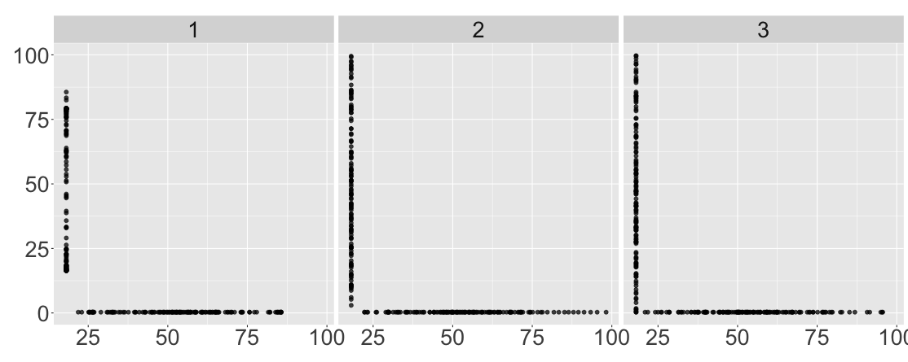
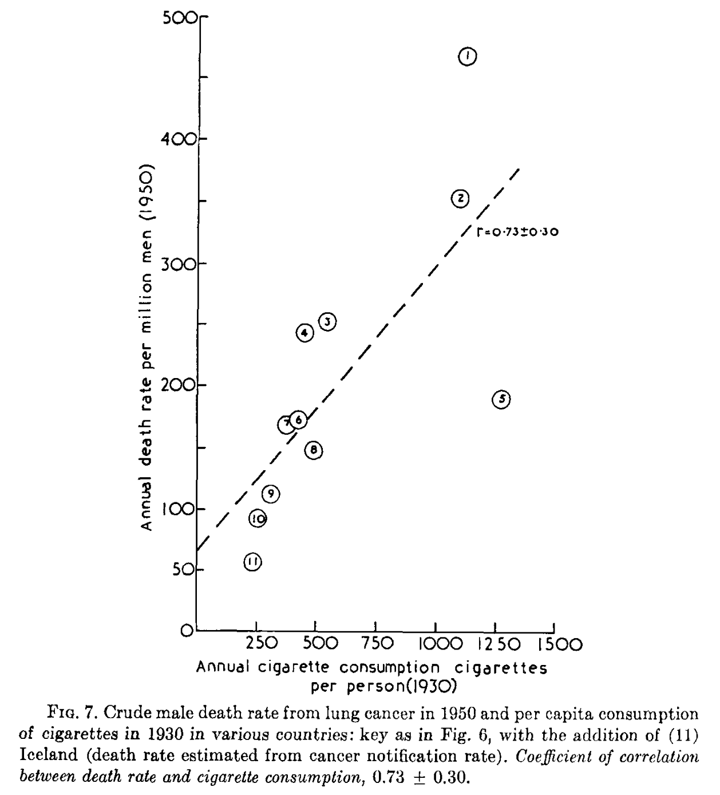
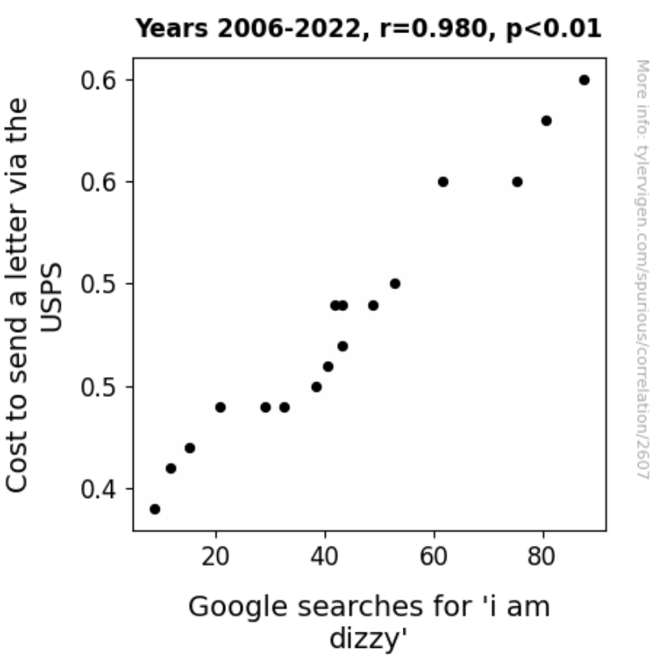
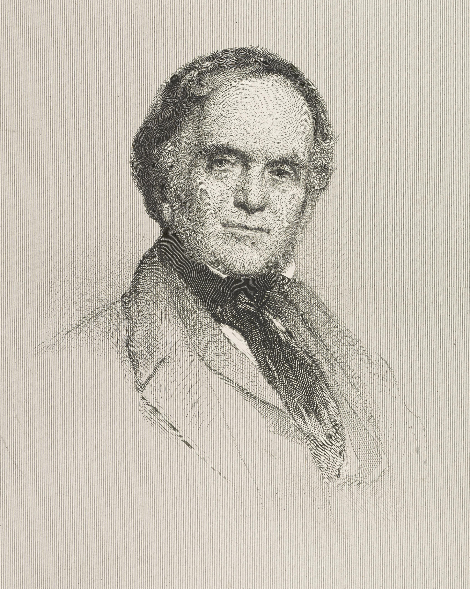
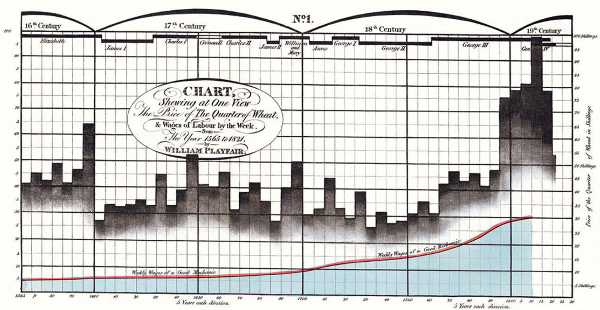
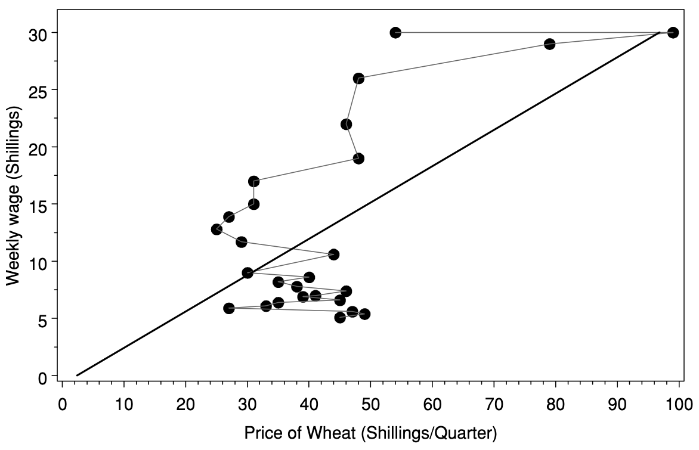
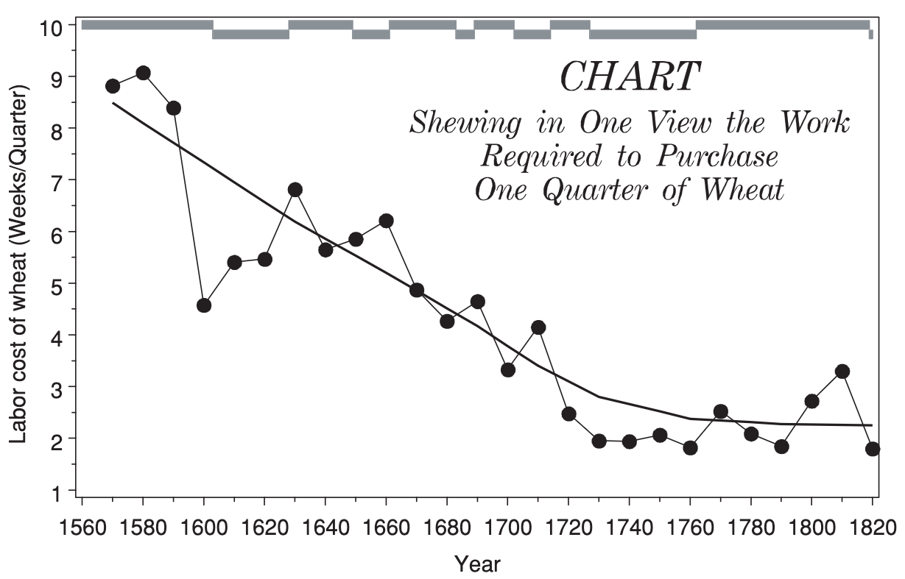
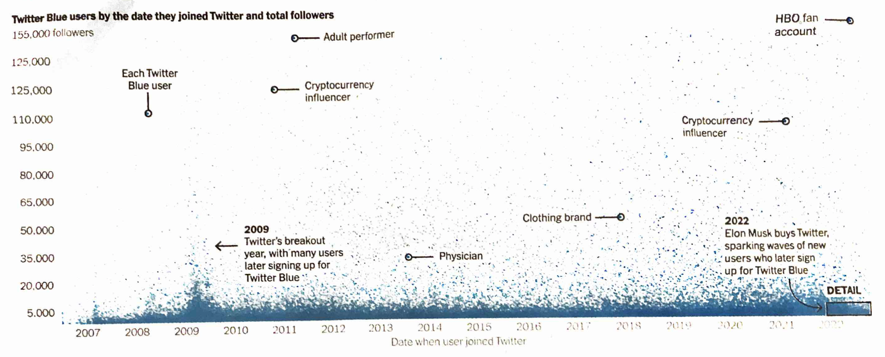

```{r}
library(datasauRus)
library(tidyverse)
library(knitr)
library(kableExtra)
library(gganimate)
# See here:https://arelbundock.com/posts/quarto_figures/index.html
knitr::opts_chunk$set(
  out.width = "70%", # enough room to breath
  fig.width = 6,     # reasonable size
  fig.asp = 0.618,   # golden ratio
  fig.align = "center" # mostly what I want
)
out2fig = function(out.width, out.width.default = 0.7, fig.width.default = 6) {
  fig.width.default * out.width / out.width.default 
}
code_flag = TRUE;# Set to true and recompile after class

```

## Edward R Tufte (1942-)

::::: columns
::: {.column width="50%"}
American political scientist, statistician, and professor emeritus at Yale University

'Godfather' of data visualization and visual presentation of information

Author of Visual Display of Quantitative Information (2001)
:::

::: {.column width="50%"}
{width="50%"}

::: {style="font-size: 75%;"}
Photo by Keegan Peterzell - Own work, CC BY-SA 4.0, <https://commons.wikimedia.org/w/index.php?curid=40367115>
:::

:::

:::::

## Nine principles of graphical excellence

1. Show the data
2. Induce the viewer to think about the substance 
3. Be integrated with the statistical and verbal descriptions of data
4. Avoid distorting what the data say
5. Present many numbers in small space
6. Make large data sets coherent
7. Reveal the data at several levels of detail, from broad overview to fine structure
8. Encourage comparison between different pieces of data
9. Serve clear purpose: description, exploration, tabulation or decoration


## Graphical excellence

*1. Show (all) the data*

## Three datasets

```{r, message = FALSE}
# 1. Prepare Data
base_data <- datasaurus_dozen %>%
  filter(dataset %in% c("circle", "dino", "slant_down")) %>%
  mutate(dataset2 = factor(dataset) %>% as.numeric() %>% factor()) %>%
  mutate(point_id = row_number())

```

```{r}
base_data %>%
  group_by(dataset2) %>%
  summarise(n = n(), 
            mean.x = mean(x), sd.x = sd(x),
            mean.y = mean(y), sd.y = sd(y),
            cor.xy = cor(x, y)) %>%
  mutate(across(c(mean.x, mean.y, sd.x, sd.y), \(x) round(x, 1)), 
         cor.xy = round(cor.xy, 2),
         n = round(n, 0)) %>%
  pivot_longer(cols = n:cor.xy) %>% 
  mutate(value = as.character(value)) %>%
  pivot_wider(id_cols = name, names_from = dataset2, values_from = value) %>%
  kable(col.names = c("", 1:3)) %>%
  #kable_styling(font_size = 10) %>%
  add_header_above(c(" " = 1, "Dataset" = 3))
```

## 

```{r}
# CALCULATE BOUNDS: Find the edges of the data so we don't zoom out to 0
min_x <- min(base_data$x)
min_y <- min(base_data$y)

# 2. Construct the Animation States
anim_data <- bind_rows(
  # State 1: Univariate (Split)
  base_data %>% 
    mutate(state = "1. Univariate",
           anim_x = x,
           anim_y = min_y, # Collapse Y to the bottom edge of the DATA
           group_id = paste0(point_id, "_x")), 
  
  base_data %>% 
    mutate(state = "1. Univariate",
           anim_x = min_x, # Collapse X to the left edge of the DATA
           anim_y = y,
           group_id = paste0(point_id, "_y")),
  
  # State 2: Bivariate (Joint)
  base_data %>% 
    mutate(state = "2. Bivariate",
           anim_x = x,
           anim_y = y,
           group_id = paste0(point_id, "_x")),
  
  base_data %>% 
    mutate(state = "2. Bivariate",
           anim_x = x,
           anim_y = y,
           group_id = paste0(point_id, "_y")) 
)
```

```{r}
#| fig-asp: 0.4
#| out-width: 130%
#| fig-width: 11.14286

ggplot(anim_data %>% filter(state == "1. Univariate"), aes(x = anim_x, y = anim_y, group = group_id)) +
  geom_point(size = 2, alpha = 1) + 
  facet_wrap(vars(dataset2), ncol = 3) +
  theme(text = element_text(size = 24),
        legend.position = "none") + 
  labs(y = NULL, x = NULL)

```

## 

```{r}
#| echo: false
#| fig-asp: 0.4
#| out-width: 120%
#| fig-width: 11.14286

```

##

```{r}
#| fig-asp: 0.4
#| out-width: 140%
#| fig-width: 12
#| #| out.extra: "style='max-width: none; margin-left: -20%;'"
ggplot(anim_data %>% filter(state == "2. Bivariate"), aes(x = anim_x, y = anim_y, group = group_id)) +
  geom_point(size = 2, alpha = 1) + 
  facet_wrap(vars(dataset2), ncol = 3) +
  theme(text = element_text(size = 24),
        legend.position = "none") + 
  labs(y = NULL, x = NULL)
```

## 

```{r}
#| label: datasaurus_dozen
#| out-width: 130%
#| fig-width: 11.14286
# Install packages if needed: 
# install.packages("datasauRus"); install.packages("tidyverse")
# Load packages
library(datasauRus); library(tidyverse);
ggplot(data = datasaurus_dozen) +
  geom_point(mapping = aes(x = x, y = y)) +
  facet_wrap(facets = vars(dataset), ncol = 5) +
  labs(x = NULL, y = NULL) + 
  theme(text = element_text(size = 18)) 
```

## 

All datasets have the nearly equal summary statistics:

-   number of observations
-   mean of x and y
-   standard deviation of x and y
-   correlation between x and y (and same regression of y on x)

## 

```{r}
datasaurus_dozen %>% 
  group_by(dataset) %>% 
  group_modify(~ enframe(coef(lm(y ~ x, data = .x)))) %>% 
  pivot_wider(id_cols = dataset) %>%
  mutate(across(where(is.numeric), \(x) formatC(x, format = "f", 2))) %>%
  kable(col.names = c("Dataset","Intercept", "Slope"))
```

## 

```{r}
#| out-width: 130%
#| fig-width: 11.14286
ggplot(datasaurus_dozen) +
  geom_point(aes(x = x, y = y), size = 1) +
  geom_smooth(aes(x = x, y = y), color = "red", linetype = "longdash", method = "lm", se = FALSE) + 
  facet_wrap(vars(dataset), ncol = 5) +
  labs(x = NULL, y = NULL) + 
  guides(color = "none") +
  theme(text = element_text(size = 18)) 
```

## Graphical excellence

*2. Induce the viewer to think about the substance*

## Scatterplots are simplest bivariate plots

Steps:

1.  Set of paired numbers $(x_i, y_i)$ where $i$ indexes pairs, e.g. $(x_1, y_1)$ is first pair, $(x_2, y_2)$ is second pair, etc.

2.  Place points on a cartesian coordinate system. Labeling of points reflects assumption that $x_i$ goes on the x-axis, $y_i$ goes on y-axis

    * $x_i$ sometimes called explanatory, independent, or predictor variable
    * $y_i$ sometimes called response, dependent, or outcome variable

## Ex 1: Lung cancer, cigarettes

::::: columns
::: {.column width="30%"}
Lung-cancer deaths per million in 1950 ($y$) against annual per-capita cigarette consumption in 1930 ($x$) for 11 countries.

:::

::: {.column width="60%"}
{width="80%"}
:::
:::::

::: {style="font-size: 75%;"}
Figure 7 (Doll, 1955)
:::

## Graphical excellence

*3. Be integrated with the statistical and verbal descriptions of data*

*4. Avoid distorting what the data say*

## Scatterplots imply a relationship

::::: columns
::: {.column width="40%"}
So don't create a scatterplot if you don't want to imply a relationship.
:::

::: {.column width="60%"}
{width="80%"}
:::
:::::

::: {style="font-size: 75%;"}
<https://www.tylervigen.com/spurious-correlations>
:::

## Poor choice of scale


{width="60%"}
{width="60%"}

::: {style="font-size: 75%;"}
Figures 3.6 (top) and 3.5 (bottom), Wilke (2019)
:::


## Dependent vs Independent Variables

Two main types of scatterplots:

1.  $x$ and $y$ are both uncontrolled. Goal is to show whether they are co-varying

2.  $x$ is controlled or "independent" variable, e.g. time, age, dose, or an experimentally controlled variable.


## William Playfair (1759-1823)

::::: columns
::: {.column width="50%"}

Scottish engineer, economist, proto-government-spy, and many other things

> When he wasn’t blackmailing lords and being sued for libel, William Playfair invented the pie chart, the bar graph, and the line graph

Cara Giamo, 2016

::: {style="font-size: 75%;"}
<https://www.atlasobscura.com/articles/the-scottish-scoundrel-who-changed-how-we-see-data>
:::
:::

::: {.column width="50%"}
{width="50%"}

::: {style="font-size: 75%;"}
<https://en.wikipedia.org/wiki/William_Henry_Playfair#/media/File:William-playfair.jpg>, Public Domain
:::

:::

:::::


## Ex 2: Playfair's graph of prices, wages, and British monarchs

{width="80%"}

> Never at any former time was wheat so cheap, in proportional to mechanical labor, as it is in the present time (Playfair)

::: {style="font-size: 75%;"}
Figure 3, Friendly and Denis (2005); Originally from Tufte, p34
:::

```{r, echo = FALSE}
# price of a quarter of wheat, in shillings
# weekly wage for a good mechanic, in shillings
# the ruling British monarch at the time
# Two separate variables plotted against time
```

## Modernization Attempt 1

### "Pure" scatterplot

{width="80%"}

Direct scatterplot of wheat price and wage, connected by consecutive years

::: {style="font-size: 75%;"}
Figure 5, Friendly and Denis (2005)
:::

## Modernization Attempt 2

### Create new variable

{width="80%"}

Now very easy to see Playfair's claim about inflation-adjusted price of wheat. Statistical graphics should reveal data (Tufte, p13)

::: {style="font-size: 75%;"}
Figure 5, Friendly and Denis (2005)
:::

## Graphical excellence

*5. Present many numbers in small space*

*6. Make large data sets coherent*

*7. Reveal the data at several levels of detail, from broad overview to fine structure*

## Ex 3: Temperature anomalies

Land and ocean anomalies from 1850 to 2024 with respect to the 1901-2000 average

Separate data for northern and southern hemispheres

## Northern hemisphere

```{r}
#| message: false
#| echo: false
temps_southern <- read_csv("../../../GlobalTemps/temp_southern.csv")
temps_northern <- read_csv("../../../GlobalTemps/temp_northern.csv")
```

::: panel-tabset
### Plot

```{r}
#| message: false
#| echo: false
#| out-width: 130%
#| fig-width: 11.14286
#| label: northern_hemisphere

# temps_northern is the object name I chose
ggplot(temps_northern) +
  geom_point(aes(x = Year, y = Anomaly), size = 1) + 
  scale_x_continuous(name = NULL, expand = expansion(0.01)) +
  scale_y_continuous(name = "Temperature Anomaly (C)", n.breaks = 6) + 
  theme(text = element_text(size = 24))
```

### Code

```{r}
#| label: northern_hemisphere
#| echo: !expr code_flag
#| eval: false
```
:::

Average temperature anomalies in the northern hemisphere over time

::: {style="font-size: 75%;"}
<https://www.ncei.noaa.gov/access/monitoring/climate-at-a-glance/global/time-series>
:::

## Connected lines

::: panel-tabset
### Plot

```{r}
#| message: false
#| echo: false
#| out-width: 130%
#| fig-width: 11.14286
#| label: northern_hemisphere_connected

ggplot(temps_northern) +
  geom_point(aes(x = Year, y = Anomaly), size = 1) + 
  geom_line(aes(x = Year, y = Anomaly)) +
  scale_x_continuous(name = NULL, expand = expansion(0.01)) +
  scale_y_continuous(name = "Temperature Anomaly (C)", n.breaks = 6) + 
  theme(text = element_text(size = 24))
```

### Code

```{r}
#| label: northern_hemisphere_connected
#| echo: !expr code_flag
#| eval: false
```
:::

Emphasis on interyear variability

::: {style="font-size: 75%;"}
<https://www.ncei.noaa.gov/access/monitoring/climate-at-a-glance/global/time-series>
:::

## Smooth interpolation

::: panel-tabset
### Plot

```{r}
#| message: false
#| echo: false
#| out-width: 130%
#| fig-width: 11.14286
#| label: northern_hemisphere_smooth

ggplot(temps_northern) +
  geom_point(aes(x = Year, y = Anomaly), size = 1) + 
  geom_smooth(aes(x = Year, y = Anomaly), method = "gam", se = FALSE) +
  scale_x_continuous(name = NULL, expand = expansion(0.01)) +
  scale_y_continuous(name = "Temperature Anomaly (C)", n.breaks = 6) + 
  theme(text = element_text(size = 24))
```

### Code

```{r}
#| label: northern_hemisphere_smooth
#| echo: !expr code_flag
#| eval: false
```
:::

Emphasis on trend

::: {style="font-size: 75%;"}
<https://www.ncei.noaa.gov/access/monitoring/climate-at-a-glance/global/time-series>
:::

## Bars

::: panel-tabset
### Plot

```{r}
#| message: false
#| echo: false
#| out-width: 130%
#| fig-width: 11.14286
#| label: northern_hemisphere_bars

ggplot(temps_northern) +
  geom_col(aes(x = Year, y = Anomaly), position = "dodge") + 
  scale_x_continuous(name = NULL, expand = expansion(0.01)) +
  scale_y_continuous(name = "Temperature Anomaly (C)", n.breaks = 6) + 
  theme(text = element_text(size = 24))
```

### Code

```{r}
#| label: northern_hemisphere_bars
#| echo: !expr code_flag
#| eval: false
```
:::


Emphasis on positive vs negative deviation

::: {style="font-size: 75%;"}
<https://www.ncei.noaa.gov/access/monitoring/climate-at-a-glance/global/time-series>
:::

## Ribbon

::: panel-tabset
### Plot

```{r}
#| message: false
#| echo: false
#| out-width: 130%
#| fig-width: 11.14286
#| label: northern_hemisphere_ribbon

ggplot(temps_northern) +
  geom_ribbon(aes(x = Year, ymin = 0, ymax = Anomaly), alpha = 0.6) + 
  scale_x_continuous(name = NULL, expand = expansion(0.01)) +
  scale_y_continuous(name = "Temperature Anomaly (C)", n.breaks = 6) + 
  theme(text = element_text(size = 24))
```

### Code

```{r}
#| label: northern_hemisphere_ribbon
#| echo: !expr code_flag
#| eval: false
```
:::

Emphasis on positive vs negative deviation, also on time spent above or below

::: {style="font-size: 75%;"}
<https://www.ncei.noaa.gov/access/monitoring/climate-at-a-glance/global/time-series>
:::

## Graphical excellence

*8. Encourage comparison between different pieces of data*

## Northern, Southern hemispheres


::: panel-tabset
### Plot

```{r}
#| message: false
#| echo: false
#| out-width: 130%
#| fig-width: 11.14286
#| label: both_hemispheres

temps <-
  bind_rows(
    bind_cols(hemi = "Southern", temps_southern), 
    bind_cols(hemi = "Northern", temps_northern)
  )

ggplot(temps) +
  geom_point(aes(x = Year, y = Anomaly, color = hemi), size = 1) + 
  scale_x_continuous(name = NULL, expand = expansion(0.01)) +
  scale_color_manual(name = NULL, values = c("#1B9E77", "#D95F02")) +
  scale_y_continuous(name = "Temperature Anomaly (C)", n.breaks = 6) + 
  theme(text = element_text(size = 24), 
        legend.position = "inside",
        legend.position.inside = c(0.15, 0.7))
```

### Code

```{r}
#| label: both_hemispheres
#| echo: !expr code_flag
#| eval: false
```
:::


::: {style="font-size: 75%;"}
<https://www.ncei.noaa.gov/access/monitoring/climate-at-a-glance/global/time-series>
:::

## 


::: panel-tabset
### Plot

```{r}
#| message: false
#| echo: false
#| out-width: 130%
#| fig-width: 11.14286
#| label: both_hemispheres_step

ggplot(temps) +
  geom_point(aes(x = Year, y = Anomaly, color = hemi), size = 1) + 
  geom_step(aes(x = Year, y = Anomaly, color = hemi), direction = "mid") +
  scale_x_continuous(name = NULL, expand = expansion(0.01)) +
  scale_color_manual(name = NULL, values = c("#1B9E77", "#D95F02")) +
  scale_y_continuous(name = "Temperature Anomaly (C)", n.breaks = 6) + 
  theme(text = element_text(size = 24), 
        legend.position = "inside",
        legend.position.inside = c(0.15, 0.7))
```


### Code

```{r}
#| label: both_hemispheres_step
#| echo: !expr code_flag
#| eval: false
```
:::


::: {style="font-size: 75%;"}
<https://www.ncei.noaa.gov/access/monitoring/climate-at-a-glance/global/time-series>
:::

## 

::: panel-tabset
### Plot

```{r}
#| message: false
#| echo: false
#| out-width: 130%
#| fig-width: 11.14286
#| label: both_hemispheres_smooth

ggplot(temps) +
  geom_point(aes(x = Year, y = Anomaly, color = hemi), size = 1) + 
  geom_smooth(aes(x = Year, y = Anomaly, color = hemi), method = "gam", se = FALSE) +
  scale_x_continuous(name = NULL, expand = expansion(0.01)) +
  scale_color_manual(name = NULL, values = c("#1B9E77", "#D95F02")) +
  scale_y_continuous(name = "Temperature Anomaly (C)", n.breaks = 6) + 
  theme(text = element_text(size = 24), 
        legend.position = "inside",
        legend.position.inside = c(0.15, 0.7))
```


### Code

```{r}
#| label: both_hemispheres_smooth
#| echo: !expr code_flag
#| eval: false
```
:::

::: {style="font-size: 75%;"}
<https://www.ncei.noaa.gov/access/monitoring/climate-at-a-glance/global/time-series>
:::

## 

::: panel-tabset
### Plot

```{r}
#| message: false
#| echo: false
#| out-width: 130%
#| fig-width: 11.14286
#| label: both_hemispheres_bars

ggplot(temps) +
  geom_col(aes(x = Year, y = Anomaly, fill = hemi), position = "dodge") + 
  scale_x_continuous(name = NULL, expand = expansion(0.01)) +
  scale_fill_manual(name = NULL, values = c("#1B9E77", "#D95F02")) +
  scale_y_continuous(name = "Temperature Anomaly (C)", n.breaks = 6) + 
  theme(text = element_text(size = 24), 
        legend.position = "inside",
        legend.position.inside = c(0.15, 0.7))
```


### Code

```{r}
#| label: both_hemispheres_bars
#| echo: !expr code_flag
#| eval: false
```
:::


::: {style="font-size: 75%;"}
<https://www.ncei.noaa.gov/access/monitoring/climate-at-a-glance/global/time-series>
:::

## 

::: panel-tabset
### Plot

```{r}
#| message: false
#| echo: false
#| out-width: 130%
#| fig-width: 11.14286
#| label: both_hemispheres_ribbon

ggplot(temps) +
  geom_ribbon(aes(x = Year, ymin = 0, ymax = Anomaly, fill = hemi), alpha = 0.6) + 
  scale_x_continuous(name = NULL, expand = expansion(0.01)) +
  scale_fill_manual(name = NULL, values = c("#1B9E77", "#D95F02")) +
  scale_y_continuous(name = "Temperature Anomaly (C)", n.breaks = 6) + 
  theme(text = element_text(size = 24), 
        legend.position = "inside",
        legend.position.inside = c(0.15, 0.7))
```


### Code

```{r}
#| label: both_hemispheres_ribbon
#| echo: !expr code_flag
#| eval: false
```
:::


::: {style="font-size: 75%;"}
<https://www.ncei.noaa.gov/access/monitoring/climate-at-a-glance/global/time-series>
:::

## Graphical excellence

*9. Serve clear purpose: description, exploration, tabulation or decoration*

## Ex 4: Twitter followers

{width="80%"}

Description: Total number of followers Twiter Blue account has as of early November, 2022 against day joining twitter

::: {style="font-size: 75%;"}
Scan from print article and commentary from <https://web.archive.org/web/20250831092920/https://junkcharts.typepad.com/junk_charts/2022/12/the-blue-mist.html>; online version of article at <https://www.nytimes.com/interactive/2022/11/23/technology/twitter-elon-musk-twitter-blue-check-verification.html>
:::

:::{.speaker-notes}
What is the purpose? Hard to know whether blue users have a lot of followers; would expect time bias but there doesn't seem to be one (no funnel effect); why are some points labeled?
:::


## Code Together Task


**No Spice**: Make the Global Temperature Anomaly plots on slide 26

**Weak Sauce**: Make one of the plots on slides 27-29

**Medium Spice**: Make one of the plots on slides 30 or 32-35

**Yoga Flame**: Make the plot on slide 36

**Dim Mak**: Make the plot on the next slide

Use the GlobalTemps or CityTemps datasets available on the Canvas Datasets page

## Detroit Temperatures, 1965-2024


::: panel-tabset
### Plot

```{r}
#| message: false
#| echo: false
#| out-width: 150%
#| fig-width: 12.85714
#| label: detroit_temps

detroit_temps <- 
  bind_cols(city = "Detroit",
            # Your path will be different than mine: this is the
            # relative path with respect to my slides
            # I'm using skip = 4 to skip the first 4 lines
            read_csv("../../../CityTemps/detroit.csv", skip = 4)) %>%
  # One temperature is -99. Presumably this is a flag for missingness
  filter(Value != -99) %>%
  # Split up the date variable
  separate_wider_position(cols = Date, widths = c("Year" = 4, "Month"= 2)) %>%
  mutate(Year = factor(Year), 
         MonthNum = as.numeric(Month),
         # Map integers to month abbrevations:
         MonthFct = c("Jan","Feb", "Mar", "Apr", "May", "Jun", "Jul", "Aug", "Sep", "Oct","Nov", "Dec")[MonthNum] %>% fct_inorder(ordered = T))

detroit_temps_avg <-
  detroit_temps %>%
  group_by(MonthFct) %>%
  summarize(Value = mean(Value))

ggplot(detroit_temps,
       aes(x = MonthFct, y = Value)) + 
  geom_line(aes(group = Year), alpha = 0.35) + 
  geom_line(data = filter(detroit_temps, Year == "2024"),  aes(group = 1), color = "darkred", size = 2) + 
  geom_line(data = detroit_temps_avg,  aes(group = 1), linetype = "dashed", size = 2) +
  labs(x = NULL, y = "Temp (F)") +
  theme(text = element_text(size = 24))
```


### Code

```{r}
#| label: detroit_temps
#| echo: !expr code_flag
#| eval: false
```
:::

Faint lines = Year; Dark red line = 2024; Dashed line = Average


## References

Doll, R., 1955. *Etiology of lung cancer*. In Advances in cancer research (Vol. 3, pp. 1-50).

Friendly, M. and Denis, D., 2005. The early origins and development of the scatterplot. Journal of the History of the Behavioral Sciences, 41(2), pp.103-130.

Tufte, E.R., 2001. *The visual display of quantitative information*.
