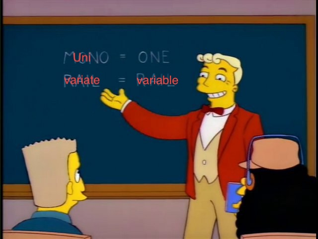
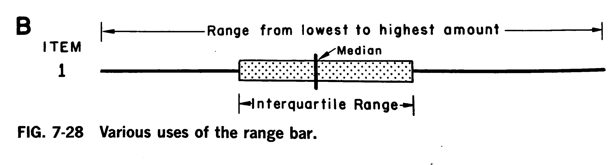

```{r}
library(datasauRus)
library(tidyverse)
library(knitr)
library(kableExtra)
library(cowplot)
# See here:https://arelbundock.com/posts/quarto_figures/index.html
knitr::opts_chunk$set(
  out.width = "70%", # enough room to breath
  fig.width = 6,     # reasonable size
  fig.asp = 0.618,   # golden ratio
  fig.align = "center" # mostly what I want
)
out2fig = function(out.width, out.width.default = 0.7, fig.width.default = 6) {
  fig.width.default * out.width / out.width.default 
}
code_flag = TRUE;# Set to true and recompile after class
```


```{r}
load("ultrarunning.RData")
ultrarunning <- 
  ultrarunning %>%
  mutate(original_order = 1:n()) %>%
  mutate(pb100k_dec_cat = cut(pb100k_dec, breaks = seq(5.5, 25.5, 1), labels = seq(6, 25, 1))) %>%
  mutate(pb100k_dec_cat_label = as.numeric(as.character(pb100k_dec_cat))) %>%
  mutate(pb100k_decimal_char = str_split_i(formatC(pb100k_dec, format = "f", digits = 2), fixed("."), 2), 
         pb100k_decimal = as.numeric(pb100k_decimal_char)) %>%
  arrange(pb100k_dec) %>%
  group_by(pb100k_dec_cat) %>%
  mutate(height = row_number() - 0.5) %>%
  mutate(pb100k_dec_char = formatC(pb100k_dec, format = "f", digits = 2)) %>%
  ungroup() %>%
  arrange(original_order)
```

## Univariate Plots

::::: columns
::: {.column width="30%"}
Univariate plots are used to visualize the distribution of a single variable:

  * What are the typical values?
  * What is the spread?
  * Are there 'outliers'?
:::

::: {.column width="70%"}

:::
:::::

## Examples

-   Histograms
-   Boxplots
-   Density plots
-   Barplots
-   Violin plots

## Ultra-runner data (Samtleben, 2023)

$n = 288$ ultra-runners (completing 100km ultra-marathons)

Each runner's personal best (in hours):

```{r}
#| size: tiny
ultrarunning$pb100k_dec
```

::: {style="font-size: 75%;"}
<https://causeweb.org/tshs/ultra-running/>
:::

## Creating a histogram

Appropriate for summarizing a set of numbers (continous variables)

1.  Choose a bin size and a center value, e.g. one hour bins centered at the integers would be denoted as $(5.5, 6.5]$, $(6.5, 7.5]$, $(7.5, 8.5]$, etc. Bins will be non-overlapping. Calculate enough bins to completely cover data

2.  Assign each runner to a bin, e.g. 13.50 goes into the $(12.5, 13.5]$ bin and 13.51 goes in to the $(13.5, 14.5]$ bin

3.  Plot bars for each bin, with the height of the bar corresponding to the number of runners in that bin

## 

```{r}
#| out-width: 130%
#| fig-width: 11.14286
ggplot(ultrarunning) +
  geom_text(aes(x = pb100k_dec_cat_label, y = height, label = pb100k_dec_char), size = 2.5) + 
  scale_x_continuous(name = "Personal best time (hours)", limits = c(5.5, 26), expand = expansion(0.02)) +
  scale_y_continuous(name = "Count", limits = c(0, 46), expand = expansion(0.02)) +  
  theme(text = element_text(size = 24))
```

## 

```{r}
#| out-width: 130%
#| fig-width: 11.14286
ggplot(ultrarunning) + 
  geom_histogram(aes(x = pb100k_dec), binwidth = 1, center = 10, fill = "white", color = "black") + 
  geom_text(aes(x = pb100k_dec_cat_label, y = height, label = pb100k_dec_char), size = 2.5) + 
  scale_x_continuous(name = "Personal best time (hours)", limits = c(5.5, 26), expand = expansion(0.02)) +
  scale_y_continuous(name = "Count", limits = c(0, 46), expand = expansion(0.02)) +  
  theme(text = element_text(size = 24))
```

## 

```{r}
#| out-width: 130%
#| fig-width: 11.14286
ggplot(ultrarunning) + 
  geom_histogram(aes(x = pb100k_dec), binwidth = 1, center = 10, fill = "white", color = "black") + 
  scale_x_continuous(name = "Personal best time (hours)", limits = c(5.5, 26), expand = expansion(0.02)) +
  scale_y_continuous(name = "Count", limits = c(0, 46), expand = expansion(0.02)) +  
  theme(text = element_text(size = 24))
```

## {#no-spice}

::: panel-tabset
### Plot

```{r}
#| out-width: 130%
#| fig-width: 11.14286
#| label: histogram
ggplot(ultrarunning) + 
  geom_histogram(aes(x = pb100k_dec), binwidth = 1, center = 10, fill = "grey", color = "black") + 
  labs(x = "Personal best time (hours)",
       y = "Count") +
  theme(text = element_text(size = 24))
```

### Code

```{r}
#| label: histogram
#| echo: !expr code_flag
#| eval: false
```
:::

## Bin width of 10 hours -- too large

```{r}
#| out-width: 130%
#| fig-width: 11.14286
ggplot(ultrarunning) + 
  geom_histogram(aes(x = pb100k_dec), binwidth = 10, fill = "grey", color = "black") + 
  scale_x_continuous(expand = expansion(0.02)) +
  labs(x = "Personal best time (hours)",
       y = "Count") +
  theme(text = element_text(size = 24))
```

## Bin width of 3 minutes -- too small

```{r}
#| out-width: 130%
#| fig-width: 11.14286
ggplot(ultrarunning) + 
  geom_histogram(aes(x = pb100k_dec), binwidth = 0.05, fill = "grey", color = "black") + 
  scale_x_continuous(expand = expansion(0.02)) +
  labs(x = "Personal best time (hours)",
       y = "Count") +
  theme(text = element_text(size = 24))
```

## Density plot

- Alternative to summarizing continuous variable
- Smoothed version of histogram (but amount of smoothing is adjustable)
- $y$-axis is density: single connected line and area under the line equals 1

## Different amounts of smoothing 

```{r}
#| out-width: 130%
#| fig-width: 11.14286
ggplot(ultrarunning) + 
  geom_density(aes(x = pb100k_dec, color = "Sensible")) +
  geom_density(aes(x = pb100k_dec, color = "Too wiggly"), bw = 0.2) +
  geom_density(aes(x = pb100k_dec, color = "Too smooth"), bw = 10) +
  scale_x_continuous(expand = expansion(0.02)) +
  coord_cartesian(ylim = c(0, 0.2)) + 
  labs(
    x = "Personal best time (hours)",
    y = "Density", 
    color = NULL) +
  theme(text = element_text(size = 24))
```

## Comparison

::::: columns

::: {.column width="50%"}

#### Histogram

- More familiar to most readers
- $y$-axis is counts by default (but technically these should be densities*)
- Requires choosing binwidth
:::

::: {.column width="50%"}
#### Density plot

- Less familiar to readers
- $y$-axis is density
- Algorithms to choose appropriate amount of smoothness
:::

::::: 

Generally no reason not to show both. 


::: {style="font-size: 75%;"}
*Density $\neq$ probability (but you can think of it as relative probability)
:::


## {#yoga-flame1}

::: panel-tabset
### Plot

```{r}
#| out-width: 130%
#| fig-width: 11.14286
#| label: histogram_and_density

ggplot(ultrarunning) + 
  geom_histogram(aes(x = pb100k_dec, y = after_stat(density)), binwidth = 1, center = 10, fill = "grey", color = "black") + 
  geom_density(aes(x = pb100k_dec)) +
  labs(x = "Personal best time (hours)",
       y = "Density") +
  theme(text = element_text(size = 24))
```

### Code

```{r}
#| label: histogram_and_density
#| echo: !expr code_flag
#| eval: false
```
:::

## Mary E Spear

::::: columns
::: {.column width="50%"}
American graphic analyst for the US government for more than 30 years

Author of Charting Statistics (1952) and Practical Charting Techniques (1969)

Inventor of the 'range bar' (boxplot)
:::

::: {.column width="50%"}

:::
:::::

::: {style="font-size: 75%;"}
Fair use, <https://en.wikipedia.org/wiki/File:Mary_Eleanor_Hunt_Spear_died_1986.png>
:::

## 



::: {style="font-size: 75%;"}
Figure 7-28, Spear (1969)
:::

Interquartile Range = segment from first quartile to third quartile

## Boxplots

Sometimes called box-and-whisker plots

1. Calculate the five-number summary: minimum, lower quartile, median, upper quartile, maximum
2. Draw a box from lower quartile to upper quartile and line at median (box)
3. Draw line segments extending from the edge of box to $1.5\times$ IQR in either direction (whiskers)
4. Any points outside of these segments are plotted directly (outliers)


## Running times

```{r}
#| out-width: 130%
#| fig-width: 11.14286

p0 <- 
  ggplot(ultrarunning) +
  geom_point(aes(x = pb100k_dec, y = 0)) + 
  scale_y_continuous(breaks = NULL, name = NULL, limits = c(-1, 1)) +
  labs(x = "Personal best time (hours)") +
  theme(text = element_text(size = 24))
p0
```

## Jittered running times

```{r}
#| out-width: 130%
#| fig-width: 11.14286

p1 <- 
  ggplot(ultrarunning) +
  geom_point(aes(x = pb100k_dec, y = 0), position = position_jitter(width = 0, height = 0.33, seed = 1)) + 
  scale_y_continuous(breaks = NULL, name = NULL, limits = c(-1, 1)) +
  labs(x = "Personal best time (hours)") +
  theme(text = element_text(size = 24))
p1
```

## Five-number summary

```{r}
#| out-width: 130%
#| fig-width: 11.14286

foo <- 
  quantile(ultrarunning$pb100k_dec) %>%
  enframe(value = "pb100k_dec")
foo_iqr = foo$pb100k_dec[4] - foo$pb100k_dec[2]
foo2 <-
  bind_rows(
    tibble(name = "lower_hinge", 
           start = foo$pb100k_dec[2],
           end = max(foo$pb100k_dec[1], foo$pb100k_dec[2] - 1.5 * foo_iqr)),
    tibble(name = "upper_hinger", 
           start = foo$pb100k_dec[4],
           end = min(foo$pb100k_dec[5], foo$pb100k_dec[4] + 1.5 * foo_iqr)),
  )

p1 +   
  geom_segment(data = foo, aes(x = pb100k_dec, xend = pb100k_dec, y = -0.5, yend = 0.5), color = "black")
```

## Whiskers

```{r}
#| out-width: 130%
#| fig-width: 11.14286
p1 +   
  geom_segment(data = foo, aes(x = pb100k_dec, xend = pb100k_dec, y = -0.5, yend = 0.5), color = "black") +
  geom_segment(data = foo2, aes(x = start, xend = end, y = 0, yend = 0), color = "black")
```

## Enclose the box

```{r}
#| out-width: 130%
#| fig-width: 11.14286
p1 +   
  geom_boxplot(aes(x = pb100k_dec), fill = "#00000000", outlier.shape = NA)
```

## Typical boxplot {#weak-sauce}

::: panel-tabset
### Plot

```{r}
#| out-width: 130%
#| fig-width: 11.14286
#| label: boxplot

ggplot(ultrarunning) +
  geom_boxplot(aes(x = pb100k_dec)) +
  labs(x = "Personal best time (hours)") +
  theme(text = element_text(size = 24)) +
  scale_y_continuous(breaks = NULL, name = NULL, limits = c(-1, 1)) +
  theme(text = element_text(size = 24))
```

### Code

```{r}
#| label: boxplot
#| echo: !expr code_flag
#| eval: false
```
:::

## Add back individual points {#yoga-flame2}

::: panel-tabset
### Plot

```{r}
#| out-width: 130%
#| fig-width: 11.14286
#| label: boxplot2

ggplot(ultrarunning) +
  geom_boxplot(aes(x = pb100k_dec), outlier.shape = NA) + # <1>
  geom_jitter(aes(x = pb100k_dec, y = 0), width = 0, height = 0.33) + # <2>
  scale_x_continuous(name = "Personal best time (hours)") +
  scale_y_continuous(breaks = NULL, name = NULL, limits = c(-1, 1)) +
  theme(text = element_text(size = 24))
```

### Code

```{r}
#| label: boxplot2
#| echo: !expr code_flag
#| eval: false
```
:::


Random vertical jitter allows to see multiple datapoints with same value

## Violin plots

More recent introduction is 'violin plot': density plot and its reflection


```{=html}
<iframe width="780" height="500" src="https://i.imgflip.com/9ebv55.jpg" title="Webpage example"></iframe>
```

Easy to create and show for multiple variables at once, like boxplots, but
better provides more accurate representation of distribution, like density plot


## Simple violin plot {#medium-spice1}

::: panel-tabset
### Plot

```{r}
#| label: violin1
#| out-width: 130%
#| fig-width: 11.14286
p1 <-
  ggplot(ultrarunning, aes(x = pb100k_dec)) +
  geom_violin(aes(y = 0), fill = "grey70") + 
  scale_x_continuous(name = "Personal best time (hours)") +
  scale_y_continuous(breaks = NULL, name = NULL, limits = c(-1, 1)) +
  theme(text = element_text(size = 24))
p1 +
  geom_hline(yintercept = 0, linetype = "dashed")
```

### Code

```{r}
#| label: violin1
#| echo: !expr code_flag
#| eval: false
```
:::


## With boxplot {#medium-spice2}

::: panel-tabset
### Plot

```{r}
#| label: violin2
#| out-width: 130%
#| fig-width: 11.14286

# See how p1 is created on previous slide
p1 + 
  geom_boxplot(width = 0.25)
```

### Code

```{r}
#| label: violin2
#| echo: !expr code_flag
#| eval: false
```
:::


## With datapoints

```{r}
#| label: violin3
#| out-width: 130%
#| fig-width: 11.14286
p1 + 
  geom_jitter(aes(y = 0), height = 0.15)
```


## Comparison

::::: columns
::: {.column width="50%"}
#### Boxplot

- One word
- More familiar to readers
- Clearly shows 1st, 2nd, and 3rd quartiles
- Easy to draw by hand
- Potentially misleading representation of distribution
:::

::: {.column width="50%"}

#### Violin plot

- Two words
- Less familiar to most readers
- Doesn't show quartiles (but can be easily added)
- Requires choosing binwidth (same as density plot)
- More accurate representation of distribution
:::

::::: 

Generally no reason not to show both

## Comparison

The decimal part of each runner's personal best (in hours):

```{r}
#| size: tiny
ultrarunning$pb100k_decimal_char
```

## 

```{r}
#| out-width: 130%
#| fig-width: 11.14286

#histogram
p1 <-
  ggplot(ultrarunning) + 
  geom_histogram(aes(x = pb100k_decimal, y = after_stat(density)), binwidth = 5, fill = "grey", color = "black") + 
  scale_y_continuous(breaks = NULL, name = NULL) +
  coord_cartesian(xlim = c(0, 99)) +
  labs(x = NULL, y = NULL) +
  theme(text = element_text(size = 22))

#boxplot
p2 <- 
  ggplot(ultrarunning) +
  geom_boxplot(aes(x = pb100k_decimal)) +
  scale_y_continuous(breaks = NULL, name = NULL) +
    coord_cartesian(xlim = c(0, 99)) +
labs(x = NULL) +
  theme(text = element_text(size = 22))

#violin plot
p3 <-
  ggplot(ultrarunning, aes(x = pb100k_decimal)) +
  geom_violin(aes(y = 0), fill = "grey70") +
  geom_jitter(aes(y = 0), height = 0.15, width = 0) +
  scale_y_continuous(breaks = NULL, name = NULL, limits = c(-0.5, 0.5)) +
    coord_cartesian(xlim = c(0, 99)) +
labs(x = "Decimal part of personal best time (hours)") +
  theme(text = element_text(size = 22))

plot_grid(p1, p2, p3, ncol = 1, align = "v", axis = "lr",rel_heights = c(1, 1, 1.5))
```

## Bar Charts

Univariate summaries of *categorical* variable

Can show counts or proportions

## Simple Bar Chart

::: panel-tabset
### Plot

```{r}
#| label: barchart
#| out-width: 130%
#| fig-width: 11.14286

# Create a new variable to store the surface type
ultrarunning <-
  ultrarunning %>%
  mutate(sex_char = 
           case_when(
             sex == 2 ~ "Male",
             sex == 1 ~ "Female", 
             TRUE ~ "Unknown") %>%
           factor() %>%
           fct_relevel("Male", "Female", "Unknown"),
         pb_surface_name = 
           case_when(
             pb_surface == 1 ~ "trail",
             pb_surface == 2 ~ "track",
             pb_surface == 3 ~ "road",
             pb_surface == 4 ~ "mix of all three") %>%
           factor() %>%
           fct_relevel("trail", "road", "track"))

ggplot(ultrarunning) +
  geom_bar(aes(x = pb_surface_name)) +
  labs(x = "Surface type",
       y = "Count") +
  theme(text = element_text(size = 24))
```

### Code

```{r}
#| label: barchart
#| echo: !expr code_flag
#| eval: false
```

:::

## Stacked Bar Chart {#yoga-flame3}

::: panel-tabset
### Plot

```{r}
#| label: barchart_stacked
#| out-width: 130%
#| fig-width: 11.14286
# See how pb_surface_name and sex_char are created on slide 31
ggplot(ultrarunning) +
  geom_bar(aes(x = pb_surface_name, fill = sex_char)) +
  labs(x = "Surface type",
       y = "Count",
       fill = "Sex") +
  theme(text = element_text(size = 24))
```

### Code

```{r}
#| label: barchart_stacked
#| echo: !expr code_flag
#| eval: false
```

:::

## Filled Bar Chart {#yoga-flame4}

::: panel-tabset
### Plot

```{r}
#| label: barchart_filled
#| out-width: 130%
#| fig-width: 11.14286
# See how pb_surface_name and sex_char are created on slide 31
ggplot(ultrarunning) +
  geom_bar(aes(x = pb_surface_name, fill = sex_char), position = "fill") +
  labs(x = "Surface type",
       y = "Proportion",
       fill = "Sex") +
  theme(text = element_text(size = 24))
```

### Code

```{r}
#| label: barchart_filled
#| echo: !expr code_flag
#| eval: false
```

:::

## Dodged Bar Chart {#yoga-flame5}

::: panel-tabset
### Plot

```{r}
#| label: barchart_dodged
#| out-width: 130%
#| fig-width: 11.14286
# See how pb_surface_name and sex_char are created on slide 31
# preserve = "single" maintains a constat bar width, even when there are empty
# categories
ggplot(ultrarunning) +
  geom_bar(aes(x = pb_surface_name, fill = sex_char), position = position_dodge(preserve = "single")) +
  labs(x = "Surface type",
       y = "Count",
       fill = "Sex") +
  theme(text = element_text(size = 24))
```

### Code

```{r}
#| label: barchart_dodged
#| echo: !expr code_flag
#| eval: false
```

:::

## Stacked vs. Filled vs. Dodged

All are different flavors of bar charts

::::: columns
::: {.column width="33%"}
#### Stacked

- Emphasizes overall count differences between bars
- Difficult to assess subgroup count differences between bars (except first subgroup)
- Difficult to count small categories
:::

::: {.column width="33%"}

#### Filled

- Easy to assess overall proportional differences between bars for first and last subgroups
- Difficult to assess subgroup proportional differences between bars in interior subgroups
- No information on counts
:::

::: {.column width="33%"}

#### Column plot

- Emphasis on count differences between bars for each subgroup
- Difficult to assess overall count differences between bars
- Difficult to count small categories
:::

::::: 


## Bars vs. Histograms vs. Columns

::::: columns
::: {.column width="33%"}
#### Bar charts / Bar plots

- Only appropriate for categorical variables
- Bars are categories. Nothing exists between bins
- Bars may be ordered by value or by count
- $y$-axis can be counts or proportions
- Use `geom_bar()`
:::

::: {.column width="33%"}

#### Histogram

- Only appropriate for continuous variables
- Bins are intervals based on binwidth. No gap between bins
- Bins are naturally ordered by value
- $y$-axis can be counts or densities
- Use `geom_histogram()`
:::

::: {.column width="33%"}

#### Column plot

- Special type of bivariate plot:
  - $x$-axis is categorical
  - $y$-axis is continuous
  - Bars instead of points
  - Bars drawn from $y$ to 0
- No summarization of $y$ variable
- Use `geom_col()`
:::

::::: 


## Bivariate extensions {#dim-mak1}

::: panel-tabset
### Plot

```{r}
#| out-width: 130%
#| fig-width: 11.14286
#| label: bivariate_violin1
ggplot(ultrarunning %>% filter(sex_char != "Unknown"), aes(x = pb100k_dec, y = sex_char)) +
  geom_violin(fill = "grey70") + 
  geom_boxplot(width = 0.25) +
  scale_x_continuous(name = "Personal best time (hours)") +
  scale_y_discrete(name = NULL) + 
  theme(text = element_text(size = 24))
```

### Code

```{r}
#| label: bivariate_violin1
#| echo: !expr code_flag
#| eval: false
```

:::


## Bivariate extensions {#dim-mak2}

::: panel-tabset
### Plot

```{r}
#| out-width: 130%
#| fig-width: 11.14286
#| label: bivariate_violin2
ggplot(ultrarunning, aes(x = pb100k_dec, y = pb_surface_name)) +
  geom_violin(fill = "grey70") + 
  geom_boxplot(width = 0.25) +
  scale_x_continuous(name = "Personal best time (hours)") +
  scale_y_discrete(name = NULL) + 
  theme(text = element_text(size = 24))
```

### Code

```{r}
#| label: bivariate_violin2
#| echo: !expr code_flag
#| eval: false
```

:::

## Bivariate extensions {#dim-mak3}

::: panel-tabset
### Plot

```{r}
#| out-width: 130%
#| fig-width: 11.14286
#| label: bivariate_violin3
ggplot(ultrarunning, aes(x = pb_surface_name, y = pb100k_dec)) +
  geom_violin(fill = "grey70") + 
  geom_boxplot(width = 0.25) +
  scale_y_continuous(name = "Personal best time (hours)") +
  scale_x_discrete(name = NULL) + 
  theme(text = element_text(size = 24))
```

### Code

```{r}
#| label: bivariate_violin3
#| echo: !expr code_flag
#| eval: false
```

:::


## Layering in `ggplot`

Adding multiple geometric objects to one ggplot object results in multiple layered views of the information. 

Example of jittered points over boxplot:

```{r}
#| label: boxplot2
#| echo: true
#| eval: false
#| size: small
```

1. First create boxplot
2. Then add points across $y=0$ line with random vertical jitter

Other examples of layering we've seen so far: layering density over histogram of running times (slide 15); data points over a boxplot (slide 24); boxplot over violin plot (slide 27)

## When to layer?

Some situations when you would want to layer:

  - When single layer has critical weakness / deficiency (*Avoid distorting what the data say*)
  - When you want to highlight both granular and aggregate components of the data (*Reveal the data at several levels of detail, from broad overview to fine structure*)
  - To anchor your data (layer A) within context of reference / other data (layer B) (*Encourage comparison between different pieces of data*)


## Code Together Task


**No Spice**: Make the histogram on [slide 9](#no-spice);

**Weak Sauce**: Make the boxplot on [slide 24](#weak-sauce);

**Medium Spice**: Make the layered violin plots on [slide 27](#medium-spice1) or [slide 28](#medium-spice2);

**Yoga Flame**: Make the layered Density+Histogram on [slide 15](#yoga-flame1) (hint: use `after_stat` to get the correct y-axis for the histogram); or the layered boxplot on [slide 25](#yoga-flame2) (hint: use `geom_jitter` instead of `geom_point`); or one of the barcharts on slides [35](#yoga-flame3), [36](#yoga-flame4), or [37](#yoga-flame5) (hint: you will need to use `case_when` to create some character variables before making the plots);

**Dim Mak**: Make one of the bivariate violin plots on slides [40](#dim-mak1), [41](#dim-mak2), or [42](#dim-mak3);


## References

Samtleben, E., 2023. Ultrarunning dataset. Teaching of Statistics in the Health Sciences Resource Portal, Available at https://www.causeweb.org/tshs/ultra-running/.

Spear, M.E., 1969. Practical charting techniques.